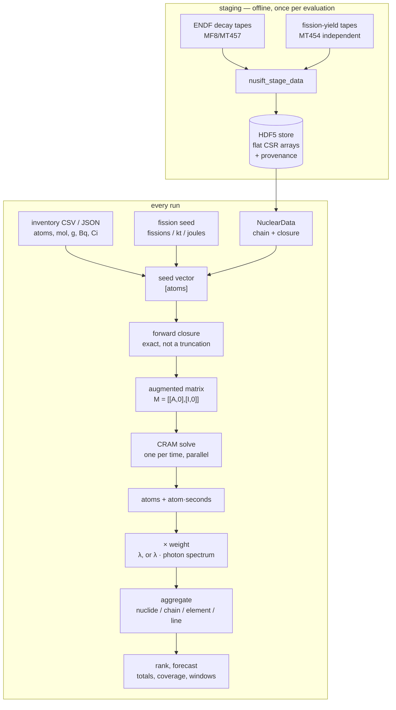

# NuSIFT methodology

How NuSIFT gets from an isotopic inventory to a ranked answer, stage by stage: what is
evaluated exactly, what is approximated and by how much, and what is not modelled at all.

Each stage has its own document. Read them in order for the whole method, or jump to the one
that produced the number you are looking at.

| # | Stage | What it decides |
| --- | --- | --- |
| 1 | [Nuclear data](nuclear-data.md) | What the store holds, how ENDF becomes a chain, and why whole photon spectra are persisted rather than one constant per nuclide |
| 2 | [Inventory and seeding](inventory.md) | Every route to a starting atom count — a file in any unit, or a fission source sized three ways |
| 3 | [The decay solve](decay-solve.md) | The matrix, CRAM, the forward-closure pruning, time grids, threads, and determinism |
| 4 | [Interval integration](interval-integration.md) | Time-integrated answers in closed form, and the cancellation guard |
| 5 | [Exposure](exposure.md) | The photon transport model: lines, air attenuation, air kerma, and what it excludes |
| 6 | [Ranking and forecasting](ranking.md) | Weights, aggregation, coverage, dominance windows, and how a report states its own limits |

## The one design decision everything follows from

The engine produces exactly two matrices and never sums anything:

```
atoms(k, i)           = nᵢ(t_k)                    [atoms]
integratedAtoms(k, i) = ∫₀^{t_k} nᵢ(τ) dτ          [atom·s]
```

Every quantity NuSIFT reports is a **linear functional of one of those with a fixed
per-nuclide or per-line weight**. Activity is λᵢ times atoms. Exposure is λᵢ times a photon
weight times atoms. The time-integrated forms are the same weights against atom·seconds.

That is why ranking by nuclide, mass chain, element, or individual gamma line — instantaneously
or integrated, in Bq or R/h or Sv/h, at any distance — is a post-multiply rather than seven code
paths, and why two ways of asking the same question cannot drift apart. It is also the reason
the engine's output is deliberately narrow: the moment the solver knows what a "ranking" is,
that guarantee is gone.



## Conventions that hold everywhere

**Units are part of the name.** `energyEv`, `halfLifeSeconds`, `distanceM`, `sigmaBarn`,
`airDensityKgM3`. Conversions live in one file,
[`nusift/units.hpp`](../nusift/units.hpp), so a constant cannot be spelled two ways in two
places. A year is the Julian year, 365.25 d — stated in the CLI help because the choice is
arbitrary but its consequences are not.

**A nuclide is a ZAI key.** `Z*10000 + A*10 + I`, one 64-bit integer, sortable and stable
across every layer: the HDF5 store axis, the chain index, the inventory, and the CSV output all
identify a nuclide the same way.

**Stable means terminator, not error and not infinity.** A half-life ≤ 0 encodes stability
throughout. Such a nuclide gets no decay data, no diagonal entry, and a decay constant of zero,
so it contributes exactly nothing to any metric while still receiving atoms from its parents.

**Absence is reported, never imputed.** A store without atomic weights refuses gram input
rather than falling back on A as the molar mass. A store without photon lines makes exposure
unavailable rather than returning zeros. A nuclide that emits photons NuSIFT does not model is
counted and footnoted rather than quietly contributing nothing. The recurring principle: a
silent zero and a real zero must never look alike.

**Provenance travels with the answer.** The evaluation, its staging date, the tool version, and
the seed that produced the inventory are stamped into the store and reprinted in every report
header — because for a triage answer, what produced it is part of it.

## Scope of the model

Implemented and exercised end to end: decay from an inventory or from fission, instantaneous
and time-integrated activity, point-source photon exposure, ranking by four aggregates,
dominance forecasting, and a Python binding for the instantaneous path.

Not modelled, each of which would *raise* a reported exposure: scattered photons beyond an
explicit `--buildup` factor, source self-absorption, bremsstrahlung and any continuous photon
spectrum, and beta, alpha, or neutron dose. Not yet implemented: neutron activation as a source
term, shielding, decay heat, and a binned spectrum for detector response.

The limits are quantified per store rather than asserted in general — run `nusift data info`
and it will tell you how many nuclides in *this* evaluation emit photons it cannot model. See
[Exposure §7](exposure.md#7-what-is-not-modelled-and-what-it-costs).

## Validation

[**validation.md**](validation.md) is the other half of this documentation: where these methods
are checked against values NuSIFT was not fitted to — published gamma constants, evaluated
half-lives, atomic weights, fission yields, an empirical decay law, and an independent
implementation of the same physics.

It is generated by [`validation/make_report.py`](../validation/make_report.py) from the
committed store and regenerated in CI, which fails if the committed report no longer matches
what the code produces. The reference data and the reasoning behind every acceptance band live
in [`validation/references/`](../validation/references/README.md).

## Regenerating the figures

The data-driven figures come from [`figures/make_figures.py`](figures/make_figures.py) (numpy
only). Air-coefficient figures parse the NIST table directly out of
[`air_coefficients.cpp`](../nusift/exposure/air_coefficients.cpp) so they cannot drift from the
values the code interpolates; the rest are built from committed CLI output under
[`figures/data/`](figures/data/README.md).
