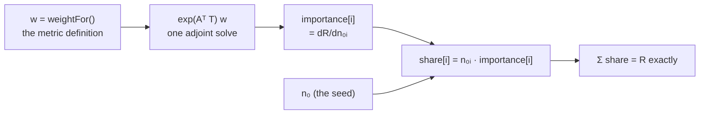

# Seed attribution

The second way to attribute one response: not to the nuclide producing it now, but to the
nuclide that was seeded. What the adjoint computes, why the shares are exact rather than
estimated, and what the method does not cover.

← [Ranking and forecasting](ranking.md) · [Methodology index](README.md)

---

## 1. Two attributions of one number

[Ranking](ranking.md) answers *what is producing this response right now*. That is the correct
reading of a ranking, and it is why a Cs-137 source's exposure lands on the Ba-137m daughter
that actually emits the photons rather than on the Cs-137 that is usually named.

Seed attribution answers a different question about the same number: **which of the nuclides I
seeded is this response riding on.** For an inventory read from a file the two are close. For a
fission seed they are almost disjoint:

| | Top contributors, activity at 30 d | |
| --- | --- | --- |
| **`rank`** — emitting now | La-140, Pr-143, Ce-141, Ba-140, Zr-95 | what is present |
| **`attribute`** — seeded then | Xe-140, Sr-95, Ba-143, Cs-140, Cs-141 | what produced it |

Both partition the same total, `2.0562e+17 Bq`. Xe-140 has a 13.6-second half-life and is
utterly gone at 30 days; it is the largest single seed contributor at 30 days because its yield
is what determined how much A=140 there would be. Ba-140 is the reverse — a top emitter, barely
seeded at all. **Neither ranking is derivable from the other.**

## 2. The adjoint, and why the shares are exact

Every metric is `R = ⟨w, n(T)⟩` for a fixed per-nuclide weight ([Ranking §2](ranking.md)). Decay
is linear, so

$$
R = \langle w, e^{AT} n_0\rangle = \sum_i n_{0,i}\,\langle w, e^{AT} e_i\rangle
$$

and the inner product in that sum is exactly `dR/dn₀ᵢ`. The adjoint identity
`⟨w, e^{AT} n₀⟩ = ⟨e^{Aᵀ T} w, n₀⟩` delivers all of them from **one solve** on the transposed
matrix — a vector whose dot product with the seed is `R` and whose entries are the per-nuclide
derivatives.



The consequence is what makes this a feature rather than a diagnostic: `importance[i] · n₀ᵢ` is
not an estimate of nuclide *i*'s influence, it is *i*'s **exact share** of `R`, and the shares
sum to `R`. Measured on a 20 kt U-235 seed at 30 days, they sum to 1 within `7e-12`.

So seed attribution carries a total, a covered fraction, and an omitted count like any other
ranking — and needs no evaluated uncertainties to mean anything. It is a decomposition, not an
uncertainty analysis.

## 3. Share and importance are different columns

```
   #  seed     seed atoms           Bq     frac      cum
   1  Xe-140   1.0172e+23   2.6962e+16    13.1%    13.1%
   4  Cs-140   6.0060e+22   1.5919e+16     7.7%    38.0%
```

Xe-140 and Cs-140 carry very different shares and **near-identical importance**
(`2.6505e-07` against `2.6505e-07` Bq per atom). They are consecutive links in the A=140 chain,
both far shorter-lived than the response time, so an atom seeded as either is worth the same at
30 days. The difference in share is entirely a difference in how many atoms fission produced.

That is the distinction the two columns exist to draw:

- **share** — how much of the answer this seed accounts for. What to look at first.
- **importance** — what one *more* atom would be worth. What to seed more accurately.

The residual `1.2e-5` gap between the two importances is not solver noise: it is Xe-140's small
delayed-neutron branch leaving the A=140 chain. A test pins it at a tolerance loose enough to
admit that branch and tight enough to catch a transposed index.

## 4. Cost

One adjoint solve — cheaper than the forward path, since `R` falls out of the same vector rather
than needing a second pass. There is no quadrature and no convergence parameter anywhere in this
path, which is not true of parameter sensitivities (see §6).

Pruning applies unchanged: the adjoint runs on the same forward closure the decay solve uses, and
the two share one `prepare()` precisely so an importance vector cannot end up indexed differently
from the inventory it multiplies.

## 5. What it does not do

- **Interval domains.** The shares are of an *instantaneous* response. Attributing a
  time-integrated total to its seed needs the integrated adjoint, which is a different solve;
  `attribute` refuses an interval unit rather than reporting an instantaneous number under it.
- **Aggregates other than nuclide.** An inventory row names a nuclide, so that is what a share
  can name. Mass-chain and element seeds are a natural extension and are not implemented.
- **Gamma lines.** A photon line has no seed. Rank by line to see which lines carry the dose;
  attribute by nuclide to see which seeds carry them.

## 5a. The error bar the assay puts on the answer

`dR/dn₀` is a derivative, and the seed is a thing somebody measured. Multiply the two and the
importance column stops being a diagnostic and becomes an error bar:

```
σ_R² = gᵀ Σ g
```

**Exact, not first order.** `R` is linear in `n₀`, so there is no expansion, no small-error
assumption and no derivative that had to be estimated — the same linearity that makes the shares
a partition rather than an estimate. A single seeded nuclide therefore turns a 5% assay into a 5%
answer at *every* time and to every digit, whatever the chain beneath it, which is what the test
asserts rather than a tolerance chosen to pass.

What it buys is the assay-planning question the importance column could only hint at. Ordering by
**variance fraction** rather than by share answers *which measurement to improve*, and the two
orderings differ:

```
   seed          of variance    1-sigma on R      row sigma     share of R
   Sr-90             94.0%      2.4949e+13     1.6384e+22          31.7%
   Cs-137             5.1%      5.8299e+12     4.1084e+21          61.7%
```

Cs-137 is most of the answer and almost none of its uncertainty; Sr-90 is the reverse. Change the
metric and it reorders again — under photon dose the same two rows drop to nothing and Co-60
takes 90% of the variance, because importance is in the product and importance is what the metric
decides.

### Two units problems that turned out not to be problems

**The measurement basis does not need to be retained.** `toAtoms()` is `value · k` in every
branch — 1 for atoms, `N_A` for moles, `N_A·g/M` for a mass, `1/λ` for an activity — so it is
strictly linear with no offset, and the same call converts a σ as correctly as it converts a
quantity. The basis *is* needed for `dR/dλ` below, where `n₀ = A₀/λ` moves with the parameter
being differentiated. Those are different questions and only one of them needs it.

**Assays on different dates need no new machinery.** A σ cannot ride on a reconciled inventory —
a diagonal `Σ` at assay becomes `DΣDᵀ` at the epoch and `D` is not diagonal — so the propagation
has to reach back to assay time. But the carry and the response interval share one decay matrix,
so their exponentials commute:

```
R = ⟨w, e^{AT} Σ_a e^{Aτ_a} n_a⟩ = Σ_a ⟨e^{Aᵀ(T + τ_a)} w, n_a⟩
```

The importance of an assay carried forward by `τ` is just the ordinary adjoint run for `T + τ`.
One existing solve per assay, and `R = Σ_a ⟨g_a, n_a⟩` is an identity a test checks against the
ordinary ranking total.

### What it assumes, and says

A per-row σ is the **diagonal** of `Σ`, which asserts the assay errors are independent. Aliquots
counted on one detector against one standard are not; rows fitted to a total are not. Off-diagonal
terms move `σ_R` in either direction and nothing here can detect them. The report also states what
share of the response came from rows that stated an uncertainty at all — an error bar propagated
from rows holding half the answer is not an error bar on the answer — and that the nuclear data is
taken as exact, which is the next section's subject.

## 6. Not implemented: parameter sensitivities

`dR/dn₀` is a sensitivity to the *seed*. The related question — how much the answer depends on
the **evaluated data**, `dR/dλ` for half-lives or `dR/dσ` for cross sections — is a different
calculation, and is not implemented.

It is measurable today: `tests/spike/sensitivity_spike.cpp` (built with
`-DNUSIFT_BUILD_SPIKES=ON`) runs it against cram's adjoint quadrature and checks it against
central finite differences. Three findings from that harness are worth recording, because they
shape what a future feature would have to do:

1. **A weighted response has two derivative terms.** cram's `R = ⟨w, n(T)⟩` holds `w` fixed, so
   its adjoint returns only the implicit term. But NuSIFT's weight *is* λ, so the derivative
   carries a second explicit term `(wᵢ/λᵢ)·nᵢ(T)`. Both are needed, and they are separately
   meaningful. What the two together give is the derivative **at fixed atom inventory** — the
   right one for a fission seed, where `n₀ = fissions · Y` is a count of atoms and does not
   move with λ. An inventory specified in *activity* fixes `A₀`, not `n₀`, so `n₀ = A₀/λ`
   carries a third term `∂R/∂n₀ · (-A₀/λ²)`; a feature would have to keep the basis the
   inventory was measured in rather than assume either one.
2. **The two cancel catastrophically at secular equilibrium.** For Ba-137m they cancel across
   seven orders of magnitude — its activity is pinned by its parent's feed rate, so moving its
   own λ barely moves `R`. A relative error against that difference is meaningless; the
   elasticity `λ·(dR/dλ)/R` stays interpretable.
3. **The quadrature is a footgun at default settings.** A single 30-day interval at cram's
   default `endRefinements` is 37% wrong for the Cs-137/Ba-137m pair, silently. The fix is
   refinement chosen from the shortest removal time in the pruned set — cram's own documented
   rule — not a finer schedule, which costs four times as much and does worse.

This is the **other** parameter class from §5a, and the two do not overlap: that one propagates
what the assay said about the inventory at fixed nuclear data, this one would propagate what the
evaluation says about the nuclear data at a fixed inventory. A complete error budget wants both.

Uncertainty propagation on top of any of this additionally needs evaluated σ's, which the store
reserves (`nuclide_half_life_uncertainty`, `mode_branching_uncertainty`,
`nfy_product_yield_uncertainty`) and does not yet stage. Measured elasticities are near-equal
between half-lives and yields (RSS `0.227` against `0.236`), so which parameter class dominates
an error budget is decided entirely by those σ's — and therefore cannot be answered at all until
they are staged.

Those RSS figures are **sensitivity norms, not error bars**, and they stay norms even once the
σ's land. `σ_R/R = σ_rel·√(∑eᵢ²)` is `gᵀΣg` with Σ taken diagonal and every relative
uncertainty taken equal; real evaluations satisfy neither. Fission yields are correlated through
the mass and charge balance the evaluation was fitted under — *independent* yield is a yield
type, meaning pre-decay, and says nothing about statistical independence — and branching
fractions normalized to sum to one are anti-correlated by construction. Off-diagonal terms can
move the total in either direction. An error budget needs the covariance, which is a larger
staging problem than the σ's alone.

---

## Where this lives in the code

| | |
| --- | --- |
| [`nusift/engine/adjoint_engine.hpp`](../nusift/engine/adjoint_engine.hpp) | Why the shares partition rather than approximate, and what one solve buys |
| [`nusift/engine/adjoint_engine.cpp`](../nusift/engine/adjoint_engine.cpp) | The transposed solve, and the `t = 0` shortcut |
| [`nusift/engine/decay_engine_internal.hpp`](../nusift/engine/decay_engine_internal.hpp) | The `prepare()` the forward and adjoint paths share, so their index spaces cannot diverge |
| [`nusift/triage/attribution.cpp`](../nusift/triage/attribution.cpp) | Shares, ordering, coverage, the pinned tail, and `requireSeedPin` |
| [`nusift/triage/uncertainty.hpp`](../nusift/triage/uncertainty.hpp) | Why `gᵀΣg` is exact, why the basis is not needed, and why a dated assay needs no new solve |
| [`nusift/triage/uncertainty.cpp`](../nusift/triage/uncertainty.cpp) | The per-assay adjoint at `T + τ`, and the variance ordering |
| [`nusift/triage/response.cpp`](../nusift/triage/response.cpp) | `responseWeights`, which hands the adjoint the same metric definition the forward path uses |
| [`tests/spike/sensitivity_spike.cpp`](../tests/spike/sensitivity_spike.cpp) | The parameter-sensitivity measurements behind §6 |
