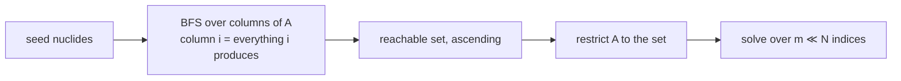

# The decay solve

The matrix, the CRAM evaluation, the pruning that makes it fast without approximating anything,
and the properties that make a parallel run reproduce a serial one exactly.

← [Inventory and seeding](inventory.md) · [Methodology index](README.md) · next: [Interval integration](interval-integration.md)

---

## 1. What is being solved

Pure radioactive decay of a fixed nuclide vector:

$$
\frac{\mathrm{d}\mathbf{n}}{\mathrm{d}t} = A\,\mathbf{n}, \qquad \mathbf{n}(t) = e^{At}\mathbf{n}_0
$$

**A** is cram's decay matrix: `−λᵢ` on the diagonal, and `+λᵢ·bᵢⱼ` off it for every branch from
*i* to *j*, including isomeric final states and spontaneous fission. It is sparse, constant, and
built entirely from the staged decay data.

**A is constant, which is both the enabling property and the scope limit.** Constant A is what
lets the time integral be obtained in closed form ([Interval integration
§3](interval-integration.md#3-the-augmented-system)) and what makes every time independent of
every other. It also means NuSIFT models *decay*, not depletion under irradiation: there is no
flux, no burnup, and no reaction term. The store reserves one-group activation cross sections in
schema v1 and writes them empty, so adding that later forces no restage — but it is not
implemented, and nothing in the current path pretends otherwise.

## 2. CRAM

The matrix exponential is evaluated by the Chebyshev Rational Approximation Method, from
[cram](https://github.com/lefebvre/cram-depletion). CRAM approximates `exp(At)` by a partial
fraction expansion over a set of poles, so a solve is a set of sparse linear solves rather than a
series expansion — which is what makes it stable on a decay matrix whose eigenvalues span the
twenty-odd orders of magnitude between a microsecond isomer and a billion-year primordial.

| Order | Use |
| --- | --- |
| `--cram-order 16` | Screening |
| `--cram-order 48` | **Default**, and what any reported number should use |

Measured on a 20 kt U-235 fission source at 30 days, the two orders agree to about 1e-15
relative — the top contributor's value is identical in all 16 printed digits. That is a
statement about this problem at this time, not a general guarantee: the whole reason CRAM has an
order parameter is that the approximation degrades outside the region the poles were fitted for.
Order 48 is the default because it is cheap insurance, not because 16 is visibly wrong here.

**One factorization per time, applied once.** Nothing is shared between times.

## 3. Pruning: exact, and the largest single lever

Before solving, the chain is restricted to the nuclides **forward-reachable from the seed**.

Reachability is read off the decay matrix's own sparsity rather than by re-walking decay modes:
`A(j,i) ≠ 0` means *i* produces *j*. That captures daughters, branching, and spontaneous fission
products uniformly, and it cannot disagree with the matrix actually being solved — which a
second traversal of the decay-mode records eventually would.



**Why it is exact rather than a truncation.** The reachable set is closed under production. Any
matrix entry dropped by the restriction has a column outside the set, and every nuclide outside
the set is identically zero for all time — it has no seed and no reachable producer. So the
restricted solve is not an approximation of the full one; it is the same solution with the
permanently-zero rows omitted.

It is also the largest performance lever available, because sparse LU cost grows superlinearly:

| Configuration | One interval solve, 20 kt U-235, full ENDF/B-VIII.1 |
| --- | --- |
| store open only | 0.042 s |
| pruned (default) | ≈0.11 s |
| `--no-prune` | 1.54 s |

Roughly 15× here, and it keeps the output legible as a side effect by omitting thousands of
permanently-zero rows. `--no-prune` exists to check that claim, not as a higher-fidelity mode.

## 4. Time grids

Times are seconds, and every entry point parses them with the same code — so a notebook and a
terminal can never disagree about what `1.5y` means.

```
--at 30d                    repeatable, one cooling time each
--times 1h:100y:log:60      start : stop : log|lin : count
--interval 1h,30d           a window; see interval-integration.md
```

Durations accept `s`, `m`, `h`, `d`, `y`; a bare number is seconds; a year is 365.25 days.
Four decisions in the grid builder are worth naming:

**Log grids pin their endpoints.** `exp(log(x))` does not always round-trip, and a reported time
1e-16 off the one that was asked for is confusing in output and can reorder against an interval
endpoint meant to coincide with it. The first and last points are assigned, not computed.

**A log grid refuses a zero endpoint** rather than silently substituting something small, and
says to use a linear grid to include 0.

**Near-duplicate times are collapsed** at a relative tolerance of 1e-12. The engine rejects exact
duplicates outright, and a pair of times separated by 1e-16 s costs a full factorization while
carrying no information the neighbouring point does not.

**Non-finite endpoints are refused up front.** A grid is built by interpolating between its
endpoints, so one NaN does not produce one bad time — it poisons every point, and the failure
would otherwise surface much later as a CRAM solve against a nonsense time.

The engine then requires times to be non-negative, finite, and **strictly ascending**, and says
which pair broke the order when they are not. `t = 0` is short-circuited: it is the seed itself
with a zero integral, so it never enters CRAM.

## 5. Parallelism and determinism

Each time is an independent factorization sharing nothing with the others, so the loop
parallelises directly. Two implementation choices follow from cram's contract and from the cost
profile:

**Each worker holds its own solver.** cram documents `CramSolver` as not thread-safe: the pole
tables it reads are immutable constants, but the per-pole factorizations must not be shared.

**Times are dealt round-robin, not in contiguous blocks.** Cost rises with *t* — a later time
touches more of the matrix — so contiguous blocks would leave the worker holding the early times
idle while the last one finishes.

A worker that throws stores its exception and the failure is rethrown on the calling thread once
every worker has stopped. Letting it escape a thread would call `std::terminate` and lose the
message entirely.

### The result does not depend on the thread count

Each time writes only to its own slice of the output, and no reduction crosses times, so a
parallel run is **bit-for-bit** a serial one. Verified rather than asserted:

```console
$ nusift rank --seed-fission U-235 --yield-kt 20 --times 1h:100y:log:80 \
      --metric exposure --top 0 --format csv --threads 1 > serial.csv
$ nusift rank ... --threads 8 > parallel.csv
$ cmp serial.csv parallel.csv && echo identical
identical            # 28499 rows
```

Measured speedup on the same 80-point forecast: 1.56 s serial, 0.46 s with the default thread
count — about 3.4× on this machine. Factorization dominates, so the scaling is close to linear
until memory bandwidth bites.

A single-time run stays serial regardless: spawning a thread to do one solve costs more than it
saves.

## 6. What comes out

```
atoms(k, i)           = nᵢ(t_k)                    [atoms]
integratedAtoms(k, i) = ∫₀^{t_k} nᵢ(τ) dτ          [atom·s]
```

Both matrices, always — the integral is a free by-product of the augmented system, so there is no
configuration in which NuSIFT computes one without the other and no second code path to keep in
agreement. Storage is dense and row-major by time: 200 times × 4000 nuclides × 2 arrays × 8 B is
12.8 MB, which is not worth being clever about.

The index space is the **pruned** chain, so it is generally a subset of the `NuclearData` index
space and must not be used to index into it. Lookups go through the ZAI key. The Python bindings
expose both matrices as zero-copy NumPy views over this storage.

The engine never sums anything. Everything that turns these matrices into a reported number
lives in [Ranking](ranking.md), by design — see [the index](README.md#the-one-design-decision-everything-follows-from).

## 7. Source map

| File | Role |
| --- | --- |
| [`nusift/engine/decay_engine.hpp`](../nusift/engine/decay_engine.hpp) | `DecayOptions`, and the augmented-system derivation |
| [`nusift/engine/decay_engine.cpp`](../nusift/engine/decay_engine.cpp) | `forwardClosure`, `restrict`, `augment`, `decay`, `intervalIntegral` |
| [`nusift/engine/decay_result.hpp`](../nusift/engine/decay_result.hpp) | The two matrices and their index-space contract |
| [`nusift/io/time_spec.cpp`](../nusift/io/time_spec.cpp) | Duration parsing, `logspace`/`linspace`, `mergeTimes`, `formatDuration` |
