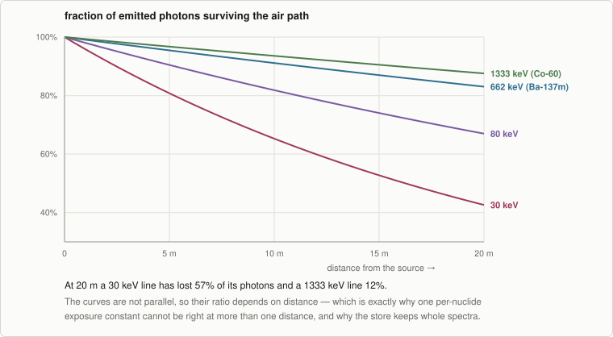

# Exposure

The photon transport model: an unshielded point source in air, evaluated line by line. What each
term is, what it excludes, and how much the exclusions are worth.

← [Interval integration](interval-integration.md) · [Methodology index](README.md) · next: [Ranking and forecasting](ranking.md)

---

## 1. The model, in full

$$
k(E) \;=\; \underbrace{\frac{e^{-\mu_{\text{air}}(E)\,d}}{4\pi d^{2}}}_{\text{spreading and path}}
\;\cdot\; \underbrace{E \cdot 1.602176634\times10^{-19}}_{\text{eV} \to \text{J}}
\;\cdot\; \underbrace{(\mu_{en}/\rho)_{\text{air}}(E)}_{\text{air kerma, CPE}}
\;\cdot\; \underbrace{\frac{3600}{0.00876}}_{\text{kerma} \to \text{R/h}}
\;\cdot\; B
$$

$$
\dot{X} \;=\; A_{\text{Bq}} \sum_j y_j \, k(E_j) \qquad [\text{R/h}]
$$

with `μ_air(E) = (μ/ρ)_air(E) · ρ_air` in m⁻¹, `y_j` the absolute intensity of line *j* in photons
per decay, and `B` the scatter buildup factor (1.0 by default — uncollided photons only).

Term by term:

| Term | What it does | Where it comes from |
| --- | --- | --- |
| `1/(4πd²)` | Point-source spreading | Geometry |
| `exp(−μ_air·d)` | Photons removed along the air path | NIST μ/ρ × air density |
| `E · 1.602e-19` | Energy fluence rather than photon fluence | Exact SI |
| `(μ_en/ρ)_air` | Energy actually absorbed in air, assuming charged-particle equilibrium | NIST |
| `3600 / 0.00876` | Air kerma per hour → roentgen per hour | Roentgen definition |
| `B` | Scattered photons | The user's assumption, made explicit |

Everything downstream is this coefficient times a per-nuclide activity, so exposure is a linear
functional of the same atom counts every other metric uses — see
[the index](README.md#the-one-design-decision-everything-follows-from).

## 2. Why the sum cannot be collapsed

`μ_air` is energy-dependent, so `exp(−μ_air(E)·d)` sits **inside** the sum over lines and cannot
be factored out of it.

<p align="center">
  
</p>

The curves are not parallel. Their ratio depends on distance, so **no single per-nuclide constant
is correct at more than one distance**. That is the physical reason the data store persists whole
spectra rather than one number per nuclide ([Nuclear data §3](nuclear-data.md#3-why-whole-spectra-not-one-constant-per-nuclide)),
and the reason the geometry can be changed at runtime with no restage.

## 3. Air coefficients

Dry air, from the NIST X-Ray Mass Attenuation Tables (Hubbell & Seltzer, NISTIR 5632), converted
from cm²/g to m²/kg. **The grid is NIST's own, not a resampling** — keeping their energy points
means the interpolation error is only what log-log interpolation introduces between tabulated
values, with nothing added by a prior regridding step.

Interpolation is **log-log** rather than linear because both coefficients are close to power laws
in energy over each interval; interpolating linearly on a grid this coarse would misplace values
by percent-level amounts in exactly the few-hundred-keV region where most decay photons sit.

Outside 10 keV – 10 MeV both coefficients are **clamped** to the end value. For the shipped
ENDF/B-VIII.1 store that affects 5705 lines across 1471 nuclides, nearly all soft X-rays — a
count `nusift data info` reports rather than leaving to be discovered. Their contribution is an
order-of-magnitude figure, and in practice any real source encapsulation absorbs them before they
reach air.

Air density is a parameter (`--air-density`, default 1.205 kg/m³, dry air at ~20 °C and one
atmosphere) because a site at elevation is meaningfully thinner.

## 4. The gamma constant is the vacuum special case

With no attenuation the exponential is 1 and the `1/(4πd²)` factors out, leaving a
distance-independent constant — the only configuration in which a per-nuclide scalar is a
complete description of a spectrum:

$$
\Gamma \;=\; \frac{1}{4\pi}\sum_j y_j \, E_j \cdot 1.602\times10^{-19} \cdot (\mu_{en}/\rho)(E_j) \cdot \frac{3600}{0.00876}
$$

This is what published tables give, usually as R·cm²/(h·mCi), so it is what to compare against a
reference. **It is not what NuSIFT uses to compute an exposure rate** — `exposureRate()` sums over
lines with attenuation inside the sum.

It does make a useful check. From the shipped store:

```console
$ nusift data nuclide Ba-137m
  gamma constant   3.472 R.cm2/(h.mCi)  (vacuum, at 1 m)
$ nusift data nuclide Co-60
  gamma constant   12.91 R.cm2/(h.mCi)  (vacuum, at 1 m)
```

Ba-137m's 3.472, multiplied by the ~94.7% branch from Cs-137 to the isomer, gives **3.29** — the
figure usually tabulated for a Cs-137 source, about 3.3. Nothing in NuSIFT was fitted to produce
that: the constant falls out of the equilibrium ratio and the staged line intensities. Co-60's
12.91 sits a couple of percent under the values commonly quoted (≈13.0–13.2), which is within the
spread between published tabulations.

## 5. Photons are attributed to the nuclide that emits them

This is a modelling choice with visible consequences. NuSIFT attaches each line to its actual
emitter, so a Cs-137 source's exposure is attributed to **Ba-137m**, not to Cs-137:

| Nuclide | Discrete lines | Strongest |
| --- | --- | --- |
| Cs-137 | 1 | 283.5 keV × 5.8e-6 |
| Ba-137m | 7 | 661.7 keV × 0.899 |

A ranking therefore names the 2.55-minute daughter rather than the 30-year parent. That is the
physically correct attribution, and it is what makes the published constant fall out of the
equilibrium ratio rather than having to be folded into a table. It also means a reader who
expected "Cs-137" has to be told why they got "Ba-137m" — which is what the mass-chain aggregate
is for ([Ranking §3](ranking.md#3-aggregation)).

## 6. Units

One physical quantity is computed — **photon exposure in air, in roentgen** — and converted once,
at the end:

| Unit | Conversion | Caveat |
| --- | --- | --- |
| R, R/h | native | — |
| Gy, Gy/h | × 0.00876 Gy/R | absorbed dose **in air** |
| Sv, Sv/h | × 0.00876, w_R = 1 | see below |

The roentgen is defined as 2.58e-4 C/kg, which with a mean ionization energy of 33.97 J/C gives
8.76e-3 Gy per R.

**The sievert here is an air-kerma conversion with a photon radiation weighting factor of 1. It
is not an ICRP-74 fluence-to-H\*(10) operational quantity, and it is not effective dose to a
person.** The headers say so, `roentgenToGray` and `roentgenToSievert` are separate functions
returning the same number precisely because the quantities are different, and conflating them in
a report is how a dose gets misread.

Interval-domain exposure carries one more correction: the rate is computed per **hour** while the
integral weights atom-**seconds**, so an accrued exposure has a spurious factor of an hour taken
back out at the same point as the unit conversion and nowhere else. See
[Ranking §2](ranking.md#2-weights-are-the-metric-definition).

## 7. What is not modelled, and what it costs

Each of these would **raise** a reported exposure, so every NuSIFT exposure is a lower bound in
the direction of all four:

**Scattered photons.** The default buildup factor is 1.0 — uncollided fluence only. For a bare
source at a metre in air this is a small correction; through any shielding it is not, which is
why `--buildup` is exposed rather than hidden inside a default.

**Source self-absorption.** A point source has no volume to absorb its own photons. A real source
with mass attenuates its own soft lines heavily.

**Bremsstrahlung and any continuous photon spectrum.** NuSIFT models discrete lines only. What is
missing is measured per nuclide at staging time and reported alongside the ranking:

```
! 1.9% of the emitted photon energy is in spectra NuSIFT does not model,
  so these exposures are understated by roughly that much
```

That percentage is **activity-weighted**, not a count of flagged nuclides — a nuclide with a large
unmodelled fraction but negligible activity contributes negligibly to it, which is the whole point
of reporting a magnitude rather than a tally.

**Beta, alpha, and neutron dose entirely.** NuSIFT reports photon exposure. A pure beta emitter
contributes exactly zero to it while being perfectly capable of dominating a contact dose.

And one gap that belongs to the evaluation rather than to the model: **1546 unstable nuclides in
ENDF/B-VIII.1 have an evaluated average photon energy but no discrete spectrum.** They contribute
zero to an exposure ranking while genuinely emitting photons. An exposure answer dominated by
short-lived exotic species is understated in a way the ranking cannot show, which is why
`nusift data info` states the count explicitly.

## 8. Geometry validation

A point source has no exposure rate defined at zero distance, so a non-positive distance is an
input error rather than an infinity. Negative air density and non-positive buildup are refused
the same way. These are checked on every coefficient evaluation rather than once at construction,
because the geometry is a plain value type a caller can assemble however it likes.

## 9. Source map

| File | Role |
| --- | --- |
| [`nusift/exposure/point_source.hpp`](../nusift/exposure/point_source.hpp) | The model, the geometry parameters, and the exclusions — stated in the header |
| [`nusift/exposure/point_source.cpp`](../nusift/exposure/point_source.cpp) | `pointExposureCoeff`, `gammaConstant`, `exposureRatePerBecquerel` |
| [`nusift/exposure/air_coefficients.cpp`](../nusift/exposure/air_coefficients.cpp) | The NIST table and the clamped log-log interpolation |
| [`nusift/units.hpp`](../nusift/units.hpp) | The roentgen definition and the radiation weighting factor |
| [`nusift/nucdata/photon_lines.hpp`](../nusift/nucdata/photon_lines.hpp) | `GammaLine`, absolute intensities, and the discrete-energy sum |
