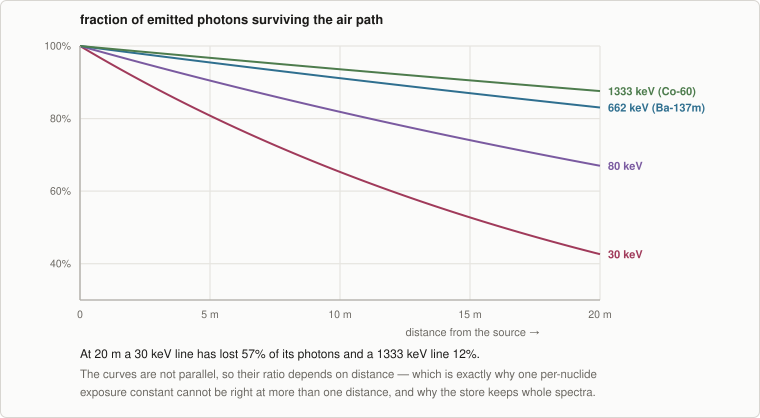

# Exposure

The photon transport model: an unshielded point source in air, evaluated line by line. What each
term is, what it excludes, and how much the exclusions are worth.

← [Interval integration](interval-integration.md) · [Methodology index](README.md) · next: [Ranking and forecasting](ranking.md)

---

## 1. The model, in full

$$
k(E) \;=\; \underbrace{\frac{e^{-\mu_{\text{air}}(E)\,d}}{4\pi d^{2}}}_{\text{spreading and path}}
\;\cdot\; \underbrace{E \cdot 1.602176634\times10^{-19}}_{\text{eV} \to \text{J}}
\;\cdot\; \underbrace{(\mu_{en}/\rho)_{\text{air}}(E)}_{\text{air kerma, CPE}}
\;\cdot\; \underbrace{\frac{3600}{0.00876}}_{\text{kerma} \to \text{R/h}}
\;\cdot\; B
$$

$$
\dot{X} \;=\; A_{\text{Bq}} \sum_j y_j \, k(E_j) \qquad [\text{R/h}]
$$

with `μ_air(E) = (μ/ρ)_air(E) · ρ_air` in m⁻¹, `y_j` the absolute intensity of line *j* in photons
per decay, and `B` the scatter buildup factor (1.0 by default — uncollided photons only).

Term by term:

| Term | What it does | Where it comes from |
| --- | --- | --- |
| `1/(4πd²)` | Point-source spreading | Geometry |
| `exp(−μ_air·d)` | Photons removed along the air path | NIST μ/ρ × air density |
| `E · 1.602e-19` | Energy fluence rather than photon fluence | Exact SI |
| `(μ_en/ρ)_air` | Energy actually absorbed in air, assuming charged-particle equilibrium | NIST |
| `3600 / 0.00876` | Air kerma per hour → roentgen per hour | Roentgen definition |
| `B` | Scattered photons | The user's assumption, made explicit |

Everything downstream is this coefficient times a per-nuclide activity, so exposure is a linear
functional of the same atom counts every other metric uses — see
[the index](README.md#the-one-design-decision-everything-follows-from).

The photon metric rides on the same kernel. Dropping the three energy-deposition terms — the eV→J
conversion, the mass energy-absorption coefficient, and the kerma-to-roentgen scale — leaves

$$
f(E) \;=\; \frac{e^{-\mu_{\text{air}}(E)\,d}}{4\pi d^{2}} \cdot B \qquad [\text{photons}/(\text{m}^2\,\text{s}\,\text{Bq}) \text{ per photon/s emitted}]
$$

the fluence rate at the point per becquerel. `pointFluenceCoeff` and `pointExposureCoeff` share
the spreading-and-attenuation factor rather than computing two, so the two metrics cannot
disagree about what the air path does to a photon; the unit test suite pins the ratio at exactly
the kerma conversion. The photon-metric weights that use these coefficients are
[Ranking §2](ranking.md#2-weights-are-the-metric-definition).

## 2. Why the sum cannot be collapsed

`μ_air` is energy-dependent, so `exp(−μ_air(E)·d)` sits **inside** the sum over lines and cannot
be factored out of it.

<p align="center">
  
</p>

The curves are not parallel. Their ratio depends on distance, so **no single per-nuclide constant
is correct at more than one distance**. That is the physical reason the data store persists whole
spectra rather than one number per nuclide ([Nuclear data §3](nuclear-data.md#3-why-whole-spectra-not-one-constant-per-nuclide)),
and the reason the geometry can be changed at runtime with no restage.

## 3. Air coefficients

Dry air, from the NIST X-Ray Mass Attenuation Tables (Hubbell & Seltzer, NISTIR 5632), converted
from cm²/g to m²/kg. **The grid is NIST's own, not a resampling** — keeping their energy points
means the interpolation error is only what log-log interpolation introduces between tabulated
values, with nothing added by a prior regridding step.

Interpolation is **log-log** rather than linear because both coefficients are close to power laws
in energy over each interval; interpolating linearly on a grid this coarse would misplace values
by percent-level amounts in exactly the few-hundred-keV region where most decay photons sit.

Outside 10 keV – 10 MeV both coefficients are **clamped** to the end value. For the shipped
ENDF/B-VIII.1 store that affects 5705 lines across 1471 nuclides, nearly all soft X-rays — a
count `nusift data info` reports rather than leaving to be discovered. Their contribution is an
order-of-magnitude figure, and in practice any real source encapsulation absorbs them before they
reach air.

Air density is a parameter (`--air-density`, default 1.205 kg/m³, dry air at ~20 °C and one
atmosphere) because a site at elevation is meaningfully thinner.

## 4. The gamma constant is the vacuum special case

With no attenuation the exponential is 1 and the `1/(4πd²)` factors out, leaving a
distance-independent constant — the only configuration in which a per-nuclide scalar is a
complete description of a spectrum:

$$
\Gamma \;=\; \frac{1}{4\pi}\sum_j y_j \, E_j \cdot 1.602\times10^{-19} \cdot (\mu_{en}/\rho)(E_j) \cdot \frac{3600}{0.00876}
$$

This is what published tables give, usually as R·cm²/(h·mCi), so it is what to compare against a
reference. **It is not what NuSIFT uses to compute an exposure rate** — `exposureRate()` sums over
lines with attenuation inside the sum.

It does make a useful check. From the shipped store:

```console
$ nusift data nuclide Ba-137m
  gamma constant   3.472 R.cm2/(h.mCi)  (vacuum, at 1 m)
$ nusift data nuclide Co-60
  gamma constant   12.91 R.cm2/(h.mCi)  (vacuum, at 1 m)
```

Ba-137m's 3.472, multiplied by the ~94.7% branch from Cs-137 to the isomer, gives **3.29** — the
figure usually tabulated for a Cs-137 source, about 3.3. Nothing in NuSIFT was fitted to produce
that: the constant falls out of the equilibrium ratio and the staged line intensities. It is
also, honestly, an identity rather than an independent check — a tabulated "Cs-137" constant *is*
the Ba-137m constant times the branch, because Cs-137 emits almost nothing itself (§5).

Co-60's 12.91 against a commonly quoted 13.0–13.2 needs more care, because **the published values
disagree with each other by more than any of them disagrees with NuSIFT**.

Start with what cannot be responsible. Γ(Co-60) is two lines, and it is pinned:

| Perturbation | Δ |
| --- | --- |
| Both intensities forced to exactly 1.0 | +0.07% |
| Both lines collapsed onto the 1.25 MeV NIST grid point — no interpolation at all | −0.00% |
| Linear interpolation instead of log-log | +0.12% |

No change to the decay data or to the interpolation moves the number by a quarter of a percent.
The gap is in the conversion convention, and it decomposes:

| Term | Worth |
| --- | --- |
| The roentgen depends on `W/e`, revised 33.7 → 33.85 (ICRU 1979) → 33.97 J/C. Anything tabulated before that revision reads high. | +0.75% |
| An air *kerma* rate constant uses the mass energy-**transfer** coefficient; exposure needs mass energy-**absorption**. | +0.32% |
| Air-coefficient evaluation: NISTIR 5632 log-log against Hubbell 1969 / Hubbell & Seltzer 2001 cubic-spline. | ~0.5% |

[Ninkovic & Adrovic](https://cdn.intechopen.com/pdfs/32834/intech-air_kerma_rate_constants_for_nuclides_important_to_gamma_ray_dosimetry_and_practical_application.pdf)
recalculated these constants precisely because "published data are in strong
disagreement", and got 309.0 µGy·m²/(GBq·h) for Co-60. In the modern roentgen that is **13.05**;
in the pre-1979 roentgen it is **13.15** — the classic 13.2. Same physics, different decade.

Like-for-like against that recalculation — their >20 keV cut, their transfer coefficients —
NuSIFT sits **0.8% low** on Co-60 and **0.9% low** on Ba-137m. One uniform offset in the air
table, not a Co-60 problem. The Cs-137 comparison only *looked* cleaner because 3.3 is quoted to
two significant figures and cannot resolve a percent.

That comparison is not confined to these two nuclides. [validation.md](validation.md) applies
each published table's own low-energy cutoff to fifty-odd nuclides across two independent
tabulations and reports every residual, regenerated on each change. It is also where the size of
the cutoff convention is made visible: summing the whole spectrum against a table that counts
only photons above 20 keV disagrees by up to a factor of ten on the X-ray emitters, none of it
physics.

The residual is **not** scatter that an uncollided calculation omits. These constants are vacuum
quantities by definition: "a point source of a unit activity of the nuclide in a vacuum … no
self-attenuation, no air scatter" ([Peplow 2020](https://doi.org/10.1097/HP.0000000000001136)).

## 5. Photons are attributed to the nuclide that emits them

This is a modeling choice with visible consequences. NuSIFT attaches each line to its actual
emitter, so a Cs-137 source's exposure is attributed to **Ba-137m**, not to Cs-137:

| Nuclide | Discrete lines | Strongest |
| --- | --- | --- |
| Cs-137 | 1 | 283.5 keV × 5.8e-6 |
| Ba-137m | 7 | 661.7 keV × 0.899 |

A ranking therefore names the 2.55-minute daughter rather than the 30-year parent. That is the
physically correct attribution, and it is what makes the published constant fall out of the
equilibrium ratio rather than having to be folded into a table. It also means a reader who
expected "Cs-137" has to be told why they got "Ba-137m" — which is what the mass-chain aggregate
is for ([Ranking §3](ranking.md#3-aggregation)).

The alternative is worse than untidy, and the tables that take it say so themselves. Unger &
Trubey's Cs-137 entry is the product of the 94.6% branch and their computed Ba-137m constant,
added as a convenience, and it carries a warning: applied to a data set holding activities of
*both* Cs-137 and Ba-137m, it double-counts photons that only ever came from the daughter
([Peplow 2020](https://doi.org/10.1097/HP.0000000000001136), §Methods). NuSIFT's inventory is
exactly such a data set — it evolves both nuclides — so a folded-in constant would be a live bug
rather than a hypothetical one. Attributing each line to its emitter makes it unrepresentable.

## 6. Units

The metric computes **two** physical quantities, and which one you get is decided by the unit
rather than displayed by it:

| Unit | Quantity | Kernel |
| --- | --- | --- |
| R, R/h | photon exposure in air | native |
| Gy, Gy/h | air kerma | × 0.00876 Gy/R |
| Sv, Sv/h | **ICRP 116 effective dose** | fluence × ICRP 116 Table A.1, per irradiation geometry |

The roentgen is defined as 2.58e-4 C/kg, which with a mean ionization energy of 33.97 J/C gives
8.76e-3 Gy per R. That constant relates the two air-kerma units to each other and does nothing
else: **a sievert is not a multiple of an air kerma.** It is computed down its own path —
uncollided fluence at the point, times ICRP 116's fluence-to-effective-dose coefficient for the
photon's energy, summed line by line — and shares only the geometry with the roentgen beside it.

Note which factor is absent from that path: air's mass energy-absorption coefficient. Effective
dose does not care what air would have absorbed. The phantom calculation behind ICRP's table
already carries what a body absorbs, and applying µ_en/ρ as well would count the interaction
twice.

### The irradiation geometry is half of the answer

Effective dose is defined for a person standing in a field, so it depends on how they stand.
NuSIFT defaults to **AP** — facing the source, the most exposing orientation for the organs
carrying the largest tissue weights, and the one screening reaches for — and `--irradiation`
selects among ICRP's six (AP, PA, LLAT, RLAT, ROT, ISO). The choice is printed in the report
header beside the distance, because a sievert with no irradiation geometry named is as
incomplete as an exposure with no distance. It is not a small effect: for Am-241 at 1 m, AP
gives 5.18e-3 Sv/h where ISO gives 2.47e-3.

### What this replaced, and why it mattered

Until the kernel existed, the sievert column was air kerma multiplied by a photon radiation
weighting factor of 1 — a number that is not effective dose to a person, and that this document
apologised for. Against
[Peplow's](https://doi.org/10.1097/HP.0000000000001136) tabulation of ICRP 116 effective dose
(AP) per unit activity, in mSv·h⁻¹·MBq⁻¹ at 1 m:

| Nuclide | old air-kerma Sv | NuSIFT effective dose | ICRP 116 |
| --- | --- | --- | --- |
| Co-60 | 3.057e-4 | 3.058e-4 | 3.062e-4 |
| Ba-137m | 8.221e-5 | 8.230e-5 | 8.228e-5 |
| Am-241 | 2.802e-5 | 5.506e-6 | 5.413e-6 |

The old column's agreement on the first two was a coincidence of energy — effective dose per
fluence happens to track air kerma per fluence near 1 MeV — and it did not survive going soft.
83% of Am-241's constant sits below 20 keV, where those photons load air kerma heavily and
deposit little effective dose, so the label overstated the hazard to a person fivefold. That row
is now 1.02 rather than 5.18.

The residual 2% on Am-241 is the table's low-energy floor rather than the physics. ICRP 116
starts at 10 keV; one Am-241 line sits below that and takes the floor's coefficient, carrying
1.5% of the computed total. Excluding it the ratio is 1.002. Clamping overstates a soft photon's
dose rather than understating it, which is the direction to be wrong in, and
`isOutsideTabulatedDoseRange()` names the energies it happens to.

**What a sievert here is still not**: it is not H\*(10), the operational quantity a survey meter
reads — that needs ICRP 74, which NuSIFT does not carry — and it is not the dose to any
particular person. Effective dose is a protection quantity defined on reference phantoms with
sex-averaged, tissue-weighted organ doses, for setting and checking limits.

Interval-domain exposure carries one more correction: the rate is computed per **hour** while the
integral weights atom-**seconds**, so an accrued exposure has a spurious factor of an hour taken
back out at the same point as the unit conversion and nowhere else. See
[Ranking §2](ranking.md#2-weights-are-the-metric-definition).

## 7. What is not modeled, and what it costs

Each of these would **raise** a reported exposure, so every NuSIFT exposure is a lower bound in
the direction of all four:

**Scattered photons.** The default buildup factor is 1.0 — uncollided fluence only. For a bare
source at a meter in air this is a percent-level correction; at range it is not. Buildup is a
function of the optical depth of the path, μ_air(E)·d, and every exposure table carries that
depth averaged over the lines by the exposure each delivers. At a meter it is a few hundredths
of a mean free path; at 100 m a 662 keV photon sees 0.9 and a 100 keV photon 1.9. Past about
half a mean free path the scattered photons are tens of percent of the uncollided value, and
beyond one they exceed it, so a report whose path is that thick and whose buildup was left at
1.0 says so:

```
! the air path is 1.9 mean free paths at the energies carrying this exposure, and buildup
  is 1.0, so scattered photons are left out. Past about half a mean free path they
  add tens of percent to the uncollided value, and beyond one they exceed it. Set
  --buildup to include them.
```

The factor is one scalar applied to every line, which is an approximation of its own — buildup
is energy-dependent — so `--buildup` makes the assumption visible rather than making it right.
An energy-dependent buildup is the step past this model, not something it does.

**Source self-absorption.** A point source has no volume to absorb its own photons. A real source
with mass attenuates its own soft lines heavily.

**Bremsstrahlung and any continuous photon spectrum.** NuSIFT models discrete lines only. What is
missing is measured per nuclide at staging time and reported alongside the ranking:

```
! 1.9% of the emitted photon energy is in spectra NuSIFT does not model. The exposure
  understatement is of that order, and larger where the missing spectrum is
  softer than the lines, as bremsstrahlung usually is
```

That percentage is **activity-weighted**, not a count of flagged nuclides — a nuclide with a large
unmodeled fraction but negligible activity contributes negligibly to it, which is the whole point
of reporting a magnitude rather than a tally. It is a fraction of emitted *energy*, and exposure
per unit energy is not flat: μ_en/ρ climbs steeply below 100 keV, so a continuum softer than the
lines costs more exposure than its share of the energy. The footnote therefore says "of that
order" and which way the error leans, rather than claiming an equality it cannot.

**Beta, alpha, and neutron dose entirely.** NuSIFT reports photon exposure. A pure beta emitter
contributes exactly zero to it while being perfectly capable of dominating a contact dose.

And one gap that belongs to the evaluation rather than to the model: **1546 unstable nuclides in
ENDF/B-VIII.1 have an evaluated average photon energy but no discrete spectrum.** They contribute
zero to an exposure ranking while genuinely emitting photons. An exposure answer dominated by
short-lived exotic species is understated in a way the ranking cannot show, which is why
`nusift data info` states the count explicitly.

## 8. Geometry validation

A point source has no exposure rate defined at zero distance, so a non-positive distance is an
input error rather than an infinity. Negative air density and non-positive buildup are refused
the same way. These are checked on every coefficient evaluation rather than once at construction,
because the geometry is a plain value type a caller can assemble however it likes.

## 9. Source map

| File | Role |
| --- | --- |
| [`nusift/exposure/point_source.hpp`](../nusift/exposure/point_source.hpp) | The model, the geometry parameters, and the exclusions — stated in the header |
| [`nusift/exposure/point_source.cpp`](../nusift/exposure/point_source.cpp) | `pointExposureCoeff`, `pointFluenceCoeff`, `pointEffectiveDoseCoeff`, `gammaConstant`, and the per-becquerel sums |
| [`nusift/exposure/air_coefficients.cpp`](../nusift/exposure/air_coefficients.cpp) | The NIST table and the clamped log-log interpolation |
| [`nusift/exposure/dose_coefficients.cpp`](../nusift/exposure/dose_coefficients.cpp) | ICRP 116 Table A.1, the six irradiation geometries, and the same clamped log-log interpolation |
| [`nusift/units.hpp`](../nusift/units.hpp) | The roentgen definition |
| [`nusift/nucdata/photon_lines.hpp`](../nusift/nucdata/photon_lines.hpp) | `GammaLine`, absolute intensities, the discrete-energy sum, and the photon yield |
