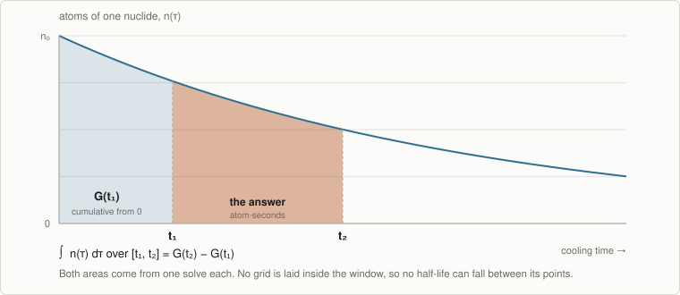
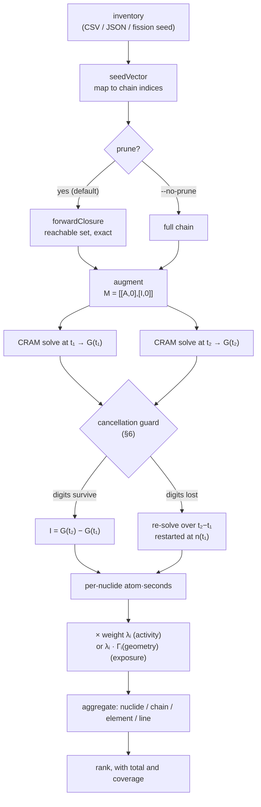
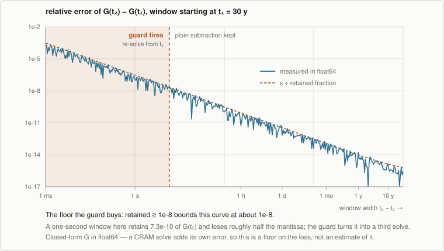
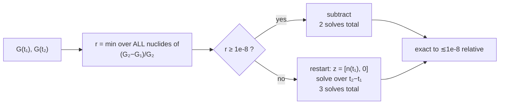

# Interval integration

How NuSIFT answers *"how much happens between t₁ and t₂"* — total decays over a window,
exposure accrued between two cooling times — and why the answer does not depend on a time
grid, a step size, or the half-lives in the source.

← [The decay solve](decay-solve.md) · [Methodology index](README.md) · next: [Exposure](exposure.md)

**The short version.** The interval integral is computed in closed form by augmenting the
decay matrix, so it is exact for any window regardless of what decays inside it. There is no
quadrature to refine and nothing half-life-aware to tune. The one adaptive decision in the
whole path is about floating-point conditioning, not physics: when subtracting two cumulative
integrals would destroy the significant digits, the window is re-solved directly.

---

## 1. The question this method answers

`nusift rank --at 30d` evaluates a rate at an instant. `nusift integrate --interval 0,1y`
answers a different kind of question — one whose answer is a *total*, not a rate:

| Question | Domain | Weight applied to | Unit |
| --- | --- | --- | --- |
| What is the activity right now? | instant | atoms | Bq, Ci |
| How many decays occur over the window? | interval | atom·seconds | decays |
| What is the dose rate right now? | instant | atoms | R/h, Gy/h, Sv/h |
| What dose is accrued over the window? | interval | atom·seconds | R, Gy, Sv |

Both columns come from the same engine. The instant domain reads per-nuclide atom counts; the
interval domain reads per-nuclide **atom·seconds**, the time integral

$$
I_i(t_1, t_2) \;=\; \int_{t_1}^{t_2} n_i(\tau)\, \mathrm{d}\tau
$$

Everything NuSIFT reports over a window is a fixed per-nuclide or per-line weight times that
quantity — which is why ranking by nuclide, mass chain, element, or gamma line over an
interval is a post-multiply rather than four code paths.

## 2. Why there is no adaptive quadrature

A natural expectation is that integrating over a window means sampling n(τ) at a set of times
and summing — and that the sample times should tighten where short-lived nuclides are churning,
because that is where a coarse grid would miss the action. Early in a fission-product decay,
the top contributors turn over in seconds.

NuSIFT does none of this, because it never discretises the window. The integral is obtained in
closed form from the same matrix exponential that produces the inventory. A quadrature rule has
a truncation error that depends on how the grid resolves the integrand; this construction has
no such term. A window of `0,1y` over a chain whose leaders live for seconds is exact, and it
is exact for the same reason and to the same degree as a window of `10y,30y`.

<p align="center">
  
</p>

So the answer to *"does it adapt the integration to the half-lives present?"* is **no, and it
has nothing to gain by doing so.** Where half-lives genuinely do drive the choice of times is a
different feature — the *forecast* grid (§9), which resolves *when* leadership changes rather
than *how much* accumulates.

## 3. The augmented system

Under pure decay the transition matrix **A** is constant, so the state and its running integral
satisfy one linear system together. Stacking them:

$$
M \;=\; \begin{bmatrix} A & 0 \\ I & 0 \end{bmatrix}
\qquad
z_0 \;=\; \begin{bmatrix} n_0 \\ 0 \end{bmatrix}
\qquad
e^{Mt} z_0 \;=\;
\begin{bmatrix}
  e^{At} n_0 \\[2pt]
  \int_0^{t} e^{A\tau} n_0 \,\mathrm{d}\tau
\end{bmatrix}
$$

The bottom-left identity block is the whole trick: it says *ẏ = x*, so the second block of the
state is by construction the running integral of the first. One CRAM solve at *t* therefore
returns both the inventory and the exact cumulative integral **G**(*t*) — no quadrature, and no
error term that depends on a time grid.

```
 M = [ A  0 ]        the decay matrix, unchanged
     [ I  0 ]        ẏ = x  →  y accumulates ∫x dτ

 top block of exp(Mt)z₀   →  n(t)          [atoms]        →  instantaneous metrics
 bottom block             →  G(t)          [atom·s]       →  interval metrics
```

Because the integral arrives free with the inventory, there is no configuration in which NuSIFT
computes one without the other, and no separate "plain A" path that could drift out of
agreement with the augmented one. `DecayResult` carries both matrices and nothing else:

```
atoms(k, i)           = n_i(t_k)
integratedAtoms(k, i) = ∫₀^{t_k} n_i(τ) dτ        [atom·s]
```

Source: [`nusift/engine/decay_engine.hpp`](../nusift/engine/decay_engine.hpp),
[`nusift/engine/decay_result.hpp`](../nusift/engine/decay_result.hpp),
`augment()` in [`decay_engine.cpp:119`](../nusift/engine/decay_engine.cpp#L119).

**Cost note.** The augmented matrix is 2*m* × 2*m* rather than *m* × *m*, so a solve is more
expensive than the un-augmented one would be. The added block is a plain identity — as sparse
as a block can be — and the integral would otherwise need its own machinery, so this is the
cheap way to have it.

## 4. Pruning, and why it does not approximate anything

*Summarised here because it applies to every solve; the full treatment with measurements is in
[The decay solve §3](decay-solve.md#3-pruning-exact-and-the-largest-single-lever).*

Before augmenting, the chain is restricted to the nuclides forward-reachable from the seed
(`forwardClosure()`, [`decay_engine.cpp:59`](../nusift/engine/decay_engine.cpp#L59)).
Reachability is read off the decay matrix's own sparsity — `A(j,i) ≠ 0` means *i* produces *j* —
so it captures decay daughters, branching, and spontaneous-fission products uniformly, and it
cannot disagree with the matrix that is actually solved.

This is exact, not a truncation. The reachable set is closed under production, so every nuclide
outside it is identically zero for all time and contributes nothing to any integral. What it
buys is large, because sparse LU cost grows superlinearly — see the measurements in §8.

`--no-prune` solves the full chain and must produce the same numbers, more slowly. It exists as
a check, not as a higher-fidelity mode.

## 5. The algorithm, end to end



Entry point: `intervalIntegral()`,
[`decay_engine.cpp:300`](../nusift/engine/decay_engine.cpp#L300).

**When t₁ = 0** the lower endpoint needs no solve at all — G(0) is zero by definition and the
inventory there is the seed — so a window starting at zero costs exactly one solve and can
never trigger the guard.

## 6. Cancellation, and the guard

`G(t₂) − G(t₁)` is the obvious way to get an interval from two cumulative integrals, and it is
correct in exact arithmetic. In float64 it has a failure mode that gets worse precisely where a
user is most likely to be looking carefully: a **narrow window late in the decay**, where both
integrals are large and nearly equal.

Take a Cs-137 source and ask for one second at 30 years:

```
G(t₁)  = 6.83477546827050138e+28  atom·s
G(t₂)  = 6.83477547327972682e+28  atom·s
         ↑──────┬──────↑
         8 identical leading digits, subtracted away

G(t₂) − G(t₁) = 5.0092254425660785e+19
stable form   = 5.0092258821288985e+19      ← ∫ = (n₀/λ)·e^{−λt₁}·(1 − e^{−λΔt})
                       ↑
                relative error 8.8e-08, from inputs good to 1e-16
```

The governing quantity is the **retained fraction** — how much of G(t₂) survives the
subtraction:

$$
r \;=\; \frac{G(t_2) - G(t_1)}{G(t_2)}
\qquad\Longrightarrow\qquad
\text{relative error} \;\approx\; \frac{\varepsilon}{r}
$$

Measured, over twelve decades of window width:

<p align="center">
  
</p>

### The decision



Three properties of this guard are worth stating plainly, because each is a deliberate choice:

**It measures, rather than predicts.** The threshold is applied to the retained fraction that
actually came out of the two solves. Guessing from the window width instead would require
knowing which decay constants are in play, which is exactly the half-life-dependent tuning this
design avoids.

**The floor sets an error bound.** With `kCancellationFloor = 1e-8` and machine epsilon near
1e-16, taking the subtraction only when *r* ≥ 1e-8 bounds its relative error at roughly 1e-8.
That is the meaning of the constant: not a heuristic, a contract.

**It is judged over the worst nuclide in the chain, so it usually fires.** The minimum is taken
over every nuclide, not the ones that matter to the ranking, so one saturated trace species
sends the whole solve down the re-solve path. On a full chain that is the ordinary case for any
t₁ > 0 — expect three factorizations, not two. The trade is deliberate: one extra solve to keep
the more accurate result, always in that direction.

The re-solve path restarts the augmented system at t₁ with a **zeroed integrator block** and the
decayed inventory n(t₁) on top, then solves over the width t₂ − t₁. The bottom block then
accumulates only over the window, so nothing large is ever subtracted.

Source: [`decay_engine.cpp:343-372`](../nusift/engine/decay_engine.cpp#L343-L372).

## 7. From atom·seconds to a number a user reads

The engine stops at atom·seconds. `buildIntervalResponse()`
([`response.cpp:599`](../nusift/triage/response.cpp#L599)) applies the weight, and it is the
*same* weight the instantaneous path uses — which is why Domain is a separate axis from Metric
rather than two more metrics:

| Metric | Weight `weightFor()` | × atoms | × atom·seconds |
| --- | --- | --- | --- |
| Activity | λᵢ | Bq | decays (dimensionless count) |
| Exposure | λᵢ · (exposure per Bq, over the photon lines, with air attenuation inside the sum) | R/h | R, once the hour is removed |

That last row carries the one unit subtlety in the path. Exposure is computed **per hour**,
because that is how a rate is quoted, while the interval domain weights atom-**seconds** — so an
integrated exposure carries a spurious factor of an hour. `domainScale()`
([`response.cpp:89`](../nusift/triage/response.cpp#L89)) takes it back out, at the same point as
the unit conversion and nowhere else. Activity has no such mismatch: becquerel against
atom-seconds is already a plain count of decays.

Units are also gated by domain, so the two can never be mixed up in a report: `decays`, `R`,
`Gy`, and `Sv` are interval-only; `Bq`, `Ci`, `R/h`, `Gy/h`, and `Sv/h` are instant-only. Asking
for `--units Bq` on an `integrate` run is refused with *"is a rate and cannot express a
time-integrated total"* rather than silently returning a number in the wrong domain.

## 8. Cost, measured

A 20 kt U-235 thermal fission source over the full ENDF/B-VIII.1 store (3828 nuclides), one
window of `1d,30d`, Release build on this machine:

| Configuration | Wall clock | Note |
| --- | --- | --- |
| store open only (`data info`) | 0.042 s | the floor every run pays |
| pruned (default) | ≈0.11 s | ~0.07 s of actual solving |
| `--no-prune` | 1.54 s | same numbers, full chain |

Pruning is worth roughly 15× here, which is why it is the default and why it had to be exact
rather than approximate.

Two further cost properties, both of which follow from the code rather than from measurement:

- **Intervals are solved sequentially and `--threads` does not help them.** `intervalIntegral()`
  builds one solver and uses it. Threading is a property of the multi-*time* path in `decay()`,
  where each time is an independent factorization; a single window has at most three solves and
  they are serially dependent (the guard needs both endpoints before it can choose, and the
  re-solve needs n(t₁)).
- **Each `--interval` re-prepares from scratch.** The CLI loop
  ([`nusift.cpp:410`](../nusift_apps/nusift.cpp#L410)) re-seeds, re-prunes, and re-augments per
  window, so N windows cost N times a single window. This is deliberate at the reporting layer:
  each window gets its own index space and therefore its own footnote about which contributors
  carry unmodelled continuum, which would otherwise be attributed to the wrong ranking.

## 9. What this method does not do

**It does not show turnover inside the window.** An interval produces one ranking, of totals
accumulated across the whole window. For an early fission source the leaders churn within
minutes, and the window total will not show that:

```console
$ nusift integrate --seed-fission U-235 --yield-kt 20 --interval 0,1h --top 6
NuSIFT activity ranking by nuclide
  t = 0 s to 1 h    total = 1.0489e+25 decays

   #  contributor       decays     frac      cum
   1  Cs-139        1.8190e+23     1.7%     1.7%
   2  Y-95          1.8160e+23     1.7%     3.5%
   3  Sr-93         1.8041e+23     1.7%     5.2%
   4  Xe-137        1.7610e+23     1.7%     6.9%
   5  Sr-94         1.7581e+23     1.7%     8.5%
   6  Xe-138        1.7313e+23     1.7%    10.2%

  shown rows cover 10.2% of the total; 835 further contributors omitted
```

That flat, long-tailed distribution is the honest answer to "how many decays over the first
hour, by nuclide" — early on, hundreds of products contribute comparably. It is *not* the answer
to "who leads, and when does that change". For that, use `forecast`, whose resolution in time is
exactly the grid you ask for:

```bash
nusift forecast -i inventory.csv --times 1h:300y:log:80 --metric exposure
```

Nothing in the forecast path is half-life-aware either: `forecast.cpp` contains no half-life
logic at all, and the only place a half-life influences a report is as a tiebreak between
near-equal contributors in the ranking. A log grid dense enough to resolve early churn is the
user's responsibility, and dominance windows can only ever be as sharp as the grid.

**It has no Python binding.** `nusift.decay()` exposes `result.integrated_atoms`, which is the
*cumulative* G(t) from zero, and `nusift.response()` builds instant-domain tables only. Getting
an interval from Python today means differencing two cumulative rows yourself — which is the
unguarded path of §6, without the guard. For narrow late windows, prefer the CLI.

**Not modelled at all** (unchanged from the instantaneous path): scatter buildup beyond an
explicit `--buildup` factor, source self-absorption, bremsstrahlung, and beta or neutron dose.
Photon energy the store carries as continuum is reported as an understatement footnote rather
than silently dropped.

## 10. Using it

```bash
# How many decays in the first year?
nusift integrate -i inventory.csv --interval 0,1y

# Dose accrued at 2 m over the first 30 days, in roentgen
nusift integrate -i inventory.csv --interval 0,30d --metric exposure --units R --distance 2

# Several windows in one run, by mass chain
nusift integrate -i inventory.csv --by mass-chain \
  --interval 0,1h --interval 1h,1d --interval 1d,30d --interval 30d,1y
```

A real run of the README's example inventory:

```console
$ nusift integrate -i inventory.csv --interval 0,1y --top 5
NuSIFT activity ranking by nuclide
  t = 0 s to 1 y    total = 8.3992e+21 decays

   #  contributor       decays     frac      cum
   1  Cs-137        3.7436e+21    44.6%    44.6%
   2  Ba-137m       3.5452e+21    42.2%    86.8%
   3  Sr-90         5.5768e+20     6.6%    93.4%
   4  Y-90          5.5188e+20     6.6%   100.0%
   5  Co-60         8.7529e+17    0.01%   100.0%

  shown rows cover the entire total
```

Ba-137m sitting just under its Cs-137 parent is the expected signature of a short-lived daughter
in secular equilibrium: over a long window it decays very nearly once per parent decay, reduced
by the ~94% branch from Cs-137 to the isomer.

### Additivity, checked against the tool

Adjacent windows must sum to the whole. From actual runs (`--format csv`), Cs-137 decays:

| Window | Decays |
| --- | --- |
| `0,11y` | 3.679576909168867e+22 |
| `11y,30y` | 4.5221536315948296e+22 |
| **sum** | **8.201730540763697e+22** |
| `0,30y` (direct) | 8.201730540763697e+22 |

Identical to every digit printed — and the two legs took different code paths, since the
`11y,30y` leg has t₁ > 0 and went through the guard.

## 11. Verification

| Test | What it pins down |
| --- | --- |
| `IntervalIntegralMatchesAnalytic` | A general window matches the difference of analytic Bateman integrals to 1e-9 relative |
| `AdjacentIntervalsAreAdditive` | Adjacent windows sum to the whole — catches a restart that carries the wrong inventory into the second leg, which no single-window test would see |
| `NarrowLateIntervalSurvivesCancellation` | A 1 s window at ~30 y matches a stable closed form, *and* beats the unguarded subtraction |
| `RejectsBackwardsInterval` | Zero-width and reversed windows are input errors, not silent zeros |
| `IntervalLineTotalMatchesTheNuclideTotal` | Aggregating an interval by gamma line totals the same as by nuclide |
| `IntervalColumnsAreLinesRatherThanNuclides` | …and actually produces line columns, not just a matching total |

In [`tests/unit/test_decay_engine.cpp`](../tests/unit/test_decay_engine.cpp) and
[`tests/unit/test_triage.cpp`](../tests/unit/test_triage.cpp).

The cancellation test deserves a note, because its first draft was wrong in an instructive way:
it used `G(t₂) − G(t₁)` as the reference. That is the very cancellation under test, so it cannot
serve as its own control — it reported an expected value of zero. The reference has to be a form
that does not cancel:

$$
\int_{t_1}^{t_2} n_0 e^{-\lambda\tau}\,\mathrm{d}\tau
= \frac{n_0}{\lambda} e^{-\lambda t_1}\left(1 - e^{-\lambda \Delta t}\right)
$$

evaluated with `expm1` for the second factor, which stays accurate when λΔt is tiny.

## 12. Source map

| File | Role |
| --- | --- |
| [`nusift/engine/decay_engine.hpp`](../nusift/engine/decay_engine.hpp) | The augmented-system derivation, and the contract for both entry points |
| [`nusift/engine/decay_engine.cpp`](../nusift/engine/decay_engine.cpp) | `forwardClosure`, `restrict`, `augment`, `decay`, `intervalIntegral` |
| [`nusift/engine/decay_result.hpp`](../nusift/engine/decay_result.hpp) | The two matrices the engine produces, and nothing else |
| [`nusift/triage/response.cpp`](../nusift/triage/response.cpp) | `weightFor`, `domainScale`, `buildIntervalResponse` |
| [`nusift/triage/response.hpp`](../nusift/triage/response.hpp) | `Domain`, and the unit/domain pairing rules |
| [`nusift_apps/nusift.cpp`](../nusift_apps/nusift.cpp) | `runIntegrate`, `parseInterval` |
| [`docs/figures/make_figures.py`](figures/make_figures.py) | Regenerates the two data-driven figures (numpy only) |

---

*Figures in §2 and §6 are drawn from float64 arithmetic on a closed-form exponential, not from a
NuSIFT run: the conditioning of G(t₂) − G(t₁) is a property of the numbers, not of the solver
that produced them. A CRAM solve carries its own error on top, so the loss plotted in §6 is a
floor on what the subtraction costs, not an estimate of it.*
