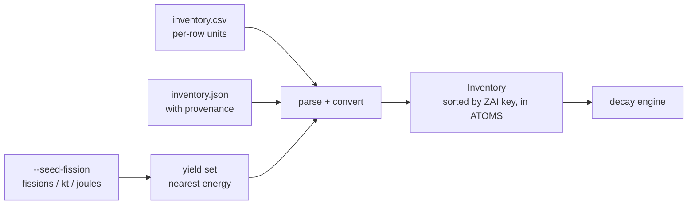

# Inventory and seeding

Every route to a starting atom count: a file in whatever units each row happens to carry, or a
fission source sized by fission count, kilotons, or joules.

← [Nuclear data](nuclear-data.md) · [Methodology index](README.md) · next: [The decay solve](decay-solve.md)

---

## 1. The one thing the engine accepts

The engine takes exactly one thing: **a vector of atom counts over chain indices**. Everything in
this document exists to produce that vector honestly, and to refuse rather than guess when it
cannot.



An `Inventory` is a sorted-by-key list of `(ZAI, atoms)`. Adding the same nuclide twice
**accumulates** rather than replacing, so a file listing a nuclide on several rows — a common
result of merging sources — sums the way a reader expects:

```console
$ cat inventory.csv
# comment
nuclide,quantity,unit
Cs-137,1,Ci
Cs-137,2,Ci

$ nusift rank -i inventory.csv --at 0 --units Ci
   #  contributor           Ci     frac      cum
   1  Cs-137        3.0000e+00   100.0%   100.0%
```

## 2. The CSV format

Three columns, with a deliberately tolerant reader — the people who have inventories have them
in spreadsheets:

```
# comments, blank lines, and a UTF-8 BOM are all accepted
nuclide, quantity, unit
Cs-137,  1.2e14,   Bq
Sr-90,   3.5,      g
Co-60,   0.8,      Ci
```

A header row is **detected, not required**. Each row carries its own unit, so an inventory
assembled from three sources that each quoted a different quantity needs no pre-conversion —
which is exactly when a hand conversion gets made once and wrong.

JSON is the secondary format. It round-trips provenance, which CSV cannot carry, and it is what
a programmatic layer hands back and forth. The parser is chosen by extension: `.json` for JSON,
anything else CSV.

**An unknown nuclide is an error by default.** `--ignore-unknown` downgrades it to a reported
skip, because a silently dropped row understates every ranking that follows with nothing in the
output to say so.

## 3. Converting to atoms

| Input | Conversion | Needs |
| --- | --- | --- |
| atoms | identity | — |
| mol | `× N_A` | — |
| g, kg, mg | `× grams / M · N_A` | staged atomic weight ratio |
| Bq, kBq, MBq, GBq, TBq | `× Bq / λ` | a non-zero decay constant |
| Ci, mCi, µCi | `× Bq/Ci / λ` | a non-zero decay constant |

Molar mass comes from the staged ENDF atomic weight ratio, `M = AWR · m_n`, **not from A**. The
A-as-molar-mass approximation is wrong by about 0.1% for mid-A nuclides and considerably worse
for light ones, and silently applying it would put an unattributable error into every
mass-specified inventory. So a store without atomic weights refuses the conversion:

> `cannot convert mass for Xx-99: the data store carries no atomic weight ratio (stage from ENDF, or give this nuclide in atoms, moles, or an activity unit)`

Likewise, an activity is meaningless for a stable nuclide, and the refusal says why rather than
returning zero or infinity:

```console
$ nusift rank -i inventory.csv --at 1d
nusift: inventory file: inventory.csv line 1: inventory: Fe-56 is stable, so an activity
cannot be converted to an atom count (N = A/lambda is undefined); give it in atoms, moles,
or a mass unit
```

Every error names the file and line. The conversion is reversible — `fromAtoms()` is what lets
an inventory be written back out in a chosen unit — and a row that cannot be expressed in the
requested output unit falls back to atoms **and is marked**, rather than aborting the write or
emitting a wrong number.

## 4. Atom counts are validated at the door

An atom count must be non-negative and finite, checked when it enters the inventory rather than
downstream. The reason is that both failures are silent:

- a **negative** seed decays into negative activities, which rank as the smallest contributors
  and vanish off the bottom of every table;
- a **NaN or infinity** propagates through CRAM into a column of NaNs whose origin is no longer
  visible by the time anyone sees it.

Neither produces an error on its own. Both produce a plausible-looking report.

## 5. Seeding from fission

A fission source reduces to a count of fissions, specifiable three ways:

```
fissions = kt · 4.184e12 J/kt ÷ (MeV_per_fission · 1.602176634e-13 J/MeV)
fissions = joules ÷ (MeV_per_fission · 1.602176634e-13)
fissions = given directly
```

### The energy-per-fission choice is not a detail

Fission releases about 200 MeV in total, but only about **180 MeV appears promptly**. The
remainder arrives as delayed beta and gamma energy over the following hours and days — which is
precisely the decay NuSIFT is being asked to model, so counting it as part of the driving yield
would double-count it.

| `--mev-per-fission` | Value | Fissions per kiloton | When |
| --- | --- | --- | --- |
| `explosive` (default) | 180 MeV | 1.45e23 | An explosive yield in kt |
| `recoverable` | 200 MeV | 1.31e23 | Reactor energy release |
| *a number* | as given | — | Anything else |

The two differ by 11% in **every** downstream number. Neither is wrong; picking silently would
be — which is why it is a named parameter and why the resolved fission count appears in the
provenance line of every run:

```
seed: fission: U-235 at thermal (0.0253 eV), 2.902e+24 fissions, 996 products, sum Y_indep = 2
```

That line records what was actually used: the resolved incident energy (snapped to the nearest
tabulated set — see [Nuclear data §4](nuclear-data.md#4-fission-yields)), the fission count, how
many products were seeded, and the yield sum.

### The sanity check that catches the wrong ENDF section

Independent yields sum to about 2.0, because fission makes two fragments. A materially different
sum means cumulative yields (MT459) were staged instead of independent ones (MT454) — and every
number downstream is then wrong by that factor. The check is one addition, and without it the
mistake stays invisible until someone compares against a reference:

```
if (totalYield < 1.8 || totalYield > 2.2)
    provenance += "  [WARNING: independent yields should sum to about 2.0]";
```

Products the chain does not know are counted and reported in the same line rather than dropped
silently. In practice closure registers every yield product, so that count is belt-and-braces —
but a silent drop there would quietly lose inventory.

If the store has no yields for the requested nuclide, the error **lists the parents it does
have**. The set of fissionable nuclides in an evaluation is small, so listing it beats leaving
the user to guess which spelling or which nuclide the store actually knows.

## 6. Worked example

```console
$ nusift rank --seed-fission U-235 --energy thermal --yield-kt 20 --at 1h --metric exposure --top 4
NuSIFT exposure ranking by nuclide
  t = 1 h    total = 5.3257e+09 R/h
  model: point source at 1 m, air attenuation on, uncollided only
  seed:  fission: U-235 at thermal (0.0253 eV), 2.902e+24 fissions, 996 products, sum Y_indep = 2
  store: ENDF/B-VIII.1 (3828 nuclides, staged 2026-08-13T15:29:37Z)

   #  contributor          R/h     frac      cum
   1  Cs-138        8.5004e+08    16.0%    16.0%
   2  I-134         7.8393e+08    14.7%    30.7%
   3  La-142        4.3748e+08     8.2%    38.9%
   4  Te-134        2.8448e+08     5.3%    44.2%

  shown rows cover 44.2% of the total; 424 further contributors omitted
  ! 1.9% of the emitted photon energy is in spectra NuSIFT does not model,
```

Every input that shaped the answer is in the header: the fissile nuclide, the resolved energy,
the fission count, the product count, the yield-sum check, the geometry, and the evaluation. The
20 kt figure resolves to 2.902e24 fissions only because `explosive` was in force; the same
command with `--mev-per-fission recoverable` seeds 11% fewer.

## 7. Source map

| File | Role |
| --- | --- |
| [`nusift/engine/inventory.hpp`](../nusift/engine/inventory.hpp) | The `Inventory` type and the quantity enumeration |
| [`nusift/engine/inventory.cpp`](../nusift/engine/inventory.cpp) | `toAtoms`, `fromAtoms`, unit parsing, and the validity check |
| [`nusift/io/inventory_io.cpp`](../nusift/io/inventory_io.cpp) | The tolerant CSV reader, the JSON reader, and both writers |
| [`nusift/seed/seed_fission.cpp`](../nusift/seed/seed_fission.cpp) | Yield-set selection, seeding, and the provenance line |
| [`nusift/seed/fission_energy.hpp`](../nusift/seed/fission_energy.hpp) | kt ↔ joules ↔ fissions, and the 180/200 MeV choice |
