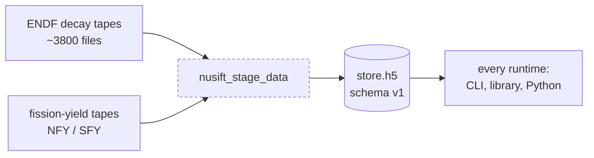
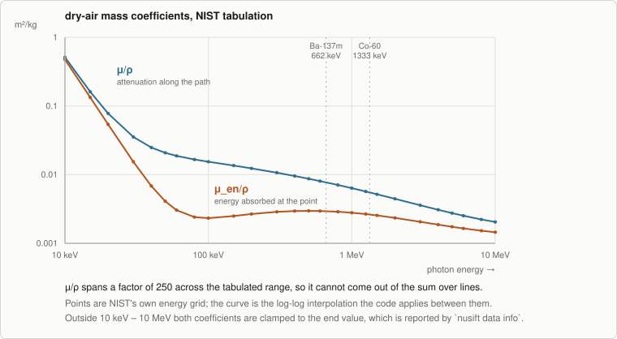
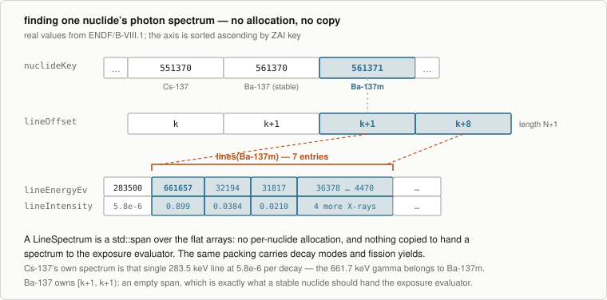
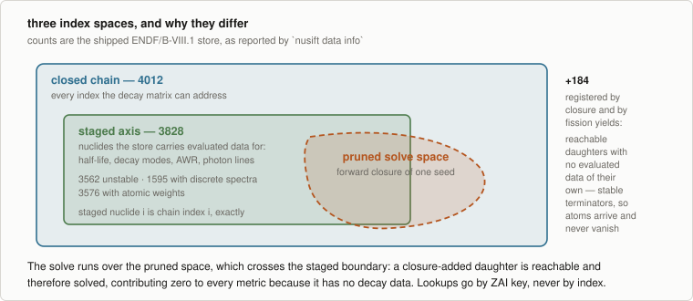

# Nuclear data

What the store holds, how ENDF tapes become a solvable chain, and why NuSIFT persists whole
photon spectra rather than one exposure constant per nuclide.

← [Methodology index](README.md) · next: [Inventory and seeding](inventory.md)

---

## 1. Two phases, and why they are separate

Staging is an **offline step, run once per evaluation**. It reads ENDF tapes and writes a
versioned HDF5 store. Production runs read that store in milliseconds with no ENDFtk anywhere in
the build.



The separation is structural, not a convenience. ENDFtk is a heavy dependency, and a build that
fetches it can never be installed — CMake rejects exporting a target whose interface names a
target that is never installed. So the staging tool is a separate configuration
(`NUSIFT_WITH_STAGING=ON`) that produces no installable artifacts, and the runtime library never
links it. It costs nothing in practice: a store is staged once, committed, and shipped inside
the wheel.

**Per-tape failures are skipped, not fatal.** An evaluation is hundreds of files and one
unparseable tape should cost that nuclide, not the whole store. Skips are reported to stderr.

## 2. What is read from ENDF, and by whom

Two readers run over the same MF8/MT457 sections, because they need different things:

| Field | Read by | Notes |
| --- | --- | --- |
| Half-life, decay modes, branching ratios, RFS | cram's ENDF reader | Feeds the depletion chain directly |
| Independent fission yields (MT454) | cram's reader | Never cumulative — see §4 |
| Atomic weight ratio | NuSIFT (`readExtras`) | Becomes molar mass; without it, gram input is refused |
| Average electromagnetic decay energy | NuSIFT | The reference the continuum shortfall is measured against |
| Discrete photon lines | NuSIFT | cram is deliberately a pure depletion library and carries no photon data |

**Intensities are made absolute at staging time.** ENDF gives a discrete normalisation factor
`FD` and a relative intensity `RI` per line; the store keeps `FD · RI`, in photons per decay.
Everything downstream is then a plain sum over lines with no normalisation left to remember —
which is what lets the exposure evaluation be written as a dot product.

**Two photon spectrum types are kept**: `STYP 0` (gammas) and `STYP 9` (X-rays and annihilation
radiation). Both are photons and both deposit energy in air. Beta and alpha spectra live in the
same record and are not photons, so they are skipped.

### The 511 keV double-counting check

Annihilation radiation is reported under STYP 9, but nothing stops an evaluation from *also*
carrying a 511 keV gamma under STYP 0. The exposure sum downstream is a plain sum over every
staged line, so an evaluation that lists it twice would double the strongest line of every
positron emitter.

Staging detects this and **warns rather than resolving it**: which of the two entries is the
duplicate is a judgement about that evaluation, and dropping the wrong one loses real data.
ENDF/B-VIII.1 makes the choice in neither direction, so the check is quiet on the shipped
tapes — which is the point of checking rather than assuming.

### Continuum photon energy, by shortfall

NuSIFT models discrete lines only. Photon energy in a continuous spectrum — most often
bremsstrahlung — is recorded per nuclide as

```
continuumPhotonEv = max(0, emEnergyEv − Σ_lines E·y)
```

Taken as the shortfall against the evaluated average rather than by integrating the continuum
record, which makes it robust to how an evaluation chose to represent the continuum and captures
anything else the lines miss. The clamp at zero matters: the average and the line sum come from
different parts of an evaluation and disagree by a few percent, so a small negative shortfall
means the lines account for everything, not that there is negative continuum.

This number is what lets a report distinguish *"this nuclide emits no photons"* from *"this
nuclide emits photons NuSIFT cannot model"*. Without it both look like a zero contribution, and
the second is a silent error. See [Exposure §7](exposure.md#7-what-is-not-modelled-and-what-it-costs).

## 3. Why whole spectra, not one constant per nuclide

This is the single most consequential storage decision in NuSIFT, and it is forced by physics
rather than chosen for completeness.

The air attenuation factor `exp(−μ_air(E)·d)` sits **inside** the sum over lines, and μ_air is
strongly energy-dependent — a factor of 250 across the tabulated range:

<p align="center">
  
</p>

Because the exponential cannot be factored out of the sum, **there is no single per-nuclide
constant that is correct at more than one distance**. A gamma constant is the vacuum special
case, where the exponential is 1 and the sum does factor.

Persisting the lines additionally buys three things a collapsed constant could never provide:
ranking of individual gamma lines, geometry changes at runtime with no restage, and a path to
shielding.

## 4. Fission yields

**Independent yields (MT454), never cumulative (MT459).** The chain feeds precursors into their
daughters explicitly, so seeding with cumulative yields would count every precursor decay twice.
A staged set that summed to far more than 2.0 would be the signature of that mistake, which is
why the seeding path checks it — see
[Inventory §5](inventory.md#the-sanity-check-that-catches-the-wrong-endf-section).

Yields are tabulated at a handful of incident energies. Staging probes the tape at
`{0, 0.0253 eV, 500 keV, 14 MeV}` — spontaneous, thermal, fast, fusion — and de-duplicates by
the energy actually returned, which recovers exactly the distinct sets the tape provides rather
than assuming a grid. At runtime, a request snaps to the **nearest tabulated energy**, so asking
for "fast" against an evaluation that tabulates only thermal gets thermal, and the resolved
energy is printed in the provenance line rather than left implicit.

## 5. The store format

Everything variable-length is CSR-packed: an offset array of length N+1 indexes into a flat
value array, so nuclide *i* owns `[offset[i], offset[i+1])`.

<p align="center">
  
</p>

Three properties of the layout are deliberate:

**Flat 1-D datasets.** The HDF5 file is readable by h5py or any other tool without knowing
NuSIFT's types. A store is inspectable without NuSIFT.

**The nuclide axis is sorted ascending by ZAI key.** Not an accident of how the chain was built:
it makes a restaged store byte-comparable against its predecessor, keeps golden tests stable, and
means NuSIFT never depends on the iteration order of whatever produced the data.

**Spans, not copies.** A `LineSpectrum` handed to the exposure evaluator is a `std::span` into
the flat array. No per-nuclide allocation, and nothing copied per evaluation.

The same packing carries decay modes, photon lines, fission yields, and the one-group activation
cross sections that are reserved in schema v1 and written empty — so adding activation later
forces neither a schema bump nor a restage of everything else.

### Provenance is per field, not per file

```
version, library, createdUtc, nusiftVersion, stagedTapeCount
decaySource, linesSource, yieldsSource     ← each: none | endf | openmc-chain-xml
```

Recorded per field because the ingestion paths cover different fields. An OpenMC depletion-chain
XML carries decay data, branchings, and fission yields but no photon lines and no atomic weight
ratios. A store built only from XML must therefore report that exposure and gram conversions are
*unavailable* rather than silently returning zeros.

Every store is validated on load by the same `validateStoreArrays()` that the in-memory
constructor uses — so a hand-built chain in a test is held to exactly the same CSR invariants as
a file, which is the point of having one validator rather than two.

## 6. From store to solvable chain

`NuclearData::fromArrays()` registers nuclides in store order, attaches decay data, loads
fission yields, and then **closes** the chain.

<p align="center">
  
</p>

**Staged nuclide *i* lands at chain index *i*, exactly.** The store axis is validated unique and
`add()` appends, so the per-nuclide arrays can be indexed by chain index with no translation
table. The constructor asserts this rather than assuming it.

**Closure registers every reachable daughter that was not staged.** Without it the matrix would
silently drop production into an unknown daughter and atoms would vanish. Closure-added nuclides
sit past the staged axis with all their per-nuclide data at defaults — no half-life, no lines —
which is precisely the stable-terminator behaviour they should have.

**`size()` is not coverage.** The closed chain is larger than the staged axis, and reporting it
as though it were the store's coverage overstates it by orders of magnitude: a store of three
nuclides plus one fission-yield set loads as a chain of twelve hundred. `stagedCount()` is the
honest number, and `nusift data info` prints both.

For the shipped ENDF/B-VIII.1 store: **3828 staged, 4012 in the closed chain** — 184 registered
purely as somewhere for atoms to land.

## 7. What the shipped store actually covers

The limits are measured per store rather than asserted in general. `nusift data info`:

```console
$ nusift data info
store:            data/nusift_b8.1.h5
schema version:   1
library:          ENDF/B-VIII.1
staged:           2026-08-13T15:29:37Z
tapes staged:     3821
nuclides staged:  3828
chain size:       4012  (staged, plus decay daughters and fission products
                       registered so nothing is produced into a gap)
decay data from:  endf
photon lines:     endf
fission yields:   endf

unstable nuclides:              3562
  with discrete photon lines:   1595
    of those, >5% continuum:    34
    of those, clamped lines:    1471
  emit photons, no spectrum:    1546
nuclides with atomic weights:   3576
```

Two of those lines are load-bearing limitations rather than statistics:

**1546 unstable nuclides emit photons with no discrete spectrum in this evaluation.** They have
an evaluated average photon energy but no lines, so they contribute *exactly zero* to an exposure
ranking while genuinely emitting photons. An exposure answer dominated by short-lived exotic
species is understated in a way the ranking itself cannot show. The tool says so in its own
output rather than leaving it to be discovered.

**5705 discrete lines across 1471 nuclides fall outside 10 keV – 10 MeV**, where the air
coefficients are clamped to the end value rather than interpolated. Their contribution is an
order-of-magnitude figure. Nearly all are soft X-rays, which any real source encapsulation
absorbs before they reach air — but the count is reported rather than assumed harmless.

## 8. Finding the store

One search order, in one place, used by every entry point — duplicating it once in the CLI and
again in a language binding is how two front ends end up quietly reading different evaluations
and reporting different answers to the same question:

1. an explicit `--store` path
2. `$NUSIFT_DATA_STORE`
3. caller-supplied paths (the Python package passes its bundled store here)
4. `<install prefix>/share/nusift/*.h5`, derived from the running executable
5. `./data/*.h5`, for working in a source tree

When nothing is found the error names **every** place it looked and gives the command that would
produce a store, because "no data store found" on its own leaves a new user with nowhere to go.

## 9. Source map

| File | Role |
| --- | --- |
| [`nusift_apps/nusift_stage_data.cpp`](../nusift_apps/nusift_stage_data.cpp) | The offline staging tool: ENDF in, HDF5 out |
| [`nusift/nucdata/store_arrays.hpp`](../nusift/nucdata/store_arrays.hpp) | The flat CSR representation and its provenance record |
| [`nusift/nucdata/store_arrays.cpp`](../nusift/nucdata/store_arrays.cpp) | `validateStoreArrays` — every CSR invariant, one place |
| [`nusift/nucdata/data_store.cpp`](../nusift/nucdata/data_store.cpp) | HDF5 read and write, schema versioning |
| [`nusift/nucdata/nuclear_data.cpp`](../nusift/nucdata/nuclear_data.cpp) | Chain construction, closure, and the runtime accessors |
| [`nusift/nucdata/photon_lines.hpp`](../nusift/nucdata/photon_lines.hpp) | `GammaLine`, `LineSpectrum`, and why lines are persisted |
| [`nusift/nucdata/fission_yield.cpp`](../nusift/nucdata/fission_yield.cpp) | Yield sets and nearest-energy selection |
| [`nusift/nucdata/store_locator.cpp`](../nusift/nucdata/store_locator.cpp) | The search order above |
