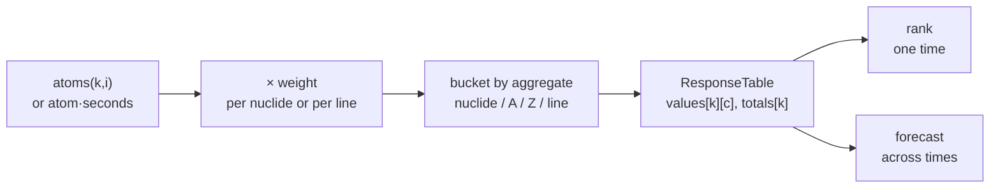
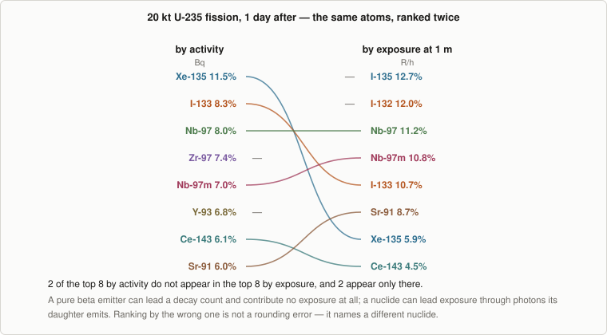
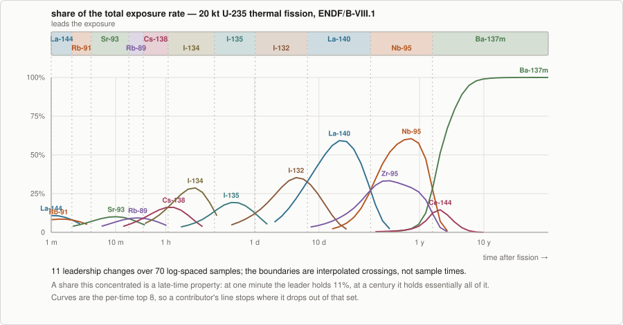

# Ranking and forecasting

Turning two matrices of atom counts into an answer: the weights that define each metric, the four
aggregations, the rules a ranking follows, and how a forecast decides who leads and when that
changes.

← [Exposure](exposure.md) · [Methodology index](README.md)

---

## 1. The response table

Everything in this document operates on one structure: a **contributors × times** table of
weighted values, plus a total per time.



The table records its own `metric`, `aggregate`, `domain`, and `unit`, so nothing downstream has
to be told again what it is holding — and a report cannot label a column with a unit the values
are not in.

## 2. Weights are the metric definition

`weightFor()` **is** the metric. Everything else in the response layer is bookkeeping over index
spaces:

| Metric | Weight | × atoms | × atom·seconds |
| --- | --- | --- | --- |
| Activity | `λᵢ` | Bq | decays |
| Exposure | `λᵢ · Σ_j y_j k(E_j)` | R/h | R |

Both metrics are λ times *something*: activity stops there, exposure carries on into the photon
spectrum. That shared factor is not a coincidence — every quantity NuSIFT reports is per-decay,
so it is proportional to the decay rate, and the metric is what each decay is worth.

**Domain is a separate axis from metric**, which is why the same weight serves both columns: λ
against atoms is a rate in becquerel; λ against atom-seconds is a count of decays. One weight,
two domains, no second definition to keep in agreement.

Two scalings are applied at one point and nowhere else — `unitScale` for the requested unit, and
`domainScale` for the hour that has to come out of an integrated exposure ([Exposure
§6](exposure.md#6-units)). Keeping them in a single place is what keeps the conversion from
creeping into the physics.

### Units are gated by both metric and domain

`decays`, `R`, `Gy`, `Sv` are interval-only; `Bq`, `Ci`, `R/h`, `Gy/h`, `Sv/h` are instant-only.
Asking for the wrong one is refused with a message that says which axis was violated:

```console
$ nusift integrate -i inventory.csv --interval 0,1y --units Bq
nusift: response: unit Bq is a rate and cannot express a time-integrated total
```

The set of units is enumerated once, and both the check and the error message that lists the
alternatives are built from it — so the message can never offer a unit the check would then
refuse.

## 3. Aggregation

Four aggregates, three of which bucket nuclides and one of which does not:

| `--by` | Bucket key | Label |
| --- | --- | --- |
| `nuclide` | ZAI | `Cs-137` |
| `mass-chain` | A | `A=140 (La-140)` |
| `element` | Z | `Ba (Ba-137m)` |
| `line` | one column per photon line | `Ba-137m 661.7 keV` |

**Buckets are named after their dominant member**, because `A=140` alone does not tell anyone
what to look at while `A=140 (La-140)` does. Dominance is taken as the largest single-nuclide
contribution *over the whole time grid*, not at one time, so a column's label does not change
identity partway down.

### The near-tie rule

A chain in secular equilibrium has every member at essentially the same activity, and whichever
edges ahead numerically is arbitrary — but the answer is not. Within a 1% band, the tie breaks
toward the **longer-lived** member:

> `A=90 (Sr-90)` is useful. `A=90 (Y-90)` points at the 64-hour daughter that merely follows it.

The long-lived parent is what controls the chain and what anyone acting on the ranking would
actually address.

### Line aggregation

A line's weight is `λᵢ · y_ij · k(E_j)`: the emitter's decay rate, the photons per decay at that
energy, and the geometry coefficient for that energy. Multiplied by the emitter's atom count it
gives what that one line contributes — the same atoms as every other aggregate, weighted more
finely.

A full evaluation carries on the order of 86000 lines (the figure the threshold was sized
against) and a fission seed reaches thousands of emitters, so columns are thresholded: a line contributing less than **1e-6 of its own emitter's** exposure is
dropped. Relative to the emitter rather than to the global total, deliberately — a global
threshold would erase the entire spectrum of every minor nuclide, and *"which line dominates this
nuclide"* is a question people ask.

## 4. What a ranking guarantees

```
sort descending by value, ties broken by contributor key   ← deterministic, not sort-order-dependent
stop at the first of: top N reached, coverage reached, fraction below --min-fraction, value ≤ 0
```

Three rules make the output honest rather than merely short:

**The total is over *all* contributors, not the shown ones.** A top-10 worth 40% and a top-10
worth 99% can never look alike, because both print the total and the covered fraction.

**Coverage is checked after appending**, so `--coverage 0.95` returns the smallest prefix that
*reaches* 95%, not the largest one that stays below it.

**The omitted count counts only contributors that actually contribute.** A chain always carries
stable terminators at exactly zero; reporting "3 further contributors omitted" beside "shown rows
cover 100%" is a contradiction that invites the reader to go looking for something that is not
there.

A zero or negative total makes every fraction meaningless. That happens legitimately — an
inventory of nothing but stable nuclides has no activity — so it produces an **empty ranking**
rather than an error or a division by zero.

### Pinning: the one knob that adds a row

`--top`, `--coverage` and `--min-fraction` all truncate. `--pin` is the only one that reaches
*past* the cut, and it exists because "which isotopes dominate" and "and where does Cs-137 stand
in all this" are different questions that a truncated ranking answers only by accident:

```
   #  contributor           Bq     frac      cum
   1  La-140        2.5574e+16    12.4%    12.4%
   ...
   8  Ru-103        1.0584e+16     5.1%    74.4%
  pinned:
  27  Cs-137        1.2962e+14   0.063%    99.6%
```

The design follows from one rule: **a pin must not change the ranking it was added to.** So the
prefix is selected exactly as it would have been, the pinned rows are appended *below* it rather
than merged into it, and each carries the rank and cumulative fraction it holds in the **full**
ordering — 27th, with everything down to it covering 99.6%. Sorting a pin into the prefix, or
renumbering the rows around it, would make a top-8 into something that is not one.

Three consequences follow from keeping the numbers true rather than convenient:

- **`coveredFraction` is a sum over the returned rows, not the cumulative of the last one.** With
  a pin below the cut those stop being the same number, and only the sum describes what the reader
  can actually see.
- **A pinned contributor that contributes nothing gets rank 0**, rendered `-`. This is a real
  answer, not a missing row: a pure beta emitter pinned in an exposure ranking contributes exactly
  zero, and a cumulative fraction is meaningless where nothing stands above. It was never in the
  omitted count either, so it cannot come out of it.
- **A pin that resolves to nothing is refused**, naming what it read and what the table ranks by.
  "Cs-137 is not in this chain" and "Cs-137 contributes nothing here" are different statements, and
  a silently empty pin makes the first look like the second.

A pin is named the way the aggregate in force names its contributors — `Cs-137`, `A=140` or `140`,
`Cs` or `Z=55` — and a **nuclide name works for every aggregate**, resolving to the bucket that
nuclide falls in. Someone who knows a nuclide name should not have to work out which isobar it
belongs to in order to follow it. In a gamma-line table a key names an *emitter*, so pinning one
pins every line of it the table carries; pinning a single line out of a spectrum is not offered,
since what is understated or overlooked is the nuclide.

Forecasting takes the same pins (§6). A ranking pin answers "where does it stand at this time"; a
forecast pin answers "what shape does it have over all of them", which is the question a list of
dominance windows structurally cannot answer about a contributor that never leads.

### Flags become footnotes

A contributor carrying more than 5% of its photon energy in an unmodelled continuum is flagged,
and the report footnotes the ranking with the **activity-weighted** magnitude of what is missing.
The flag is set for exposure only: an incomplete photon spectrum understates an exposure and says
nothing whatever about a count of decays, so an activity report carrying it would end with a
paragraph about a metric it never computed.

## 5. The same atoms, ranked twice

Activity and exposure routinely give different answers, which is the entire reason for ranking by
the one you care about rather than by a proxy:

<p align="center">
  
</p>

At one day after a 20 kt U-235 fission, Xe-135 leads the activity ranking at 11.5% and sits
seventh by exposure at 5.9%; I-135 and I-132 lead the exposure ranking and are outside the
activity top eight. A pure beta emitter can dominate a decay count and contribute no exposure at
all; a nuclide can dominate exposure through photons its *daughter* emits. Ranking by the wrong
one is not a rounding error — it names a different nuclide.

## 6. Forecasting: who leads, and when that changes

`dominanceWindows()` walks the grid, records the leader at each sample, coalesces consecutive
samples with the same leader into runs, and turns each run into a window.

<p align="center">
  
</p>

Three decisions shape what comes out:

**Boundaries are interpolated crossings, not sample times.** Between consecutive samples both
contenders are close to exponential, so `log(a/b)` is close to linear in time and its zero is the
crossing. Reporting the sample index instead would quantise every boundary to the grid. When the
ratio does not actually change sign across the interval — which happens only if the caller asked
about the wrong interval — it falls back to the midpoint.

**Runs the grid barely resolved are absorbed** (`minSamples`, default 2). Near a crossover two
contenders trade places sample to sample within numerical noise, and reporting six one-sample
windows is less truthful than reporting one boundary. Neighbours that end up the same contributor
after absorbing are merged.

**Ties break on contributor key**, for the same reason ranking does: without it the leader can
appear to change at a crossover purely from sort order.

The tracks alongside the windows answer a different question. `unionTopN` returns everything that
was ever in the top N at any sample, sorted by **peak share** — ordering by value at any single
time would bury exactly the contributor a forecast exists to surface. `persistentTopN` keeps only
those that never left the top N, which is the "steady concern" list rather than the "was briefly
important" one.

Pinned tracks are appended after both, flagged, and reported with the best rank they hold
**anywhere** on the grid alongside where they peak — deliberately two different times, since a
share is measured against the total and a shrinking total can lift a rank while the share falls.
A contributor that never leads has no window and never enters `unionTopN`, so without a pin the
forecast has no way to say that Cs-137 peaks at 68 years and gets no closer to the top than
ninth. A pinned contributor that contributes nothing anywhere is reported as exactly that.

The resolution of all of this is the grid you ask for. Nothing in the forecast path is
half-life-aware, so a log grid dense enough to resolve early churn is the user's responsibility —
see [Interval integration §9](interval-integration.md#9-what-this-method-does-not-do).

## 7. Reporting

Three formats — `text`, `csv`, `json` — from one set of ranking objects, so the numbers cannot
differ between them. Every text report carries a header naming the store, its library and staging
date, the seed provenance, and the geometry when the metric is exposure. For a triage answer the
inputs that produced it are part of it.

Each `--interval` gets its **own** report context rather than sharing the last one. The set of
contributors carrying unmodelled continuum is a property of that window, and building one context
from the last table footnotes every ranking with the last window's emitters — which need not
appear in the ranking they annotate. Pins are resolved per interval for the same reason: each is
solved over its own index space, so a pin naming something one window's chain does not reach is
refused for that window rather than silently dropped from one report out of several.

The text writer separates pinned rows under a `pinned:` heading and prints `-` where a contributor
holds no rank; CSV and JSON carry a `pinned` column and field instead, because a loaded table that
cannot tell a row that placed from one fetched below the cut cannot tell a top-N from a top-N plus
an aside. The CSV column is last, so adding it renumbered nothing anyone already reads by position.

## 8. Source map

| File | Role |
| --- | --- |
| [`nusift/triage/response.hpp`](../nusift/triage/response.hpp) | `Metric`, `Domain`, `Aggregate`, `Unit`, the pairing rules, and `ResponseTable` |
| [`nusift/triage/response.cpp`](../nusift/triage/response.cpp) | `weightFor`, `unitScale`, `domainScale`, `assemble`, `assembleLines`, the unmodelled-energy accounting, and `requirePin` |
| [`nusift/triage/ranking.cpp`](../nusift/triage/ranking.cpp) | Sorting, stop conditions, coverage, the omitted count, and the pinned tail |
| [`nusift/triage/forecast.cpp`](../nusift/triage/forecast.cpp) | `dominanceWindows`, crossing interpolation, `unionTopN`, `persistentTopN` |
| [`nusift/io/report.cpp`](../nusift/io/report.cpp) | Text, CSV, and JSON writers, and the provenance header |
