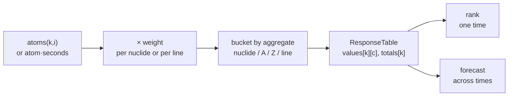
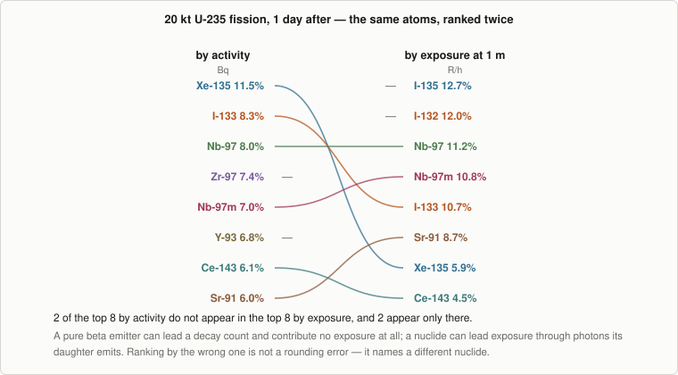
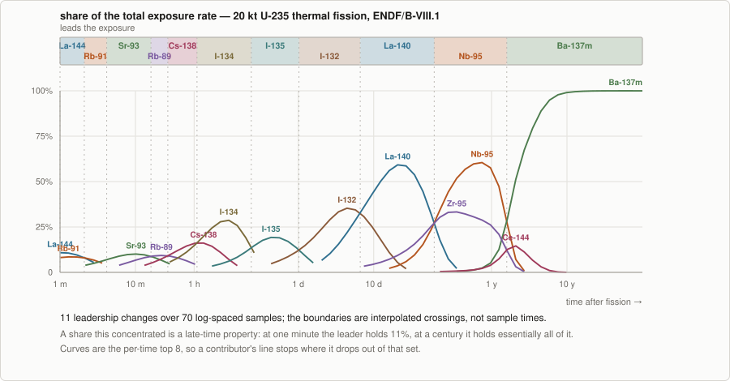

# Ranking and forecasting

Turning two matrices of atom counts into an answer: the weights that define each metric, the four
aggregations, the rules a ranking follows, and how a forecast decides who leads and when that
changes.

← [Exposure](exposure.md) · [Methodology index](README.md) · [Seed attribution](attribution.md) →

---

## 1. The response table

Everything in this document operates on one structure: a **contributors × times** table of
weighted values, plus a total per time.


```mermaid
flowchart LR
    A["atoms(k,i)<br/>or atom·seconds"] --> W["× weight<br/>per nuclide or per line"]
    W --> B["bucket by aggregate<br/>nuclide / A / Z / line"]
    B --> T["ResponseTable<br/>values[k][c], totals[k]"]
    T --> R["rank<br/>one time"]
    T --> F["forecast<br/>across times"]
```

The table records its own `metric`, `aggregate`, `domain`, and `unit`, so nothing downstream has
to be told again what it is holding — and a report cannot label a column with a unit the values
are not in.

## 2. Weights are the metric definition

`weightFor()` **is** the metric. Everything else in the response layer is bookkeeping over index
spaces:

| Metric | Weight | × atoms | × atom·seconds |
| --- | --- | --- | --- |
| Activity | `λᵢ` | Bq | decays |
| Exposure | `λᵢ · Σ_j y_j k(E_j)` | R/h | R |
| Photon | `λᵢ · Σ_j y_j` · `λᵢ · Σ_j y_j f(E_j)` | photons/s · photons/m²/s | photons · photons/m² |
| Heat | `λᵢ · (E_em + E_lp + E_hp)ᵢ` | W | J |

Every metric is λ times *something*: activity stops there; exposure and photon fluence carry on
into the photon transport (`k(E_j)` and `f(E_j)` of [Exposure §1](exposure.md#1-the-model-in-full));
photon strength stops at the discrete photon yield, `Σ_j y_j`; and decay heat stops at a
per-nuclide constant, the sum of ENDF MT457's three average decay energies. Photon strength and
heat are both geometry-free — properties of the inventory alone rather than of a place — which is
what makes them the ones to compare inventories with before a site has been chosen.

**Decay heat is the RECOVERABLE energy, not the Q value**, because the evaluation excludes the
neutrinos: for a beta emitter that is roughly half the disintegration energy, so the difference
is not a rounding correction. Nor is it the heat *deposited* anywhere. Where the three components
stop differs by orders of magnitude — heavy particles within microns, light ones within
millimeters, electromagnetic energy leaving a small source entirely — so a retained-versus-escaped
split needs a geometry this layer does not have. The metric is the source term, and the three
energies are kept separately accessible on `NuclearData` for whoever builds that split.

There is deliberately **no watt-per-gram unit**. Specific power is a ratio of two responses rather
than a response, so it is not a fixed weight: a per-nuclide W/g weight summed against atoms
produces a number that is not the mixture's specific power and means nothing at all. It belongs
above this layer, where both totals are in hand. That shared factor is not a coincidence — every
quantity NuSIFT reports is per-decay, so it is proportional to the decay rate, and the metric is
what each decay is worth.

**Domain is a separate axis from metric**, which is why the same weight serves both columns: λ
against atoms is a rate in becquerel; λ against atom-seconds is a count of decays. One weight,
two domains, no second definition to keep in agreement.

Two scalings are applied at one point and nowhere else — `unitScale` for the requested unit, and
`domainScale` for the hour that has to come out of an integrated exposure ([Exposure
§6](exposure.md#6-units)). Keeping them in a single place is what keeps the conversion from
creeping into the physics.

### Units are gated by both metric and domain

`decays`, `R`, `Gy`, `Sv`, `photons`, `photons/m2` are interval-only; `Bq`, `Ci`, `R/h`, `Gy/h`,
`Sv/h`, `photons/s`, `photons/m2/s` are instant-only.
Asking for the wrong one is refused with a message that says which axis was violated:

```console
$ nusift integrate -i inventory.csv --interval 0,1y --units Bq
nusift: response: unit Bq is a rate and cannot express a time-integrated total
```

The set of units is enumerated once, and both the check and the error message that lists the
alternatives are built from it — so the message can never offer a unit the check would then
refuse.

## 3. Aggregation

Four aggregates, three of which bucket nuclides and one of which does not:

| `--by` | Bucket key | Label |
| --- | --- | --- |
| `nuclide` | ZAI | `Cs-137` |
| `mass-chain` | A | `A=140 (La-140)` |
| `element` | Z | `Ba (Ba-137m)` |
| `line` | one column per photon line | `Ba-137m 661.7 keV` |

**Buckets are named after their dominant member**, because `A=140` alone does not tell anyone
what to look at while `A=140 (La-140)` does. Dominance is taken as the largest single-nuclide
contribution *over the whole time grid*, not at one time, so a column's label does not change
identity partway down.

### The near-tie rule

A chain in secular equilibrium has every member at essentially the same activity, and whichever
edges ahead numerically is arbitrary — but the answer is not. Within a 1% band, the tie breaks
toward the **longer-lived** member:

> `A=90 (Sr-90)` is useful. `A=90 (Y-90)` points at the 64-hour daughter that merely follows it.

The long-lived parent is what controls the chain and what anyone acting on the ranking would
actually address.

### Line aggregation

A line's weight is `λᵢ · y_ij · k(E_j)`: the emitter's decay rate, the photons per decay at that
energy, and the geometry coefficient for that energy — the fluence coefficient `f(E_j)` for a
photon fluence unit, and nothing at all for photon strength, where the weight is `λᵢ · y_ij` and
a line is ranked by its intensity rather than the energy it carries. Multiplied by the
emitter's atom count it gives what that one line contributes — the same atoms as every other
aggregate, weighted more finely.

A full evaluation carries on the order of 86000 lines (the figure the threshold was sized
against) and a fission seed reaches thousands of emitters, so columns are thresholded: a line
contributing less than **1e-6 of its own emitter's** value for the metric in force is dropped.
Relative to the emitter rather than to the global total, deliberately — a global
threshold would erase the entire spectrum of every minor nuclide, and *"which line dominates this
nuclide"* is a question people ask. A dropped line still counts toward the table's total — it
contributes, it just has no column — so the total by line is the total by nuclide exactly, and
the coverage a line ranking reports stays a true fraction of the whole.

## 3a. The energy axis: a source term rather than a ranking

Line aggregation collapses the atoms onto individual lines and then ranks them, which answers
*which line*. Collapse the emitters instead and keep the energy, and the same weights give a
**binned emission spectrum** — the source term a transport code reads, from `nusift source` and
`binned_spectrum()`.

The quantity is emission, and there is deliberately no geometry in it:

```
emission(bin b) = Σᵢ λᵢ · nᵢ(t) · Σ_{j : E_j ∈ b} y_ij        [photons/s]
```

Instantaneously that is photons per second; against atom·seconds it is a *count* of photons over
the window, integrated exactly, which is the right source for a job that runs while the inventory
decays under it. The fluence units are refused here, because a fluence has already had an
inverse-square applied and handing that to MCNP would apply the geometry twice.

**No floor.** The 1e-6 relative threshold above exists so a table stays readable; a histogram has
no such excuse, since binning collapses the rows anyway. Every evaluated line is placed, and the
identity

```
Σ_b emission(b) + belowRange + aboveRange = total
```

holds to floating point. That is the whole audit. A grid that does not reach Tl-208's 2.6 MeV line
is not *wrong* — it is short by a number the report states, in the deck as well as on screen.

### What the deck must say that the code cannot infer

A ranking is read by a person who can weigh a footnote. A source deck is read by MCNP, which
cannot, and whatever the deck does not say is simply not true of the run. So three things travel
as comment cards at the top of both formats:

| | MCNP `SDEF` | OpenMC |
| --- | --- | --- |
| Absolute rate | `SP` is normalized to unity, so the card carries the **shape**; the emission rate is printed for an `FM` multiplier | recorded in `strength=`, which OpenMC also does not apply — tallies score per source particle either way |
| Geometry | `POS`/`CEL`/`RAD`/`AXS` are the user's; unset, MCNP puts a point at the origin | `space=` is a placeholder `Point` to replace |
| Units | boundaries in MeV | boundaries in eV, one probability per bin (`len(p) == len(x) - 1`) |

Both decks also carry the unmodeled-continuum fraction, and this is the metric where it matters
most. Everywhere else in NuSIFT that flag understates a number a person is about to read; here it
understates a *source*, and the shortfall propagates through someone else's transport run where
nothing downstream knows to doubt it.

One loss is inherent and is stated rather than mitigated: bin totals are exact, but the discrete
lines inside a bin cannot be recovered from the bin. A detector-resolution question wants the line
list of §3, not this.

## 3b. The smallest list that works everywhere

`--coverage 0.95` on a ranking answers *which nuclides are 95% of this, **here***: one metric, one
instant. A monitoring list poses a different question — which nuclides are 95% of it
***everywhere***, across every metric that matters and every time on the grid, as one list — and
the second is not obtainable by repeating the first.

The union of each time's 95% prefix is a set nobody chose. It is as large as the worst time makes
it, it carries whatever the other times happened to rank highly, and nothing about it is minimal.
Worse, a union of *per-metric* lists guarantees nothing about the metrics jointly: a nuclide
dropped from the activity list because it ranked eleventh there may be the one holding up the
exposure floor two decades later.

So it is a covering problem over the values matrices that already exist:

```
choose S minimising |S|   subject to   Σ_{c ∈ S} value(r, t, c) ≥ f_r · total(r, t)
                                       for every requirement r and every time t
```

`robustTriageSet()` runs a deterministic greedy over it — `nusift shortlist`, and
`nusift.shortlist` from Python. On a 20 kt U-235 fission source over 1 h to 100 y, 40 points,
holding 95% of **both** activity and exposure at every one of the 80 constrained points:

| | nuclides |
| --- | --- |
| union of the per-time 95% prefixes, both metrics | 86 |
| the covering answer | **74** |
| candidates it chose from | 1045 |

The union is not *wrong* — it over-delivers, holding 97.1% at its worst point rather than the 95%
asked for. It is simply not minimal, and it was not chosen. Adding the exposure requirement to the
activity one costs exactly **one** further nuclide (73 → 74), which is the sort of thing only a
joint answer can tell you.

### Every constraint counts once, whatever it is measured in

The greedy scores a candidate by what it closes of the constraints still unmet, and each of those
is counted as a **fraction of its own required coverage** before the sum is taken. Adding raw
shortfalls would be adding becquerels to sieverts per hour — the activity requirement's numbers are
twenty orders of magnitude larger, so the exposure requirement would have no say in who is chosen
at all, and the same question asked in curies rather than becquerels could come back a different
list. The normalisation is also what makes an early time and a late one weigh alike within a single
requirement: "95% at every time" makes each time an equal constraint, not one scaled by how much
activity happened to be present then.

### What the report leads with

Not the list. A list of seventy-four says nothing about whether it is comfortable or exactly on
the edge, so the **binding point** comes first — the (requirement, time) where the achieved
coverage is closest to the floor:

```
closest to failing: activity (Bq) at 16.23 d -- holds 95.0% against 95.0%
```

The order members are listed in is **not a ranking**, and the report says so. The second member is
whichever most improved the constraints still unmet *given* the first, which is usually not the
second largest contributor to anything. A member with a peak share of 0.2% is there to hold up one
particular instant; dropping it is exactly what the floor forbids.

### What it does not claim

Set cover is NP-hard and greedy is not exact. What comes back is a small set that meets the floor,
**not a proof that none smaller exists** — stated in the report rather than left to be assumed,
because "the smallest set" is what a reader will otherwise hear. Greedy is within a `ln n` factor
and in practice much closer, and an exact solver over ten thousand gamma lines would buy a nuclide
or two at a cost nobody asked for.

Two boundary cases are answered rather than thrown. A time where the metric is identically zero —
exposure from a fresh inventory of pure beta emitters — constrains nothing, and *nothing to cover
is covered*. And a floor above what a table can express is reported as a **shortfall** rather than
an error: a gamma-line total counts lines below the column threshold, so even every column
together can fall short of 100%, and the set returned is still the best one available.

## 4. What a ranking guarantees

```
sort descending by value, ties broken by contributor key   ← deterministic, not sort-order-dependent
stop at the first of: top N reached, coverage reached, fraction below --min-fraction, value ≤ 0
```

Three rules make the output honest rather than merely short:

**The total is over *all* contributors, not the shown ones.** A top-10 worth 40% and a top-10
worth 99% can never look alike, because both print the total and the covered fraction.

**Coverage is checked after appending**, so `--coverage 0.95` returns the smallest prefix that
*reaches* 95%, not the largest one that stays below it.

**The omitted count counts only contributors that actually contribute.** A chain always carries
stable terminators at exactly zero; reporting "3 further contributors omitted" beside "shown rows
cover 100%" is a contradiction that invites the reader to go looking for something that is not
there.

A zero or negative total makes every fraction meaningless. That happens legitimately — an
inventory of nothing but stable nuclides has no activity — so it produces an **empty ranking**
rather than an error or a division by zero.

### Pinning: the one knob that adds a row

`--top`, `--coverage` and `--min-fraction` all truncate. `--pin` is the only one that reaches
*past* the cut, and it exists because "which isotopes dominate" and "and where does Cs-137 stand
in all this" are different questions that a truncated ranking answers only by accident:

```
   #  contributor           Bq     frac      cum
   1  La-140        2.5574e+16    12.4%    12.4%
   ...
   8  Ru-103        1.0584e+16     5.1%    74.4%
  pinned:
  27  Cs-137        1.2962e+14   0.063%    99.6%
```

The design follows from one rule: **a pin must not change the ranking it was added to.** So the
prefix is selected exactly as it would have been, the pinned rows are appended *below* it rather
than merged into it, and each carries the rank and cumulative fraction it holds in the **full**
ordering — 27th, with everything down to it covering 99.6%. Sorting a pin into the prefix, or
renumbering the rows around it, would make a top-8 into something that is not one.

Three consequences follow from keeping the numbers true rather than convenient:

- **`coveredFraction` is a sum over the returned rows, not the cumulative of the last one.** With
  a pin below the cut those stop being the same number, and only the sum describes what the reader
  can actually see.
- **A pinned contributor that contributes nothing gets rank 0**, rendered `-`. This is a real
  answer, not a missing row: a pure beta emitter pinned in an exposure ranking contributes exactly
  zero, and a cumulative fraction is meaningless where nothing stands above. It was never in the
  omitted count either, so it cannot come out of it.
- **A pin that resolves to nothing is refused**, naming what it read and what the table ranks by.
  "Cs-137 is not in this chain" and "Cs-137 contributes nothing here" are different statements, and
  a silently empty pin makes the first look like the second.

A pin is named the way the aggregate in force names its contributors — `Cs-137`, `A=140` or `140`,
`Cs` or `Z=55` — and a **nuclide name works for every aggregate**, resolving to the bucket that
nuclide falls in. Someone who knows a nuclide name should not have to work out which isobar it
belongs to in order to follow it. In a gamma-line table a key names an *emitter*, so pinning one
pins every line of it the table carries; pinning a single line out of a spectrum is not offered,
since what is understated or overlooked is the nuclide.

Forecasting takes the same pins (§6). A ranking pin answers "where does it stand at this time"; a
forecast pin answers "what shape does it have over all of them", which is the question a list of
dominance windows structurally cannot answer about a contributor that never leads.

### Flags become footnotes

A contributor carrying more than 5% of its photon energy in an unmodeled continuum is flagged,
and the report footnotes the ranking with the **activity-weighted** magnitude of what is missing.
The flag is set for exposure and photon only: an incomplete photon spectrum understates a dose
and a photon count alike and says nothing whatever about a count of decays, so an activity report
carrying it would end with a paragraph about a metric it never computed.

An exposure or photon-fluence ranking carries one more footnote, for the omission the model makes
by default: when the air path is thicker than about half a mean free path at the energies
carrying the answer and `--buildup` was left at 1.0, the report says so and gives the optical
depth — see [Exposure §7](exposure.md#7-what-is-not-modeled-and-what-it-costs). Photon strength
names no distance and carries no such footnote, whatever the geometry record holds. Both caveats
travel with the JSON output, as `unmodeled_energy_fraction`, `mean_optical_depth`, and `buildup`.

## 5. The same atoms, ranked twice

Activity and exposure routinely give different answers, which is the entire reason for ranking by
the one you care about rather than by a proxy:

<p align="center">
  
</p>

At one day after a 20 kt U-235 fission, Xe-135 leads the activity ranking at 11.5% and sits
seventh by exposure at 5.9%; I-135 and I-132 lead the exposure ranking and are outside the
activity top eight. A pure beta emitter can dominate a decay count and contribute no exposure at
all; a nuclide can dominate exposure through photons its *daughter* emits. Ranking by the wrong
one is not a rounding error — it names a different nuclide.

## 5a. Coefficient packs: a metric that is data

Every metric above is a fixed weight per nuclide. Three of them are computed here -- lambda for
activity, a photon sum through a kernel for exposure and effective dose. Most of the rest are
not physics NuSIFT should be reimplementing at all: a transport index, an intake dose
coefficient, a gross alpha weight and a skin dose per unit contamination are published tables
someone else computed, and the only thing standing between them and this engine was that
`Metric` and `Unit` are closed enums.

A **pack** is such a table as data: CSV with a machine-readable header, read at runtime, with
`Metric::Pack` post-multiplying it exactly as every other metric is post-multiplied. CSV rather
than HDF5 or JSON because the version is part of the answer, so "what changed between editions"
has to be a question `git diff` can answer.

The header is all required, and each field is there because omitting it would make a number
uninterpretable rather than merely undocumented:

| field | why it cannot be defaulted |
| --- | --- |
| `pack`, `version` | A2 values change between editions of SSR-6; a number under an edition nobody chose cannot be reproduced |
| `quantity`, `unit` | the response has no other way to know what it is reporting |
| `basis` | whether the coefficient multiplies atoms, becquerel or grams -- getting it wrong scales every answer by a decay constant, silently |
| `domain` | a rate-like coefficient against an interval integral is a different quantity, not the same one summed |
| `progeny` | see below; it decides whether a chain double-counts |
| `source` | the citation, which is what makes the transcription checkable |
| `scenario` | optional, and part of the metric's identity when present: an absorption type, a particle size, an irradiation geometry |

### Coverage, not a count

A nuclide the pack does not carry is **flagged and counted against a coverage figure**, never
silently weighted zero. The figure is measured in the quantity the coefficients multiply -- the
pack's own basis -- because the response is zero for exactly the nuclides in question, so
weighting the missing ones by the coefficient they do not have would make coverage 100% by
construction.

It earns its place immediately. The shipped SSR-6 pack covers 100% of a stored waste inventory
and **23.4%** of a fission product mix one hour after irradiation, where most of the activity is
in short-lived nuclides the regulation does not list. The two totals look alike; only the
coverage line tells them apart, and it is printed whenever it is not complete.

### Folded progeny, and why it depends on the inventory

Published tables are often written in the "+D" convention, where a parent's coefficient already
includes its short-lived daughters. SSR-6's footnote (a) does exactly this for 75 of its parents
and 127 daughters -- Ba-137m inside Cs-137, Y-90 inside Sr-90, the radon chain inside Ra-226.
Against a chain that tracks those daughters explicitly this is a trap in both directions:
weighting the daughter as well counts it twice, and weighting neither while reporting it
uncovered understates the coverage figure by the nuclides that usually dominate.

So `progeny: folded` requires a per-row list of what each coefficient absorbs, and a folded
daughter is covered **through** its parent. Two properties of real tables make this less tidy
than it sounds, and both are in the shipped pack:

- **A daughter may hold its own row as well.** SSR-6 does this 36 times, and it is the
  regulation rather than an inconsistency: yttrium-90 shipped alone is limited by its own A2,
  and yttrium-90 accompanying strontium-90 is inside its parent's. Which applies is a question
  about the inventory, so the fold is resolved against the **seed** -- which also keeps a metric
  a fixed weight vector rather than one that moves down the time axis.
- **A daughter may be folded into several parents**, because chains nest and each parent's value
  covers everything below it. Tl-208 sits under Bi-212, Pb-212, Ra-224 and Th-228; any one of
  them being seeded accounts for it.

### What the shipped packs are

Three, and the differences between them are the format's whole argument:

| pack | quantity | basis | progeny | scenario |
| --- | --- | --- | --- | --- |
| `iaea-ssr6-a2` | A2 sum of fractions, dimensionless | activity | **folded**, 127 daughters into 75 parents | slow lung absorption, 2012 edition |
| `icrp119-ingestion-worker` | committed effective dose if the whole inventory were ingested, Sv | activity | excluded | worker, most restrictive f1 |
| `icrp119-inhalation-worker-5um` | the same by inhalation, Sv | activity | excluded | worker, 5 µm AMAD, most restrictive absorption type |
| `fgr15-air-submersion-adult` | effective dose rate in a contaminated cloud, Sv/s | **concentration**, per m³ | excluded | adult, semi-infinite cloud |
| `icrp74-ambient-dose-h10` | ambient dose equivalent rate H\*(10), Sv/s | **kernel**, per unit fluence | — | the quantity a survey meter reads |

The two ICRP packs are **progeny excluded** where SSR-6 is folded, and the reason is not a
convention difference but a physical one: an intake coefficient covers the daughters that grow
in *inside the body* after intake, which is a different population from the daughters already
present in the material — those are their own intake, with their own coefficients, and summing
each nuclide on its own terms is the standard treatment. A transport A2 value, by contrast,
absorbs the daughters that travel in the package.

They also demonstrate the point ranking exists to make. On one inventory at one instant, the
ingestion hazard is led by Cs-137 and the inhalation hazard by Sr-90, because strontium's
inhalation coefficient is an order of magnitude further above cesium's than its ingestion
coefficient is. Same atoms, same solve, different weight vector, different answer.

### The distributed source, and the input an inventory cannot supply

FGR-15's coefficients are per unit activity **concentration** — Sv·Bq⁻¹·s⁻¹·m³ for a cloud,
·m² for ground deposition — and an `Inventory` carries atoms. A concentration is atoms over an
extent, and nothing in the material says what that extent is, so `basis: concentration` requires
the caller to state it: `--extent 1e6`, in the unit the pack's `per` field declares. The number
is bare precisely so it cannot disagree with the pack about whether it is an area or a volume,
and the report prints it back, because the same inventory in ten times the volume gives a tenth
the dose rate.

Both mistakes are refused rather than one being quietly absorbed: a concentration pack with no
extent, and an extent handed to a pack that multiplies becquerel, which does not become a
different number when told how much space the becquerels occupy.

**The geometry is the assumption, and it is a large one.** These coefficients are computed for a
person inside a uniformly contaminated, semi-infinite cloud — infinite compared with the mean
free path of the photons carrying the dose, which in air at 1 MeV is of order a hundred meters.
A plume that is smaller, or not uniform, or not surrounding the person gives less, and no
coefficient can know that. The pack answers "what would standing inside a cloud of this
composition commit", not "what does the plume over there deliver", and its header says so.

It is also where the chain earns its keep. FGR-15 states that its coefficients exclude decay
products and that a parent and its progeny "should be combined only after consideration of the
equations describing production and decay of daughter radionuclides over time" — which is what
the solve underneath the ranking already is. Cesium-137's own submersion coefficient is
9.4e-17 and barium-137m's is 2.7e-14, so on a cesium inventory the barium carries 99% of the
dose rate and arrives there by ingrowth rather than by being tabulated with its parent.

An intake coefficient is `domain: instant` for a reason the field exists to catch: it multiplies
**becquerel**, so against an activity it gives sieverts, and against a time-integrated activity
in becquerel-seconds it would give sievert-seconds, which is not a quantity. The pack declares
the domain and the response layer refuses the other.

### The second shape: a curve against energy

Four of the five shipped packs are a published number per nuclide. The fifth is a **kernel** — a
curve against photon energy, which composes with the staged photon lines rather than replacing
them:

    weight(nuclide) = λ · Σ  intensity(line) · fluence(E, geometry) · κ(E)
                       lines

That is exactly the construction the built-in exposure and effective-dose metrics use, with κ
read from a file instead of compiled in. A fluence-to-dose conversion and a detector efficiency
curve are the same object to this code, and neither needs C++ to arrive — which was the whole
claim packs were meant to make good.

A kernel declares `shape: kernel` and `applies: fluence`, and has no `basis`: what it multiplies
is a photon line, and the decay constant and the intensity are not a choice. It carries no
nuclides either, so the coverage question changes shape with it. What a kernel can fail to speak
for is an **energy**, not a nuclide: a line outside the tabulated range takes a clamped value,
so coverage is the share of the answer that came from lines *inside* the range. On a cesium
field against ICRP 74 that is 99.99% — the missing ten-thousandth is cesium's L X-rays, below
the curve's 10 keV floor.

The first kernel closes the gap item 1 left open. H\*(10) is the operational quantity a survey
meter reads — defined in the ICRU sphere, designed to be measurable and to be a conservative
estimate of effective dose below about 10 MeV — and it is what makes a computed field comparable
with an instrument. On a cesium field it comes out at 10.99 Sv/h against the ICRP 116 effective
dose of 9.25 Sv/h, a ratio of 1.19, which is the published relationship between the two
quantities at 662 keV. The two curves were transcribed from two publications by two different
routes, one out of a text layer and one off an image scan, so their agreeing on that ratio is a
check on both.

### What a pack is not

A weighted sum, and nothing more. SSR-6's A2 table gives a **screening index** -- the sum of
fractions -- and not a classification: special form, fissile status, package type and the LSA
and SCO provisions all bear on what a consignment may be, and none of them is a weighted sum.
That rule layer sits above the weights, versioned with them, and is not in NuSIFT.

## 6. Forecasting: who leads, and when that changes

`dominanceWindows()` walks the grid, records the leader at each sample, coalesces consecutive
samples with the same leader into runs, and turns each run into a window.

<p align="center">
  
</p>

Three decisions shape what comes out:

**Boundaries are located crossings, not sample times.** A leader change is the ratio of the two
contenders passing one, and it is handed to the [event engine](#7-located-events-when-a-curve-reaches-a-value)
rather than located here: one code path places a crossing, so a boundary in a forecast and a
crossing from `when` cannot disagree about the same instant. Between consecutive samples both
contenders are close to exponential, so `log(a/b)` is close to linear in time and its zero is the
crossing — which is what the engine's log-linear interpolation of a positive level reduces to for
a ratio against one, so routing through it did not move any boundary. Reporting the sample index
instead would quantise every boundary to the grid. When the ratio does not actually change sign
across the interval — which happens only if the caller asked about the wrong interval — it falls
back to the midpoint. The overload taking a `ResponseEvaluator` refines each boundary by solving
inside its bracket, on the same terms and at the same cost as any other refined event.

**Runs the grid barely resolved are absorbed** (`minSamples`, default 2). Near a crossover two
contenders trade places sample to sample within numerical noise, and reporting six one-sample
windows is less truthful than reporting one boundary. Neighbours that end up the same contributor
after absorbing are merged.

**Ties break on contributor key**, for the same reason ranking does: without it the leader can
appear to change at a crossover purely from sort order.

The tracks alongside the windows answer a different question. `unionTopN` returns everything that
was ever in the top N at any sample, sorted by **peak share** — ordering by value at any single
time would bury exactly the contributor a forecast exists to surface. `persistentTopN` keeps only
those that never left the top N, which is the "steady concern" list rather than the "was briefly
important" one.

Pinned tracks are appended after both, flagged, and reported with the best rank they hold
**anywhere** on the grid alongside where they peak — deliberately two different times, since a
share is measured against the total and a shrinking total can lift a rank while the share falls.
A contributor that never leads has no window and never enters `unionTopN`, so without a pin the
forecast has no way to say that Cs-137 peaks at 68 years and gets no closer to the top than
ninth. A pinned contributor that contributes nothing anywhere is reported as exactly that.

The resolution of all of this is the grid you ask for. Nothing in the forecast path is
half-life-aware, so a log grid dense enough to resolve early churn is the user's responsibility —
see [Interval integration §9](interval-integration.md#9-what-this-method-does-not-do).

## 7. Located events: when a curve reaches a value

Dominance windows answer "who leads, and when that changes". The event engine in
[`events.hpp`](../nusift/triage/events.hpp) answers the question a reader arrives with a number
already in hand: *when does this quantity reach the value I care about.* When the total falls
below a release limit, when an ingrowth-fed curve stops getting worse, how long a field stays
above a level, when a measured ratio leaves the band a scaling factor was calibrated in.

It is worth being blunt about the epistemic status of these answers, because it differs from
everything else in this documentation. An inventory and an interval integral are **exact** in the
sense [interval-integration.md](interval-integration.md) uses: closed form within the decay model,
with no time-grid term. A located event never is. It is the root of a curve that was *sampled*,
and two rules follow from that.

**The grid decides what is seen.** An event is searched for only inside a bracket the samples
actually straddle. An excursion that rises and falls back between two consecutive samples leaves
no sign change behind and is not found — not "unlikely to be found", not found. Two crossings
inside one interval cancel the same way. No amount of refinement inside the intervals that *were*
observed will reveal one that was not, so nothing here subdivides the grid on its own: choosing a
grid dense enough to resolve the excursions you care about is the caller's decision, exactly as it
is for forecasting. The unit suite asserts this rather than trusting it — a spike between two
samples is verified absent from the results, and verified present once the grid resolves it.

**The bracket is the honest error bar.** Every event carries the grid interval that observed it
and the width its location was narrowed to. A crossing reported as a bare instant would claim a
precision the sampling does not support.

### Refined, or interpolated

An `EventSeries` is the sampled curve plus — optionally — a way to evaluate the same quantity
between samples. That option is the whole difference between the two accuracies on offer, and
`TrajectoryEvent::refined` reports which one produced a given answer rather than leaving it to be
inferred from a tolerance.

| | detection | location | reported width |
| --- | --- | --- | --- |
| no evaluator | sign change between samples | interpolated inside the bracket | the whole grid interval |
| evaluator | sign change between samples | refined by real evaluations | the converged bracket |

Detection is by sample in both rows. Only the *location* changes, which is why supplying an
evaluator never finds an event the grid missed.

Interpolation is log-linear for a crossing, on the same reasoning the dominance boundaries use:
over one interval a decay response is close to exponential, so `log(value)` is close to linear in
time and the crossing of a positive level has a closed form there. It is exact for a pure
exponential, and the test suite checks it against `t = ln(N/L)/λ` rather than against a stored
number. A level or a sample at or below zero has no log, and there it falls back to a straight
line.

Refinement uses **Illinois** — regula falsi with the stale endpoint's residual halved whenever the
same side is kept twice. The bracket is maintained at every step, so a root can never escape the
interval the grid observed, and the halving cures the one-sided stalling that makes plain false
position converge arbitrarily slowly on a convex curve. A decay curve is convex in exactly that
way, so the fix is not academic. Extrema use **golden section** instead: the series is a callable
with no gradient, and a section search needs only that the bracket hold one turn — which is
precisely what three samples straddling a peak establish.

For a decay response each evaluation is a single-time solve, which costs what any other
single-time answer costs and parallelises the same way. That is what makes it reasonable to place
a crossing far more tightly than the grid that found it.

### What the vocabulary covers

`crossings` returns every crossing of a level in time order, with `firstCrossing` and
`lastCrossing` as thin wrappers over it — not cheaper searches of their own, so one code path
cannot disagree with itself about where a root is. A crossing is recorded where the boolean "the
series is below the level" flips, which makes a sample sitting exactly *on* the level not-below
and reports a curve that touches and retreats once on the way in and once on the way out.

`extrema` returns interior maxima and minima. A turn needs three samples to be distinguished from
a monotone run, so a peak in the first or last interval of the grid is not reported, and a curve
flat across three samples is not turning. This is the "is waiting actually helping" question:
freshly separated Sr-90, sealed Ra-226 and Pu-241 all have a minimum in accrued dose, and its
location is where the answer to that question changes sign.

`windowsAbove` and `windowsBelow` pair the crossings into intervals and partition the grid between
them — the CLI's `--windows above|below` chooses, defaulting to above for a rate and below for a
task budget, since the same pair of instants is a stay time on one side and a permitted start on
the other. A window whose entry or exit the grid never observed is **flagged open at that end** rather
than clipped: reporting the grid's own first sample as an entry time would invent a crossing, and
"it was already above when we started looking" is a different statement from "it rose above at
this instant".

Series come from a response table three ways — `totalSeries` for the curve a limit is compared
with, `contributorSeries` for one column, and `ratioSeries` for the clock form (Zr-95/Nb-95 for
time since fission, Cs-137/Co-60 for a scaling factor's drift). A ratio drops the leading samples
where its denominator has not grown in yet, rather than reporting an infinity that would sit in
front of every real crossing as a spurious one; a denominator that returns to zero *later* is a
pole inside the grid, no bracket spanning it would mean anything, and that is refused.

### The fixed-duration task

Everything above searches a curve of *rates*. "How much does a one-hour job cost, and when should
it be done" is not a question about that curve: it is a question about the total **accrued** over a
window of fixed length, as a function of when the window starts, and no point of it is a point of
the rate curve.

`taskSeries()` builds exactly that, one exact interval integral per start time, and then every
search above applies to it unchanged — which is the point of making it a series rather than a
command of its own:

| search | the question it becomes |
| --- | --- |
| `extrema` | the best and the worst time to start. For an ingrowth-fed mixture the best start is not the earliest, and not the latest |
| `crossings` | when the job first fits a budget, and when it stops fitting |
| `windowsBelow` | every stretch of start times the budget allows |

The units are interval units — roentgen rather than roentgen per hour, decays rather than
becquerel — because the values are accrued totals, and `buildIntervalResponse()` refuses the rest
on the same gating every other interval answer uses. A budget in sieverts now means what a reader
takes it to mean -- ICRP 116 effective dose, in the irradiation geometry the report names
([exposure.md §6](exposure.md#6-units)) -- so a dose budget is a dose budget rather than an
exposure standing in for one.

This is the expensive curve in the library, and deliberately not disguised as a cheap one. Each
sample is an interval integral — two to three solves rather than one, with nothing shared between
samples — so a sixty-point start grid is a couple of hundred solves, seconds rather than
milliseconds, and refinement adds more. What it buys is a curve whose every point is exact within
its own window, which is what makes inverting it worth doing at all.

### The stay time: the other inversion

The task curve fixes the length and searches for the start. Fix the start instead and the
**length** becomes the unknown, and that is a different inversion of the same integral: a root-find
in the size of one window rather than a search along a curve of them. No amount of sampling the
task curve produces it, because every point of that curve has the same length.

```
A(D) = ∫ over [t₀, t₀+D] of R(τ) dτ = budget       solve for D
```

`stayTime()` does it, and it is the only search in this file that can guarantee its root is
unique. `A(D)` is monotonically **non-decreasing** in `D`, because no response weight can be
negative — λ for activity, a sum of intensities through a non-negative kernel for exposure and
dose, and a coefficient pack [refuses a negative coefficient](#5a-coefficient-packs-a-metric-that-is-data)
at load. So `A` meets a positive budget at most once, there is no second root to land on, and the
bracket `[0, maxDuration]` is valid by construction because `A(0) = 0` exactly — one endpoint free,
no solve spent on it.

**The ceiling is part of the question, not a solver setting.** "How long can I stay" asked of a
decaying source has an operational bound behind it — a shift, a campaign — and a search with none
would have to invent one. `--max-stay` defaults to 24 h. A budget not spent inside it is reported
as *not spent*, with the number that makes that useful:

```
   going in at        may stay        located to      integrals
   30 d                      --              --          1
     not spent within 1 d -- a stay that long accrues 5.4994e+01 Sv, 55.0% of the budget
```

Never as a very large duration, and never as zero. This is the inverse of the mistake
[§8](#8-maximum-allowable-scale-how-much-is-allowed) guards against and the more dangerous of the
two: a caller who read `0.0` out of an unbounded stay would get *leave immediately* for *stay as
long as you like*. The Python property returns `None` rather than a float for exactly that reason,
and the JSON writer emits `null`.

Cost is tens of solves for one answer — each Illinois step is an interval integral, and a relative
tolerance of 1e-6 takes four to seven of them in practice. More than any single ranking, far less
than a task curve. The `located to` column is the width the root was narrowed to, not the tolerance
that was asked for, on the same terms every other located event reports its bracket.

### A job with a shape

Both inversions above treat a job as one window at one distance. A real job is not one: walk in,
spend twenty minutes at arm's length from the thing that matters, step back to wait on a tool,
walk out. Those legs are at different distances, so the dose is **not distributed the way the
durations are** — and which leg costs the dose is the question a plan answers and a single window
cannot.

`runTaskPlan()` is the interval integral applied leg by leg and summed:

```
accrued = Σ over legs k of  occupancy_k · w(geometry_k) · ∫ over [t_k, t_k+D_k]
```

Exact on the same terms as everything else built on that integral. The atom-seconds over a leg's
window are **geometry-independent**, so a leg at 0.8 m and a leg at 3 m cost one solve each rather
than one model each — the geometry is a fixed weight post-multiplied on top, as it is everywhere
else in this file. Since [item 1](exposure.md#6-units) that weight can be an effective-dose kernel,
so this is a worker-*dose* plan rather than an exposure plan the day it is built.

```
   leg                 starts   duration   dist/m     occ           Sv     frac       per h
   approach               30 d        3 m        4  100.0%    2.8103e-02     0.5%  5.6206e-01
   valve work             30 d       20 m      0.8  100.0%    4.8291e+00    80.4%  1.4487e+01
   break               30.02 d       10 m       --   break            --       --          --
   reassemble          30.02 d       15 m      1.2   70.0%    1.1225e+00    18.7%  6.4141e+00
   retreat             30.03 d        3 m        4  100.0%    2.8103e-02     0.5%  5.6206e-01

  budget: 2.0000e+00 Sv  -- SPENT during "valve work", 8.167 m into it
```

The **mean rate** column is what earns the breakdown. Two legs with the same dose are different
problems when one is twenty minutes at arm's length and the other two hours across the room, and
only the rate separates them. A break is a leg with occupancy zero: the clock runs, nothing
accrues, and no solve is spent on it — which is not an optimisation but the definition, since a
window nobody is standing in contributes nothing whatever the source is doing. Its distance and
rate print as `--` rather than as zeros, because "0 m" is a real and very different claim.

With a budget, the plan says not merely that it does not fit but **where to stop**, located by the
same root-find `stayTime()` runs, on that leg's own window.

### What a plan does not model

Two things, and both matter more here than in a screening answer:

- **No shielding.** Every leg is an unshielded point source in air. A plan whose middle leg is
  behind a wall cannot say so, and that leg is overstated by an amount this cannot know. That is
  the shielding item, not this one.
- **Occupancy is a factor**, and multiplying by it assumes the presence is spread *evenly* over the
  leg. Over a leg short against the decay time constant that is exact to floating point; over a
  long one it is not, and the truth lies between "all of it at the start" and "all of it at the
  end". The exact alternative needs no new machinery — split the leg into the stretches actually
  spent there, which a plan already expresses.

### Reaching it

The engine is reachable from all three front ends: `nusift when` on the command line,
`nusift stay` for the duration inversion, `nusift plan` for a job with legs,
`ResponseTable.crossings` / `.extrema` /
`.windows_above` / `.windows_below`, `nusift.task_series`, `nusift.stay_time` and
`nusift.task_plan` from Python, and `writeEvents()` / `writeStayTimes()` / `writeTaskPlan()` in
the report writers. Each carries the
bracket, because an instant without one claims a precision the sampling does not support.

Refinement is **opt in**, because it is solves: `--refine` on `when` and on `forecast`,
`refine=` taking a `nusift.evaluator(...)` from Python. Without it a series built from a table
carries samples and no evaluator, so what comes back is interpolated inside its grid bracket and
says so — `refined` is false and the reported width is the whole interval. An evaluator has to
describe the same curve the table does, down to the geometry; one built for another metric, unit
or distance is refused rather than quietly narrowing an event on one curve with values from
another.

## 8. Maximum allowable scale: how much is allowed

Ranking, forecasting and located events all answer questions about the inventory in hand. A
shipper, a holder or a waste generator asks a different one: *how much of this is allowed.* By
what factor could the inventory be multiplied before the first limit binds, and how does that
factor grow as the material decays.

```
s_max(t) = min  L_q / R_q(t)
            q
```

over criteria the caller supplies, each a quantity (a `ResponseSpec`, exactly as a ranking would
compute it) and a limit on it. The criterion achieving the minimum is the one that **binds**; the
contributors driving its response are the nuclides that decide the answer, named in the aggregate
the criterion was posed in.

This is **exact** in the sense [interval-integration.md](interval-integration.md) uses, and for
the same reason the attribution shares are: every response is a linear functional of the
inventory, so multiplying the inventory by `s` multiplies every `R_q` by exactly `s`. The scale at
which a criterion binds is a division. There is no search, no iteration, no convergence criterion
and no tolerance — which the unit suite checks the only way that means anything, by multiplying
the inventory *by the answer*, decaying it again, and requiring the binding criterion's response
to land on its limit.

What is not exact is anything the grid had to observe. `s_max(t)` is therefore reported per
sample, and locating an instant on it — when the scale first reaches 1, which is the date the
inventory as it stands becomes shippable — is the [event engine](#7-located-events-when-a-curve-reaches-a-value)'s
business rather than this layer's. `scaleSeries()` hands the curve over, and the crossing comes
back with the bracket that found it like any other.

### What this deliberately does not know

Whether a criterion is legitimate, whether it is genuinely linear, and how a regulation composes
several of them. A sum-of-fractions index, a per-table threshold, a package-type condition, a
fissile exception: those are a **rule layer** above these weights, versioned with them, and none
of it is here. A criterion is a quantity and a number, and the caller is the one asserting that
dividing by it means something. Naming it is required for exactly that reason — a report that
says the binding criterion is `""` has not said anything.

The responses are built through the same path a report uses rather than by dotting weights
against atoms directly. That costs a constant factor and buys the guarantee that the number
checked against a limit is the number a ranking of the same spec would print — the one divergence
this layer cannot afford, since the two are read side by side.

`nusift allowable` takes **one** criterion, from the command's own `--metric`, `--units` and
geometry, plus `--limit`. That is the honest limit of the flag surface: several criteria over
*different* metrics is where this capability earns its keep — and the only way the binding one can
change with time, since criteria on a single metric all scale together — and expressing that needs
a limits file the CLI does not have yet. The library and `nusift.allowable_scale` take a list. The
text report closes with the date the scale first reaches 1, located by the event engine above and
carrying its bracket; CSV and JSON carry the curve it comes from rather than a derived field a
consumer cannot check.

### Nothing to constrain is not a large allowance

A criterion whose response is zero permits any scale. It is reported as **unbounded** rather than
folded away as a very large number, because "nothing here is limited by the transport index" and
"the transport index allows 10¹⁸ times this" are different statements and only one of them is
true. When every criterion is unbounded the time carries no scale at all and a `bounded` flag
says so, rather than a zero that a caller would read as the opposite of what it means. It is the
same rule the rest of the documentation follows: a silent zero and a real zero must never look
alike.

Criteria are instantaneous. An interval unit is an accrued total over a window, and a window is
not what a possession or transport limit constrains, so such a criterion is refused rather than
quietly reinterpreted.

## 9. Counterfactual interventions: what taking something out would buy

Attribution says which seeded nuclide a response is riding on. This asks the question a process
engineer arrives with instead: if I take something **out** on a given date, what is that worth
later. What does a Cs/Sr separation before storage actually buy against the dose rate at thirty
years — in the tool's own currency rather than as a rule of thumb.

The whole thing is one adjoint solve. Decay is linear, so `R(T) = ⟨g, n(t₀)⟩` where
`gᵢ = dR(T)/dnᵢ(t₀)` is the importance of an atom present at the intervention date, and the
adjoint delivers every `gᵢ` from a single solve over `[t₀, T]` — the same duality identity
[attribution.md](attribution.md) rests on. Once `g` is in hand, removing a fraction `f` of
nuclide `i` costs the response exactly `f · nᵢ(t₀) · gᵢ`, and every alternative on the list is a
dot product against the same vector. Comparing a dozen processing schedules is a dozen dot
products, not a dozen solves.

It is **exact**, with no search, no perturbation, no finite difference and no tolerance. The
unit suite checks it the only way that means anything: it rebuilds the counterfactual inventory
by hand, decays it forward in full, and requires the adjoint's answer to match. What is *not*
exact is the premise — that the removal is instantaneous and complete to the stated fraction.

### What removing a parent does, and does not do

Removing a nuclide at `t₀` removes its atoms and, with them, everything they would have gone on
to produce after `t₀`. That second part is not bolted on: the importance `gᵢ` already carries the
whole forward evolution from `t₀` to `T`, so a parent's value includes the daughters it would
have fed. The benefit is nonetheless booked against the **parent that was removed**, not the
daughter that would have emitted.

What it does not do is remove the daughters already present at `t₀`. Take out cesium and the
barium standing in the drum at that instant stays, because it is barium. That is exactly what a
chemical separation does, and it is why the benefit of stripping Cs-137 an hour before the
response is nearly nothing while stripping it thirty years ahead is nearly everything.

This is also why the element form of a selector is the physically meaningful one. A separation
cannot pick one isotope out of another, so "remove Cs-137 but leave Cs-134" is not a process that
exists; the nuclide form remains available because "what is this one nuclide worth" is still a
fair question to ask of the arithmetic.

### Two refusals worth stating

A selector that names nothing the inventory's chain reaches is **refused**, for the reason a pin
naming nothing is refused: a removal that silently matches nothing reads as "taking this out is
worth nothing", when in fact the question never arrived. But a selector that resolves and finds
no atoms left by `t₀` is **not** an error — "there is no cesium by then" is a real answer to a
question someone actually asked. Keeping those two apart is why the selector is matched against
the chain reachable from the original seed rather than against the adjoint's own index space:
`forwardClosure()` roots only at non-zero entries, so a nuclide that has decayed away is pruned
out, and checking against the pruned set would collapse the distinction.

The same nuclide named twice within one intervention is refused as well. Half of something taken
out twice is not a stated quantity, and choosing between 75% and 100% on the user's behalf would
be a guess dressed as an answer.

### Reaching it

`nusift intervene` compares alternatives by default — each `--remove` is its own counterfactual
against the shared baseline, which is the "which separation is worth doing" question — with
`--together` for the combined one. `nusift.compare_interventions` takes the same list from
Python. Every format carries the baseline, because a benefit is uninterpretable without it, and
the text form states outright that its rows are alternatives rather than a sequence: they look
perfectly addable, and adding two of them would describe a schedule nobody computed.

## 10. Reporting

Three formats — `text`, `csv`, `json` — from one set of ranking objects, so the numbers cannot
differ between them. Every text report carries a header naming the store, its library and staging
date, the seed provenance, and the geometry when the metric is exposure or photon fluence — the
two answers that were computed at a point. For a triage answer the inputs that produced it are
part of it.

Each `--interval` gets its **own** report context rather than sharing the last one. The set of
contributors carrying unmodeled continuum is a property of that window, and building one context
from the last table footnotes every ranking with the last window's emitters — which need not
appear in the ranking they annotate. Pins are resolved per interval for the same reason: each is
solved over its own index space, so a pin naming something one window's chain does not reach is
refused for that window rather than silently dropped from one report out of several.

Located events and allowable scale add two more shapes on the same three formats. An event report
carries the bracket in every one of them, and states in text that the grid decides what is findable
at all — an empty list means the sampling did not resolve a crossing, not that none exists. CSV
puts events and windows in one table under a `kind` column, since two tables would not be a CSV and
a reader given only the crossings would lose which grid edges were never observed. An allowable
report prints an unconstrained time as `unbounded` rather than as an enormous number, and JSON
gives it a null scale and a null binding criterion — the only encoding a parser cannot mistake for
a bound of zero.

The text writer separates pinned rows under a `pinned:` heading and prints `-` where a contributor
holds no rank; CSV and JSON carry a `pinned` column and field instead, because a loaded table that
cannot tell a row that placed from one fetched below the cut cannot tell a top-N from a top-N plus
an aside. The CSV column is last, so adding it renumbered nothing anyone already reads by position.

## 11. Source map

| File | Role |
| --- | --- |
| [`nusift/triage/response.hpp`](../nusift/triage/response.hpp) | `Metric`, `Domain`, `Aggregate`, `Unit`, the pairing rules, and `ResponseTable` |
| [`nusift/triage/response.cpp`](../nusift/triage/response.cpp) | `weightFor`, `unitScale`, `domainScale`, `assemble`, `assembleLines`, the unmodeled-energy accounting, and `requirePin` |
| [`nusift/triage/ranking.cpp`](../nusift/triage/ranking.cpp) | Sorting, stop conditions, coverage, the omitted count, and the pinned tail |
| [`nusift/triage/triage_set.hpp`](../nusift/triage/triage_set.hpp) | `CoverageRequirement`, `TriageSet`, and what greedy does and does not claim |
| [`nusift/triage/triage_set.cpp`](../nusift/triage/triage_set.cpp) | The shared contributor space, the capped-gain greedy, and the binding point |
| [`nusift/triage/forecast.cpp`](../nusift/triage/forecast.cpp) | `dominanceWindows`, crossing interpolation, `unionTopN`, `persistentTopN` |
| [`nusift/triage/events.hpp`](../nusift/triage/events.hpp) | `EventSeries`, `TrajectoryEvent`, `LevelWindow`, and the missed-event semantics |
| [`nusift/triage/events.cpp`](../nusift/triage/events.cpp) | `crossings`, `extrema`, `windowsAbove`/`windowsBelow`, Illinois and golden-section refinement, and the table-backed series |
| [`nusift/triage/events.cpp`](../nusift/triage/events.cpp) | `taskSeries` and `stayTime` — the two inversions of the interval integral, and the unbounded case |
| [`nusift/triage/task_plan.hpp`](../nusift/triage/task_plan.hpp) | `PlanLeg`, `TaskPlan`, and what a plan does not model |
| [`nusift/triage/task_plan.cpp`](../nusift/triage/task_plan.cpp) | Per-leg integrals with per-leg geometry, breaks, and where a budget runs out |
| [`nusift/triage/allowable.hpp`](../nusift/triage/allowable.hpp) | `Criterion`, `CriterionHeadroom`, `AllowableScale`, and what the rule layer above them owns |
| [`nusift/triage/allowable.cpp`](../nusift/triage/allowable.cpp) | `allowableScale`, the binding-criterion minimum, unbounded semantics, and `scaleSeries` |
| [`nusift/triage/intervention.hpp`](../nusift/triage/intervention.hpp) | `Removal`, `Intervention`, `InterventionStudy`, and what removing a parent does and does not do |
| [`nusift/triage/intervention.cpp`](../nusift/triage/intervention.cpp) | `compareInterventions`, selector resolution, and the reachable-versus-present distinction |
| [`nusift/triage/spectrum.hpp`](../nusift/triage/spectrum.hpp) | `BinScale`, `BinningSpec`, `BinnedSpectrum`, and the conservation identity |
| [`nusift/triage/spectrum.cpp`](../nusift/triage/spectrum.cpp) | `resolveBinEdges`, the closed top edge, and the floorless per-line binning |
| [`nusift/io/source_report.cpp`](../nusift/io/source_report.cpp) | The `SDEF` and OpenMC writers, and the caveats they carry as comments |
| [`nusift/io/report.cpp`](../nusift/io/report.cpp) | Text, CSV, and JSON writers, and the provenance header |
| [`nusift_apps/nusift.cpp`](../nusift_apps/nusift.cpp) | The `when` and `allowable` verbs, and the `--of` / `--ratio` curve select |
