# What NuSIFT is for

The [methodology documents](README.md) are organized by stage: what the store holds, how the
solve works, what the weights are. This one is organized by the question you arrived with.

Each section is one subcommand, shown on a source the tool's model actually fits, with a figure
built from its real output and a note on what the answer does **not** say. That last part is not
modesty. Nearly every number here is exact within a stated model, and knowing which model is the
difference between a defensible answer and a confident wrong one.

**Everything below is one architecture.** The engine produces atoms and atom-seconds; every
answer is a fixed weight vector post-multiplied on one of those. That is why the same source can
be ranked by activity, by decay heat, by a regulatory index or by a dose coefficient without any
of them being a separate code path — and why two commands cannot disagree about the same instant.

## The four tracks

| Track | The situation | Commands |
| --- | --- | --- |
| [0](#track-0--knowing-what-you-have) | Before any question: what is in hand, and what can the data answer | `data`, `nuclide`, `inventory`, `decay` |
| [1](#track-1--the-source-term) | Something has just been made or released. What is it, when does that change, and what will it have done? | `rank`, `spectrum`, `forecast`, `when`, `shortlist`, `source`, `attribute`, `integrate` |
| [2](#track-2--working-around-a-compact-source) | An object someone has to approach, cut, or wait out | `rank`, `stay`, `plan`, `intervene`, `sensitivity` |
| [3](#track-3--waste-transport-and-disposal) | Sheets, limits, and what may be shipped | `reconcile`, `uncertainty`, `allowable` |

Three objects run through them, each chosen because the tool's model fits it:

- **A 20 kt U-235 thermal fission source**, asked only in geometry-free quantities — activity,
  photon strength, decay heat. Debris on the ground is a distributed source and NuSIFT's point
  kernel is not a model of one, so Track 1 never asks it for a dose at a distance.
- **A contaminated valve body** ([`examples/contaminated_component.csv`](../examples/contaminated_component.csv)),
  compact enough that a point source at a few meters *is* the model. The dose-at-a-distance
  questions live here.
- **A tonne of irradiated fuel** ([`examples/spent_fuel.csv`](../examples/spent_fuel.csv)) for the
  transport question, where the interesting answer is how far from shippable it is.

Every figure is generated by
[`figures/make_scenario_figures.py`](figures/make_scenario_figures.py) from verbatim CLI output
committed under [`figures/data/`](figures/data/), regenerated by
[`figures/data/make_data.sh`](figures/data/make_data.sh). Nothing here is drawn from memory: if a
figure says the decay heat crosses a kilowatt at 305 days, that number came out of `nusift when`.

---

## Track 0 — knowing what you have

Before anything is ranked, two questions have to be settled: what the evaluation can answer, and
what the numbers on the sheet actually mean.

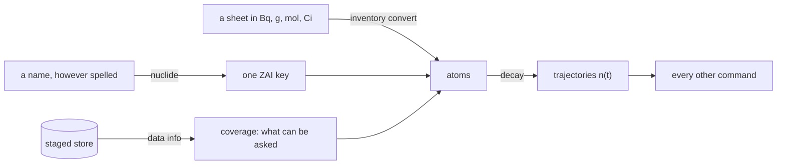

### `data` — what am I standing on?

An answer from a nuclear data store is only as good as the store, and the interesting part is
never the total count. It is the coverage: how much of *this* store can answer *this* question.

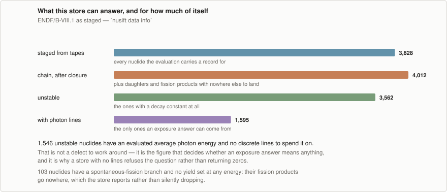

The chain is larger than what was staged, because closure registers every daughter and fission
product a seeded nuclide can reach — so nothing is ever produced into a gap. And 1546 unstable
nuclides have an evaluated average photon energy with no discrete lines to spend it on, which is
the figure that decides whether an exposure answer means anything at all.

**What it does not say.** Coverage is not accuracy. A nuclide with lines staged can still have
had them poorly evaluated, and this command counts records rather than judging them.

### `nuclide` — is that the isomer or the ground state?

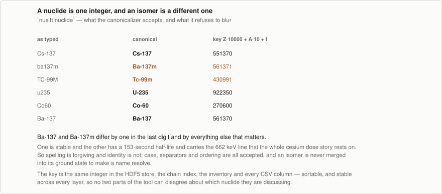

Spelling is forgiving; identity is not. `ba137m`, `Ba-137m` and `BA137M` all resolve, and none of
them resolve to Ba-137 — which is stable, where Ba-137m has a 153-second half-life and carries the
662 keV line that the entire cesium dose story rests on. An isomer is never merged into its
ground state to make a name resolve.

**What it does not say.** That a nuclide the store does not carry is not a nuclide. The
canonicalizer parses names; whether the store has data for one is a separate question.

### `inventory` — a becquerel is not an amount

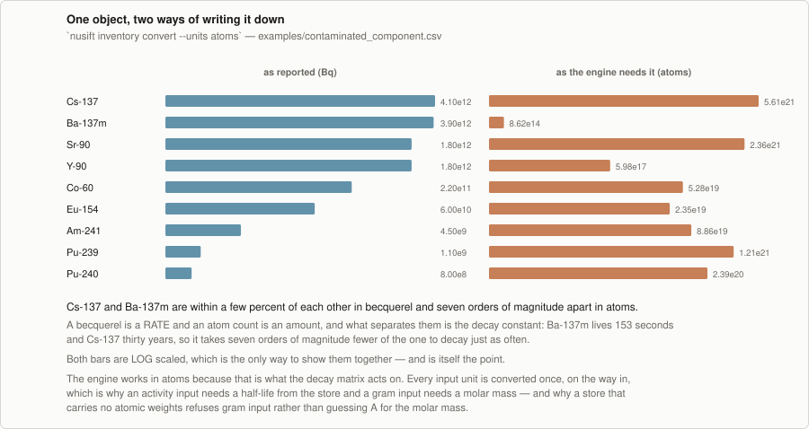

Cs-137 and Ba-137m sit within a few percent of each other in becquerel and seven orders of
magnitude apart in atoms, because a becquerel is a *rate* and what separates the two is the decay
constant. The engine works in atoms, so every input unit is converted once on the way in — which
is why an activity input needs a half-life and a gram input needs a molar mass, and why a store
carrying no atomic weights refuses gram input rather than guessing.

**What it does not say.** Nothing about whether the sheet is right. This validates units and
names, not measurements.

### `decay` — the trajectories, before any weight

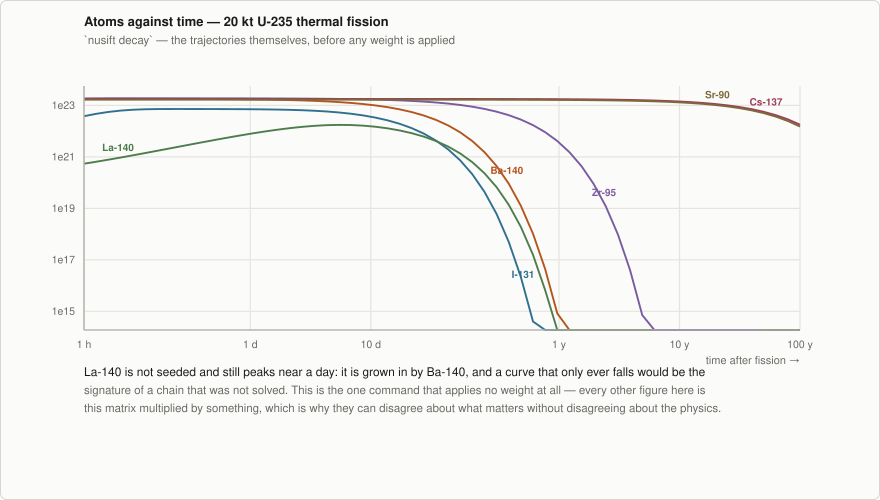

La-140 is seeded directly — fission makes 1.51e20 atoms of it — and then climbs to **115 times**
that, peaking at 5.4 days, because Ba-140 feeds it far faster than it decays. A curve that only
ever fell would be the signature of a chain that was not solved, and no ranking would show this:
by the time La-140 leads anything, most of what is there arrived from somewhere else.

This is the one command that applies no weight at all. Everything else in this document is this
matrix multiplied by something. It is also the one that can hand its answer back as an
inventory: `--write` snapshots a single time as a file every other command will read, which is
what makes [the two-step questions](#two-step-questions) below possible.

**What it does not say.** Which of these matters. That is what a metric is for, and the next
track is about choosing one.

---

## Track 1 — the source term

Something has just been made. The questions are what is in it, what it will look like through an
instrument, when it changes, and which parts are worth tracking. All of them are asked here in
quantities that need no geometry, so the answers are properties of the material rather than of
where anyone is standing.

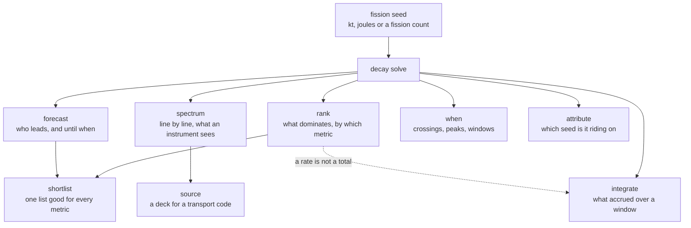

### `rank` — what dominates, and by what measure?

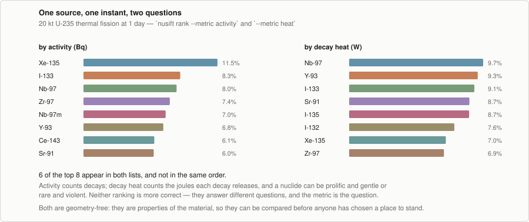

The same source at the same instant, ranked two ways. Six of the top eight appear in both lists
and not in the same order, because activity counts decays and decay heat counts the joules each
decay releases. A nuclide can be prolific and gentle, or rare and violent.

Neither ranking is more correct. The metric is the question, which is the whole reason metrics are
a separate axis from everything else.

**What it does not say.** Anything about hazard. Both of these are source terms; turning one into
a dose needs a geometry, a pathway, and a coefficient — which is what Track 2 and the coefficient
packs are for.

### `spectrum` — which lines, and whose?

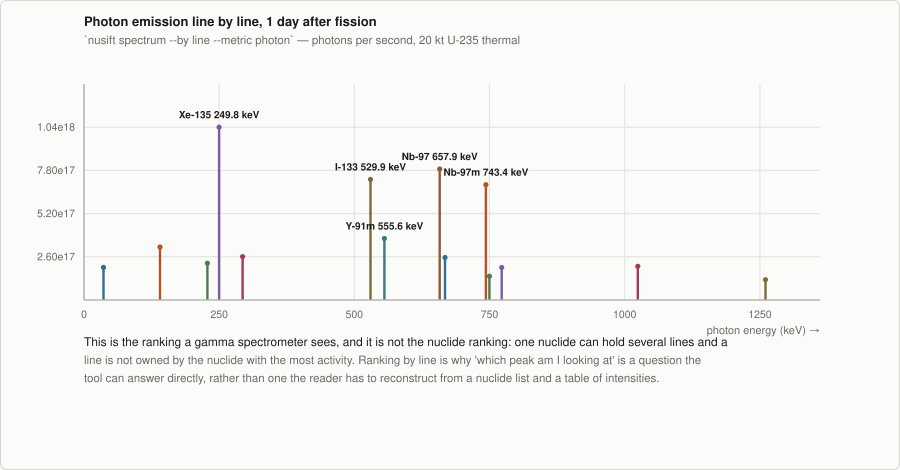

Ranking by line rather than by nuclide is the ranking a gamma spectrometer actually sees. One
nuclide holds several lines, and a line is not owned by whichever nuclide has the most activity,
so "which peak am I looking at" is a question the tool answers directly instead of one the reader
reconstructs from a nuclide list and a table of intensities.

**What it does not say.** Whether the line is resolvable. Detector resolution, efficiency and
background are properties of the instrument, not of the source, and none of them are in here.

### `forecast` — who leads, and until when?

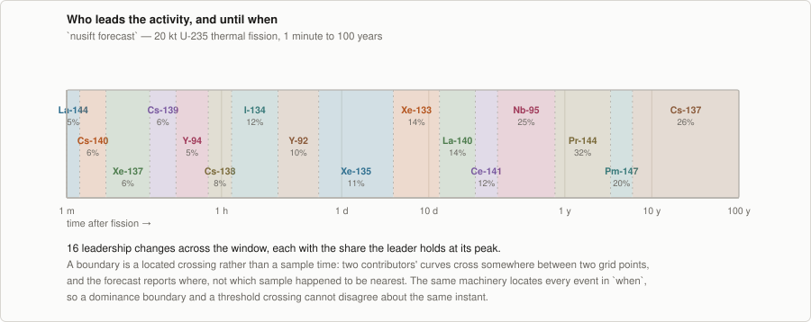

Sixteen leadership changes across a century, each with the share the leader holds at its peak. A
boundary is a *located crossing* rather than a sample time: two curves cross somewhere between two
grid points and the forecast reports where, not which sample happened to be nearest. The same
machinery locates every event in `when`, so a dominance boundary and a threshold crossing cannot
disagree about the same instant.

**What it does not say.** That the leader is the only thing that matters. A 40% leader means 60%
is elsewhere, which is what `shortlist` is for.

### `when` — when does it cross, peak, or fall below?

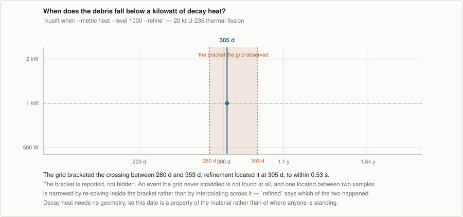

The grid bracketed this crossing between 280 and 353 days; refinement located it at 305 days, to
within half a second. The bracket is reported rather than hidden, because the honest form of "when
does this happen" includes how well it is known.

Decay heat needs no geometry, so this date is a property of the material — a handling threshold
crossed at a time nobody has to agree on a standoff distance to compute.

**What it does not say.** That an event the grid never straddled does not exist. An excursion
entirely between two samples is not found at all, which the report states rather than leaving the
absence to be read as a negative result.

### `shortlist` — a small list that is good for everything at once

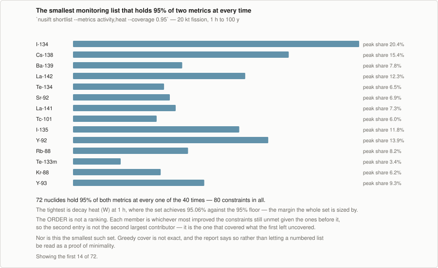

A set of nuclides holding 95% of *both* activity and decay heat at *every* one of the 40 times —
80 constraints in all. A second metric costs no extra machinery, being one more requirement over
the same values matrix, and its cost in members is worth reading carefully:

| requirement | members |
| --- | --- |
| activity | 72 |
| decay heat | 64 |
| exposure | 54 |
| activity + decay heat | 72 |
| activity + exposure | 73 |
| all three | 73 |

**Equal size is not the same set.** Adding decay heat to activity leaves the count at 72 and still
changes the answer: the joint set drops Ru-106 and takes Rh-106 instead. The activity-only set is
genuinely not good enough for heat — it falls under the 95% floor at 5 of the 40 times, bottoming
out at **91.97% near three years** — so the second requirement is doing real work that a column of
counts hides entirely. Exposure costs one further nuclide on top, because a photon weight can be
zero for a nuclide that is decaying prolifically.

**What it does not say.** That this is the smallest such set. Greedy cover is not exact, and no
claim of minimality is made anywhere — the report says so rather than letting a numbered list be
read as a proof. The ORDER is not a ranking either: each member is whichever most improved the
constraints still unmet given the ones before it, so the second entry is not the second largest
contributor but the one that covered what the first left uncovered.

The order is not a ranking. Each member is whichever most improved the constraints still unmet
given the ones before it, so the second entry is not the second largest contributor — it is the
one that covered what the first left uncovered.


### `source` — hand the photons to a code that does shielding

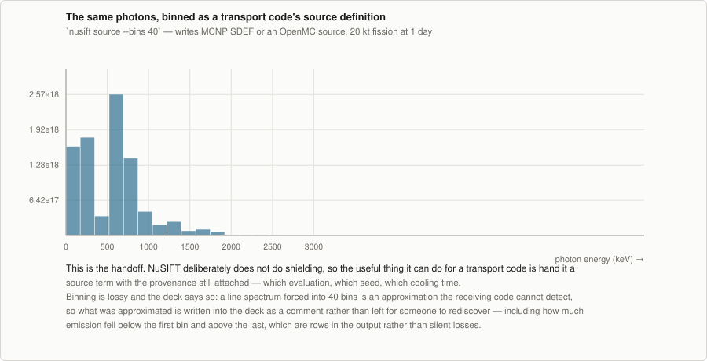

NuSIFT deliberately does not do shielding. What it can usefully do is hand a transport code a
source term with the provenance still attached: which evaluation, which seed, which cooling time,
written as an MCNP `SDEF` or an OpenMC source.

Binning is lossy and the deck says so. A line spectrum forced into forty bins is an approximation
the receiving code cannot detect, so what was approximated — including how much emission fell
below the first bin and above the last — is written into the deck rather than left to be
rediscovered.

**What it does not say.** Anything about what happens to the photons after they leave. That is the
receiving code's job, which is the point of the handoff.

### `attribute` — which seed is the answer riding on?

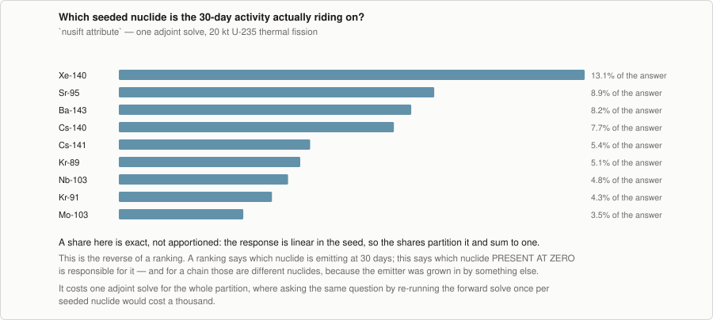

This is the reverse of a ranking. A ranking says which nuclide is emitting at thirty days;
attribution says which nuclide *present at zero* is responsible for it. For a chain those are
different nuclides, because the emitter was grown in by something else.

The shares are exact rather than apportioned — the response is linear in the seed, so they
partition it and sum to one — and the whole partition costs one adjoint solve, where re-running
the forward solve once per seeded nuclide would cost a thousand.

**What it does not say.** What to do about it. Attribution identifies the seed; `intervene` prices
removing it.

### `integrate` — a rate is not a total

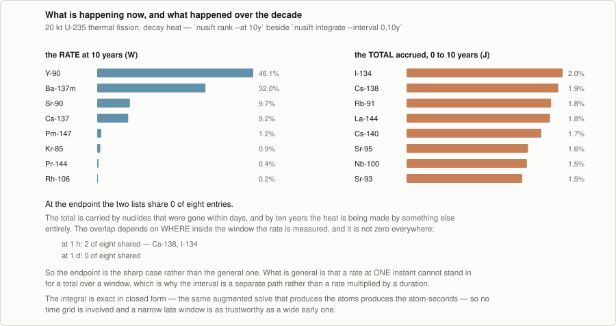

At ten years the heat is being made by long-lived nuclides. The energy released getting there came
from nuclides that were gone within days, and at that endpoint the two top-eight lists share
nothing at all.

The overlap depends on where inside the window the rate is measured, and it is not zero
everywhere: at one hour two of the eight are shared, at one day none are. So the endpoint is the
sharp case rather than the general one. What is general is that a rate at any single instant
cannot stand in for a total over a window, which is why the interval is a separate path rather
than a rate multiplied by a duration.

The integral is exact in closed form — the same augmented solve that produces the atoms produces
the atom-seconds — so no time grid is involved and a narrow late window is as trustworthy as a
wide early one.

This is asked in decay heat rather than exposure on purpose. An exposure answer here would be a
point-source kernel aimed at dispersed debris, which is the pairing this guide tells you not to
make a page earlier.

**What it does not say.** That either list is the one to act on. Which question is the right one is
the reader's; the tool's contribution is refusing to let the two be confused for each other.

---

## Track 2 — working around a compact source

Now there is an object and a person who has to approach it. A point source at a few meters is the
model, and it fits: the object is compact.

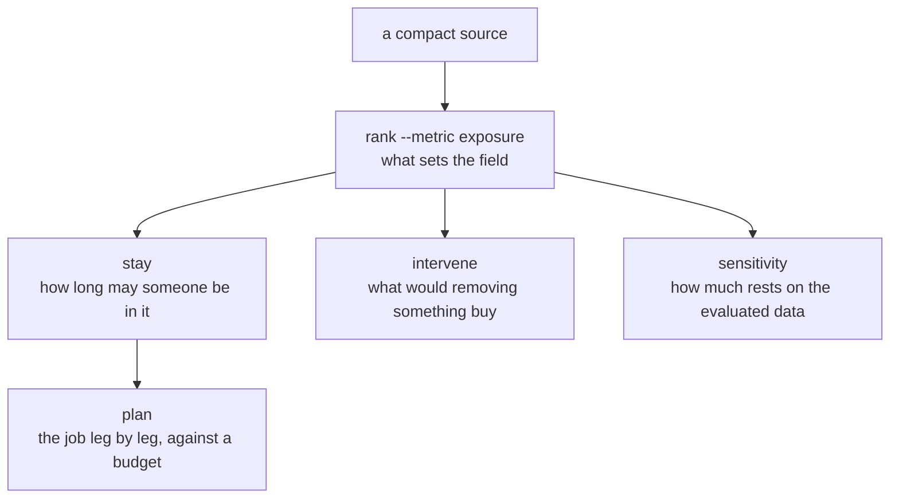

### `rank` again — what sets the field?

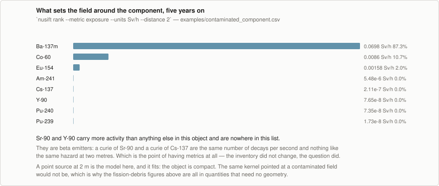

Ba-137m holds 87% of the dose rate around this object, and nobody put it there: it is the daughter
of the Cs-137 that was measured.

The instructive part is Cs-137 itself. By activity it leads at 34.9%, ahead of Ba-137m at 33.1%
and of Sr-90 and Y-90 at 15.2% each. By exposure it is **fifth, at a rounded zero** — it emits
essentially no photons of its own, and everything the cesium contributes to a dose rate it
contributes through its daughter. Sr-90 and Y-90 appear in the exposure list too, at the same
rounded zero, for the different reason that they are beta emitters.

A becquerel of Sr-90 and a becquerel of Cs-137 are the same number of decays per second and
nothing like the same hazard at two meters. The inventory did not change between this figure and
the activity ranking — the question did.

**What it does not say.** What a survey meter will read. This is ICRP 116 effective dose through
an uncollided point kernel; `H*(10)` is a different quantity and arrives as a coefficient pack.

### `stay` — how long may someone be in there?

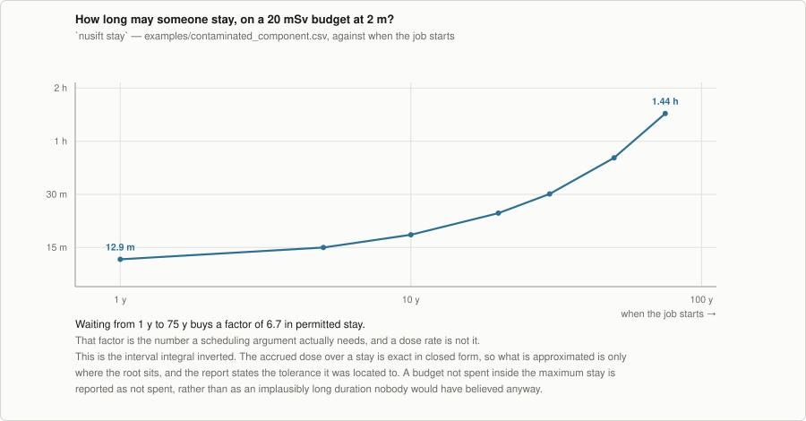

Waiting from one year to seventy-five buys a factor of 6.7 in permitted stay. That factor is the
number a scheduling argument actually needs, and a dose rate is not it.

This is the interval integral inverted: the accrued dose over a stay is exact in closed form, so
what is approximated is only where the root sits, and the report states the tolerance it was
located to.

**What it does not say.** That the stay is safe. A budget is an input here, not a judgment, and
nothing in this command knows what limit applies to whom.

### `plan` — where does the budget actually run out?

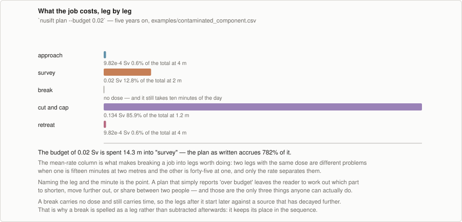

A real job is legs at different distances, and the dose is not distributed the way the durations
are. Naming the leg and the minute where the budget is spent is the point: a plan that reports only
"over budget" leaves the reader to work out which part to shorten, move further out, or share
between two people, and those are the only three things anyone can actually do.

A break carries no dose and still carries time, so the legs after it start later against a source
that has decayed further. That is why a break is spelled as a leg rather than subtracted
afterwards — it keeps its place in the sequence.

**What it does not say.** Anything about shielding, distance being achievable, or whether the work
can be done in the time given. It costs the plan as written.

### `intervene` — is the separation worth doing?

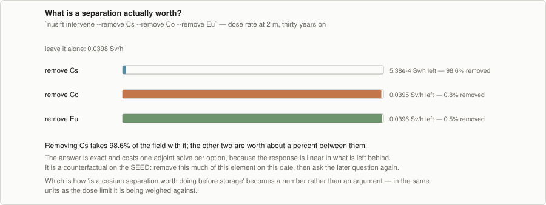

Removing cesium takes 98.6% of the field with it; removing cobalt or europium is worth about a
percent between them. That turns "is a separation worth doing before storage" from an argument
into a number, in the same units as the limit it is being weighed against.

The answer is exact and costs **one adjoint solve in total**, not one per option: that solve
returns dR/dn at the intervention date, and each option is then a dot product against it.
Comparing ten separations costs what comparing one does, which is what makes enumerating them
worth doing at all.

**What it does not say.** What the separation costs. This prices the benefit in dose; the other
side of that trade is not a quantity NuSIFT has.

### `sensitivity` — how much of this rests on the evaluated data?

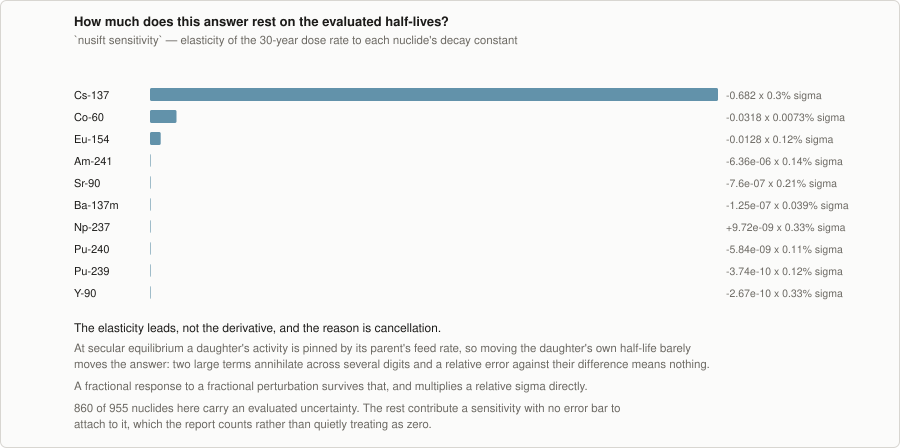

The elasticity leads rather than the derivative, and the reason is cancellation. At secular
equilibrium a daughter's activity is pinned by its parent's feed rate, so moving the daughter's own
half-life barely moves the answer: two large terms annihilate across several digits, and a relative
error against their difference means nothing. A fractional response to a fractional perturbation
survives that, and multiplies a relative sigma directly.

**What it does not say.** It is a sensitivity norm, not an error budget. It takes the covariance
diagonal, and evaluated half-lives are not independent of the branchings and yields fitted
alongside them. See [attribution.md](attribution.md) for the two correlations that can be had, one
derived and one imported.

---

## Track 3 — waste, transport and disposal

Sheets from different dates, limits with editions on them, and the question of what may be shipped.

Two flows rather than one, because they start from different things. Characterization begins with
dated sheets; the transport question begins with an inventory and a published limit.

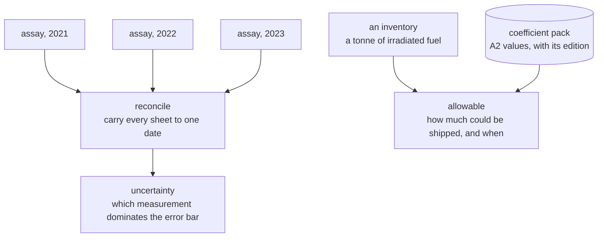

### `reconcile` — three sheets, three dates, one inventory

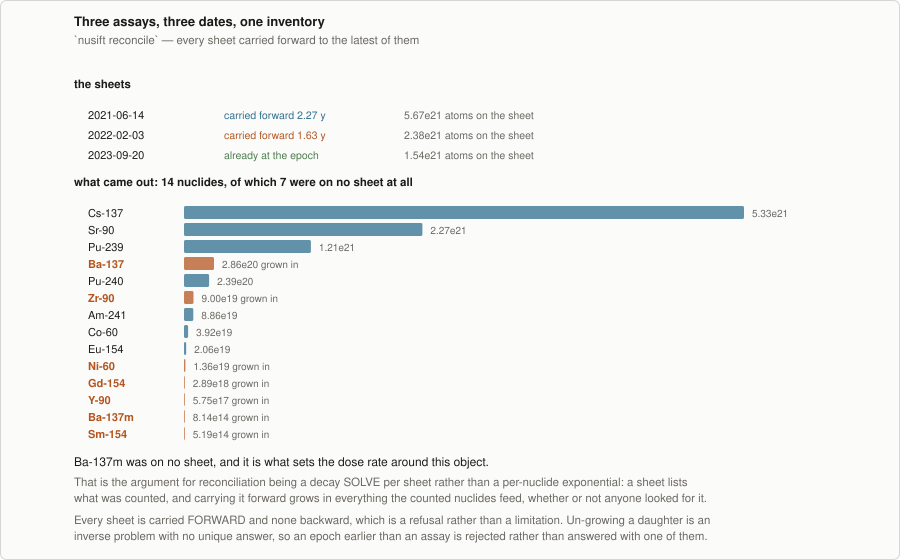

Seven nuclides were counted across three sheets; fourteen come out, and seven of them were never
measured. Ba-137m is among those seven, and it is what sets the dose rate around the object.

That is the argument for reconciliation being a decay *solve* per sheet rather than a per-nuclide
exponential: a sheet lists what was counted, and carrying it forward grows in everything the
counted nuclides feed, whether or not anyone looked for it.

**What it does not say.** It will not carry a sheet backward. Un-growing a daughter is an inverse
problem with no unique answer, so an epoch earlier than an assay is refused rather than answered
with one of the possibilities.

### `uncertainty` — which measurement should be improved?

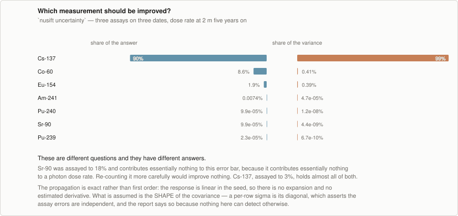

Two different questions with two different answers. Sr-90 was assayed to 18% and contributes
essentially nothing to this error bar, because it contributes essentially nothing to a photon dose
rate — re-counting it more carefully would improve nothing. Cs-137, assayed to 3%, holds almost all
of both.

The propagation is exact rather than first order: the response is linear in the seed, so there is
no expansion and no estimated derivative.

**What it does not say.** That the assay errors are independent. A per-row sigma is the *diagonal*
of the covariance, which asserts exactly that, and aliquots counted on one detector against one
standard are not independent. The report states the assumption because nothing in it can detect
otherwise.

For a fission source there is no assay to propagate and the uncertainty is in the evaluated
yields instead, which is `uncertainty --seed-fission --yield-covariance` and the one place the
tool imports a covariance rather than deriving or staging it.

### `allowable` — how much of this could be shipped?

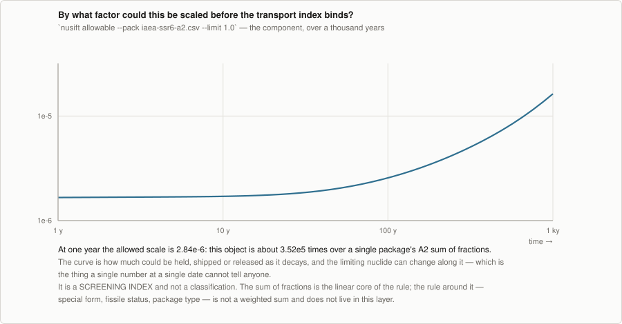

At one year the allowed scale is 2.84e-6: a tonne of irradiated fuel is roughly **350,000 times**
over a single package's A2 sum of fractions, which is a quantitative way of saying that this is
cask business rather than drum business. A thousand years of decay improves it by a factor of five
and leaves it four orders of magnitude short.

The curve is how much could be held, shipped or released as it decays, and the limiting nuclide
can change along it — which is the thing a single number at a single date cannot tell anyone.

**What it does not say.** Whether the package is compliant. This is a *screening index*: the sum of
fractions is the linear core of the rule, and the rule around it — special form, fissile status,
package type, the LSA and SCO provisions — is not a weighted sum and does not live in this layer.
The pack's edition travels with the answer because the A2 values themselves move between editions.

---

## Two-step questions

Most of the sections above are one command. A few useful questions are two, because they need
an inventory that does not exist yet — one that is the *result* of a calculation rather than
the input to it. Every analysis command consumes an inventory, and three commands produce one,
so the pattern is always the same: make the file, then ask the question of it.

### Snapshot a solve, then weigh it

```bash
nusift decay --seed-fission U-235 --energy fast --yield-kt 365 --at 30d \
        --write cooled.csv --write-units kg
grep -E "^(Ba|La|Ce)-140," cooled.csv
```

```
Ba-140,0.1439902070421733,kg
La-140,0.021824493415383055,kg
Ce-140,0.569485742341488,kg
```

**Why you would need it.** *How much of this do I have* is not a question any ranking answers.
A ranking is a rate — becquerels, sieverts per hour, watts — and a mass chain that dominates
the activity at thirty days may be a gram, while the stable end point nobody ranks is most of
the kilogram. `--write-units` runs the inventory through the staged atomic weights and gives
the amount rather than the rate, which is the number that matters for shipping, storage,
separation or an accountancy record.

It is also how a calculation becomes a record. A fission seed is a derivation — 365 kt, an
energy, a yield set — and anyone who wants the same starting point has to repeat it and get the
same answer. The snapshot is the answer itself, a file that can be attached to a report, diffed
against next month's, or handed to someone who should not have to re-derive it. Reading it back
gives the same ranking as the original solve, because it is the same atoms.

`--write` takes **one** time and refuses several, because an inventory is a single moment
rather than a trajectory. Non-positive entries are dropped and counted: a solve leaves
numerical dust around 1e-30 of the inventory in nuclides that have effectively vanished, some
of it negative, and an atom count is non-negative by definition.

### Bring assays to one date, then analyse

```bash
nusift reconcile -i assays.csv --write merged.csv --write-units Bq
nusift rank -i merged.csv --at 30d --metric exposure --units Sv/h
```

**Why you would need it.** Sheets arrive on the dates someone happened to count them, and every
command downstream needs a single epoch. Doing it in two steps rather than one means the merged
inventory is a file you can look at, question and keep — which matters precisely because
reconciliation is the step that moves numbers. See [`reconcile`](#reconcile--three-sheets-three-dates-one-inventory)
for what it will not do.

### Normalise the units, then trust the file

```bash
nusift inventory convert -i messy.csv --units Bq -o normalised.csv
```

**Why you would need it.** A sheet whose rows are variously in grams, curies and becquerels is
valid input, and unreadable as a document: no two rows compare, and a typo hides. Converting
once gives a file whose rows are on one scale, so an outlier is visible. It is also the cheapest
gate in a pipeline — every nuclide name, unit and quantity is validated here, and an unknown
name fails in a second rather than forty minutes into a sweep.

### Emit rows instead of a report

```bash
nusift rank -i inventory.csv --at 30d --format csv -o rank.csv
nusift decay -i inventory.csv --times 1h:100y:log:60 --format json
```

**Why you would need it.** The text reports are for reading; `--format csv` and `--format json`
are for plotting, spreadsheets and notebooks. Every figure in this document is drawn from a
committed file produced this way rather than from numbers typed into a plotting script, which
is what stops a figure claiming something the tool does not print — see [Regenerating](#regenerating).

`decay` takes `csv` or `json` only: its output is a matrix of every nuclide against every time,
and there is no text layout for four thousand rows.

### What does not compose yet

`intervene` answers what removing Cs and Sr on a date is worth later, but does not write the
post-removal inventory, so a counterfactual cannot be carried into a second question the way a
snapshot can. The other commands are all terminal by nature: they answer about an inventory
rather than producing one.

## Where the pattern stops

Every command above is a fixed weight vector post-multiplied on a linear solve. The questions that
break that pattern are fenced off rather than approximated: source self-absorption, buildup that
depends on the source itself, shielding, and neutron activation as a source term. A rule that is
not a weighted sum — a per-table waste classification, a fissile exception, a package-type
condition — is not the engine's either, and belongs in a rule layer above the weights, versioned
with them.

The methodology documents say what each of those would cost. This one only claims what the tool
already does.

## Regenerating

```bash
./docs/figures/data/make_data.sh            # re-run every command, commit what moved
python docs/figures/make_scenario_figures.py
```

The data step needs a built CLI and a staged store; the figure step needs neither, which is why
the CLI output is committed. A figure that changed is then a diff on the numbers rather than an
unexplained change in a picture.
