# Validation

What NuSIFT computes, checked against values it was not fitted to: published gamma
constants, evaluated half-lives, atomic weights and fission yields, an empirical decay
law, and an independent implementation of the same physics.

**This file is generated.** `python validation/make_report.py` rewrites it and its
figures from the committed store, and CI regenerates it and fails if the result differs
from what is committed. Every number below is computed by `validation/checks.py`, the
same module `python/tests/test_validation.py` asserts on, so a number here and a number
CI gates on cannot be two different numbers.

|  |  |
| --- | --- |
| store | `data/nusift_b8.1.h5`, ENDF/B-VIII.1, staged 2026-08-13T15:29:37Z |
| coverage | 3828 nuclides staged, 4012 in the closed chain |
| nusift | 0.1.0 |
| cross-code | radioactivedecay 0.6.1 (pinned 0.6.1), ICRP-107 decay data |

## What this does and does not establish

A residual here is not an error bar. Every comparison is against a value produced by
someone else's conventions, someone else's evaluation, or an empirical fit, and where
those differ from NuSIFT's the difference shows up in this table as a residual whether
or not anything is wrong. The bands are therefore set from the physics that limits each
comparison, and the reasoning for each is recorded beside the numbers in
[`validation/references/README.md`](../validation/references/README.md).

Rows marked **reported** are computed and shown but not gated. That is where a known
convention or evaluation difference lives, named, rather than being hidden under a band
wide enough to swallow it.

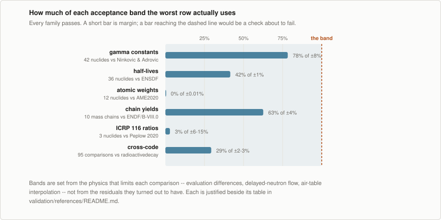

## Gamma constants

The broadest published comparison here, and the one that exercises the most at once:
staged line energies and intensities, the NIST air table, the log-log interpolation,
and the roentgen conversion, against numbers nothing in NuSIFT was tuned to.

Two independent tabulations are used, in their own units and each with its own stated
low-energy cutoff: Ninković & Adrović (2012) in µGy·m²/(GBq·h) above 20 keV, and Smith &
Stabin (2012) in R·cm²/(h·mCi) above 15 keV. Each nuclide appears once, under whichever
carries it. That the two disagree with each other by about a percent where they overlap
— Ninković's Co-60 is 13.05 R·cm²/(h·mCi) against Smith & Stabin's 12.9 — is the point
[exposure.md §4](exposure.md) makes about published constants, and NuSIFT lands between
them.

Both tables exclude photons below their cutoff, and bremsstrahlung entirely. NuSIFT by
default counts the whole spectrum, so the two are not the same quantity until the same
cutoff is applied — and for the X-ray emitters that difference reaches a factor of ten,
all of it convention rather than disagreement.

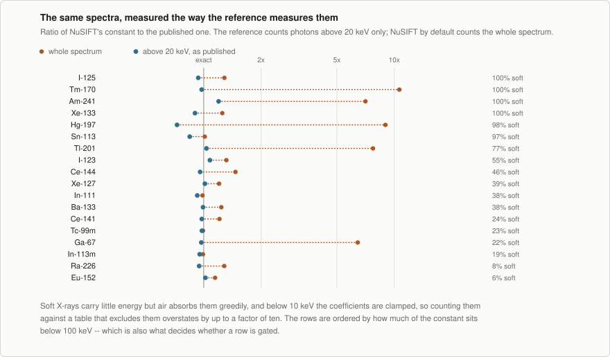

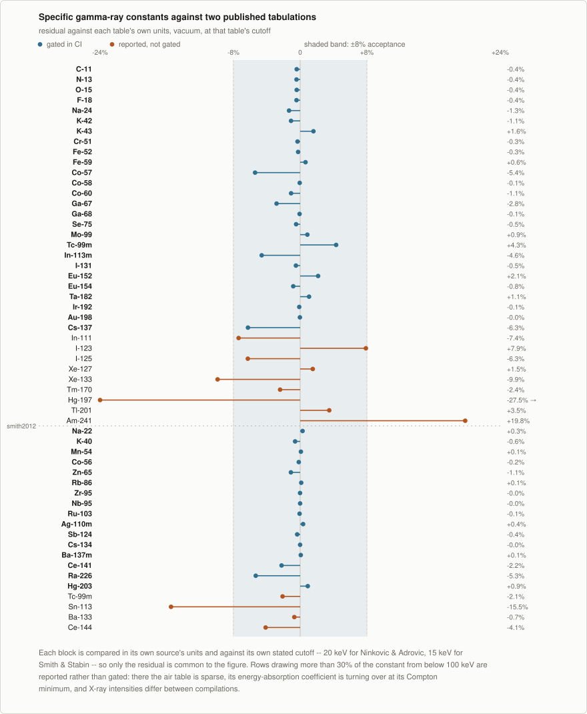

| nuclide | published | NuSIFT | unit | residual | status | source | note |
| --- | --- | --- | --- | --- | --- | --- | --- |
| C-11 | 139.3 | 138.7 | uGy.m2/(GBq.h) | -0.41% | gated | ninkovic2012 | annihilation photons only |
| N-13 | 139.4 | 138.8 | uGy.m2/(GBq.h) | -0.44% | gated | ninkovic2012 | annihilation photons only |
| O-15 | 139.5 | 138.9 | uGy.m2/(GBq.h) | -0.42% | gated | ninkovic2012 | annihilation photons only |
| F-18 | 135.1 | 134.5 | uGy.m2/(GBq.h) | -0.44% | gated | ninkovic2012 | annihilation photons only |
| Na-24 | 436.7 | 430.9 | uGy.m2/(GBq.h) | -1.33% | gated | ninkovic2012 |  |
| K-42 | 32.8 | 32.44 | uGy.m2/(GBq.h) | -1.09% | gated | ninkovic2012 |  |
| K-43 | 127.8 | 129.8 | uGy.m2/(GBq.h) | +1.59% | gated | ninkovic2012 |  |
| Cr-51 | 4.22 | 4.206 | uGy.m2/(GBq.h) | -0.32% | gated | ninkovic2012 | single 320 keV line at 10% intensity |
| Fe-52 | 97.24 | 97 | uGy.m2/(GBq.h) | -0.25% | gated | ninkovic2012 |  |
| Fe-59 | 145.9 | 146.8 | uGy.m2/(GBq.h) | +0.64% | gated | ninkovic2012 |  |
| Co-57 | 14.11 | 13.35 | uGy.m2/(GBq.h) | -5.41% | gated | ninkovic2012 | 122 and 136 keV sit in the Compton minimum where the air table is at its coarsest |
| Co-58 | 129 | 128.9 | uGy.m2/(GBq.h) | -0.06% | gated | ninkovic2012 |  |
| Co-60 | 309 | 305.6 | uGy.m2/(GBq.h) | -1.09% | gated | ninkovic2012 | the reference the unit suite also pins |
| Ga-67 | 19.45 | 18.9 | uGy.m2/(GBq.h) | -2.83% | gated | ninkovic2012 | 22% of the constant below 100 keV |
| Ga-68 | 129 | 128.9 | uGy.m2/(GBq.h) | -0.07% | gated | ninkovic2012 |  |
| Se-75 | 48.25 | 48.02 | uGy.m2/(GBq.h) | -0.49% | gated | ninkovic2012 |  |
| Mo-99 | 19.77 | 19.94 | uGy.m2/(GBq.h) | +0.86% | gated | ninkovic2012 |  |
| Tc-99m | 14.1 | 14.71 | uGy.m2/(GBq.h) | +4.31% | gated | ninkovic2012 | single 141 keV line |
| In-113m | 44 | 41.97 | uGy.m2/(GBq.h) | -4.62% | gated | ninkovic2012 | 19% of the constant below 100 keV |
| I-131 | 52.2 | 51.93 | uGy.m2/(GBq.h) | -0.51% | gated | ninkovic2012 |  |
| Eu-152 | 148.9 | 152.1 | uGy.m2/(GBq.h) | +2.15% | gated | ninkovic2012 |  |
| Eu-154 | 159.2 | 157.9 | uGy.m2/(GBq.h) | -0.83% | gated | ninkovic2012 |  |
| Ta-182 | 160 | 161.7 | uGy.m2/(GBq.h) | +1.06% | gated | ninkovic2012 |  |
| Ir-192 | 109.1 | 109 | uGy.m2/(GBq.h) | -0.11% | gated | ninkovic2012 |  |
| Au-198 | 54.54 | 54.52 | uGy.m2/(GBq.h) | -0.03% | gated | ninkovic2012 |  |
| Cs-137 | 82.1 | 76.96 | uGy.m2/(GBq.h) | -6.26% | gated | ninkovic2012 | tabulated as the Cs-137/Ba-137m equilibrium pair rather than either nuclide alone |
| In-111 | 83.13 | 76.99 | uGy.m2/(GBq.h) | -7.38% | reported | ninkovic2012 | 38% of the constant below 100 keV |
| I-123 | 36.1 | 38.94 | uGy.m2/(GBq.h) | +7.88% | reported | ninkovic2012 | 55% of the constant below 100 keV |
| I-125 | 37.73 | 35.36 | uGy.m2/(GBq.h) | -6.28% | reported | ninkovic2012 | entirely below 100 keV; 35 keV gamma and Te X-rays |
| Xe-127 | 51.09 | 51.86 | uGy.m2/(GBq.h) | +1.51% | reported | ninkovic2012 | 39% of the constant below 100 keV |
| Xe-133 | 14.33 | 12.91 | uGy.m2/(GBq.h) | -9.90% | reported | ninkovic2012 | entirely below 100 keV; 81 keV gamma and Cs X-rays |
| Tm-170 | 0.554 | 0.5407 | uGy.m2/(GBq.h) | -2.41% | reported | ninkovic2012 | entirely below 100 keV; 84 keV gamma at 0.03% intensity |
| Hg-197 | 11.37 | 8.244 | uGy.m2/(GBq.h) | -27.49% | reported | ninkovic2012 | 98% below 100 keV; 77 keV gamma and Au X-rays |
| Tl-201 | 10.22 | 10.58 | uGy.m2/(GBq.h) | +3.49% | reported | ninkovic2012 | 77% below 100 keV; Hg X-rays dominate |
| Am-241 | 3.97 | 4.756 | uGy.m2/(GBq.h) | +19.79% | reported | ninkovic2012 | essentially all from the 59.5 keV gamma and Np L X-rays |
| Na-22 | 11.8 | 11.83 | R.cm2/(h.mCi) | +0.29% | gated | smith2012 |  |
| K-40 | 0.779 | 0.7743 | R.cm2/(h.mCi) | -0.61% | gated | smith2012 |  |
| Mn-54 | 4.63 | 4.634 | R.cm2/(h.mCi) | +0.09% | gated | smith2012 |  |
| Co-56 | 17.9 | 17.87 | R.cm2/(h.mCi) | -0.16% | gated | smith2012 |  |
| Zn-65 | 3.07 | 3.036 | R.cm2/(h.mCi) | -1.11% | gated | smith2012 |  |
| Rb-86 | 0.495 | 0.4956 | R.cm2/(h.mCi) | +0.13% | gated | smith2012 | tabulated above Rb-86m in the source; the two are easily transposed |
| Zr-95 | 4.12 | 4.119 | R.cm2/(h.mCi) | -0.02% | gated | smith2012 |  |
| Nb-95 | 4.29 | 4.29 | R.cm2/(h.mCi) | -0.01% | gated | smith2012 |  |
| Ru-103 | 2.87 | 2.868 | R.cm2/(h.mCi) | -0.07% | gated | smith2012 |  |
| Ag-110m | 15 | 15.05 | R.cm2/(h.mCi) | +0.36% | gated | smith2012 |  |
| Sb-124 | 9.57 | 9.536 | R.cm2/(h.mCi) | -0.36% | gated | smith2012 |  |
| Cs-134 | 8.76 | 8.759 | R.cm2/(h.mCi) | -0.01% | gated | smith2012 |  |
| Ba-137m | 3.43 | 3.432 | R.cm2/(h.mCi) | +0.07% | gated | smith2012 | the bare isomer; the source's Cs-137 entry is this same number by its own footnote |
| Ce-141 | 0.453 | 0.4429 | R.cm2/(h.mCi) | -2.23% | gated | smith2012 |  |
| Ra-226 | 0.0394 | 0.0373 | R.cm2/(h.mCi) | -5.33% | gated | smith2012 | the bare nuclide; brachytherapy tabulations quote the daughters in equilibrium behind platinum and are 200x larger |
| Hg-203 | 1.3 | 1.312 | R.cm2/(h.mCi) | +0.91% | gated | smith2012 |  |
| Tc-99m | 0.795 | 0.7782 | R.cm2/(h.mCi) | -2.12% | reported | smith2012 | duplicate of the Ninkovic row at a different cutoff; kept as a cross-source check |
| Sn-113 | 1.21 | 1.023 | R.cm2/(h.mCi) | -15.49% | reported | smith2012 | 97% of the constant below 100 keV |
| Ba-133 | 3.04 | 3.019 | R.cm2/(h.mCi) | -0.71% | reported | smith2012 | 38% of the constant below 100 keV |
| Ce-144 | 0.135 | 0.1294 | R.cm2/(h.mCi) | -4.15% | reported | smith2012 | 46% of the constant below 100 keV |

## Half-lives

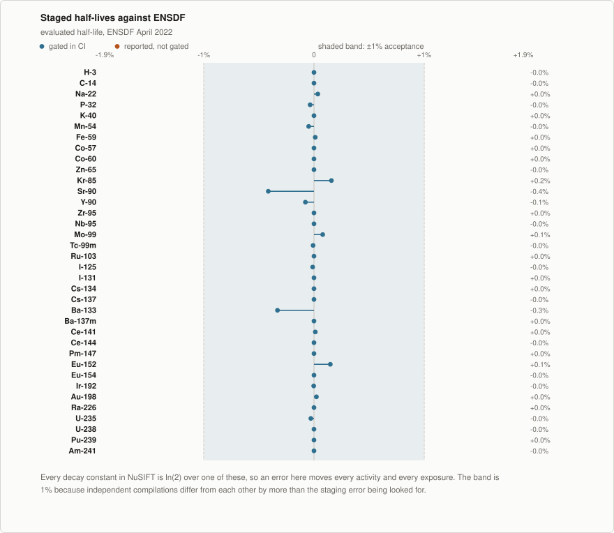

| nuclide | ENSDF | staged | residual | status | note |
| --- | --- | --- | --- | --- | --- |
| H-3 | 12.32 y | 12.32 y | -0.000% | gated |  |
| C-14 | 5700 y | 5699.99 y | -0.000% | gated |  |
| Na-22 | 2.6018 y | 2.6027 y | +0.035% | gated |  |
| P-32 | 14.268 d | 14.263 d | -0.035% | gated |  |
| K-40 | 1.248e+09 y | 1.248e+09 y | +0.000% | gated | DDEP gives 1.2522e9; the compilations differ by 0.3% |
| Mn-54 | 312.2 d | 312.05 d | -0.048% | gated |  |
| Fe-59 | 44.49 d | 44.495 d | +0.011% | gated |  |
| Co-57 | 271.74 d | 271.74 d | +0.000% | gated |  |
| Co-60 | 1925.28 d | 1925.28 d | +0.000% | gated |  |
| Zn-65 | 243.93 d | 243.93 d | -0.000% | gated |  |
| Kr-85 | 10.739 y | 10.756 y | +0.158% | gated |  |
| Sr-90 | 28.91 y | 28.79 y | -0.415% | gated | DDEP gives 28.80; the compilations differ by 0.4% |
| Y-90 | 64.05 h | 64 h | -0.078% | gated |  |
| Zr-95 | 64.032 d | 64.032 d | +0.000% | gated |  |
| Nb-95 | 34.991 d | 34.991 d | -0.000% | gated |  |
| Mo-99 | 65.924 h | 65.976 h | +0.079% | gated |  |
| Tc-99m | 6.0072 h | 6.0067 h | -0.008% | gated |  |
| Ru-103 | 39.247 d | 39.247 d | +0.000% | gated | not covered by DDEP |
| I-125 | 59.407 d | 59.4 d | -0.012% | gated |  |
| I-131 | 8.0252 d | 8.0252 d | +0.000% | gated |  |
| Cs-134 | 2.0652 y | 2.0652 y | +0.000% | gated |  |
| Cs-137 | 30.08 y | 30.08 y | -0.000% | gated | DDEP gives 30.018 |
| Ba-133 | 10.551 y | 10.5161 y | -0.331% | gated |  |
| Ba-137m | 2.552 min | 2.552 min | +0.000% | gated |  |
| Ce-141 | 32.504 d | 32.508 d | +0.012% | gated |  |
| Ce-144 | 284.91 d | 284.91 d | -0.000% | gated |  |
| Pm-147 | 2.6234 y | 2.6234 y | +0.000% | gated |  |
| Eu-152 | 13.517 y | 13.537 y | +0.148% | gated |  |
| Eu-154 | 8.601 y | 8.601 y | -0.000% | gated |  |
| Ir-192 | 73.829 d | 73.827 d | -0.003% | gated |  |
| Au-198 | 2.6941 d | 2.6947 d | +0.022% | gated |  |
| Ra-226 | 1600 y | 1600 y | +0.000% | gated |  |
| U-235 | 7.04e+08 y | 7.03799e+08 y | -0.029% | gated |  |
| U-238 | 4.468e+09 y | 4.46799e+09 y | -0.000% | gated |  |
| Pu-239 | 24110 y | 24110 y | +0.000% | gated |  |
| Am-241 | 432.6 y | 432.599 y | -0.000% | gated |  |

## Atomic weights

Everything expressed per gram goes through the staged atomic weight ratio: an inventory
given in grams, and any specific activity derived from one. AME2020 is an independent
evaluation of the same masses, which makes this the one check that pins that conversion
against something outside the ENDF pipeline.

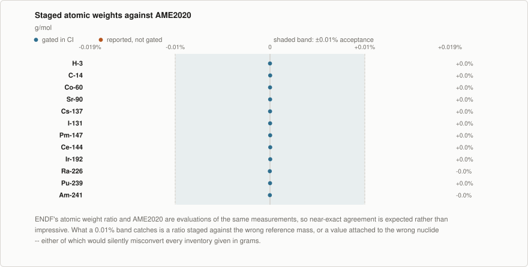

| nuclide | AME2020 | staged | residual | status | note |
| --- | --- | --- | --- | --- | --- |
| H-3 | 3.016049 | 3.016049 | +0.00000% | gated |  |
| C-14 | 14.003242 | 14.003245 | +0.00002% | gated |  |
| Co-60 | 59.933816 | 59.933820 | +0.00001% | gated | the mass defect puts this below 60; a parser assuming the leading integer is A mis-reads it |
| Sr-90 | 89.907728 | 89.907741 | +0.00001% | gated |  |
| Cs-137 | 136.907089 | 136.907098 | +0.00001% | gated | independently confirmed against the IAEA Livechart atomic_mass field |
| I-131 | 130.906126 | 130.906147 | +0.00002% | gated |  |
| Pm-147 | 146.915145 | 146.915172 | +0.00002% | gated |  |
| Ce-144 | 143.913653 | 143.913688 | +0.00002% | gated |  |
| Ir-192 | 191.962602 | 191.962651 | +0.00003% | gated |  |
| Ra-226 | 226.025408 | 226.025366 | -0.00002% | gated |  |
| Pu-239 | 239.052162 | 239.052173 | +0.00000% | gated |  |
| Am-241 | 241.056827 | 241.056794 | -0.00001% | gated |  |

There is no specific-activity sweep. It would be ln(2)·N_A/(T½·M) over two quantities
that already have their own tables above, and published specific-activity tables
disagree with each other by more than the staging error being looked for — Am-241 is
tabulated at 3.2, 3.43 and 3.5 Ci/g by different compilers, depending only on which
half-life each used. Six keystone nuclides are still checked end to end in the C++
suite, where the quotient itself is what a user reads off a report.

## Fission yields

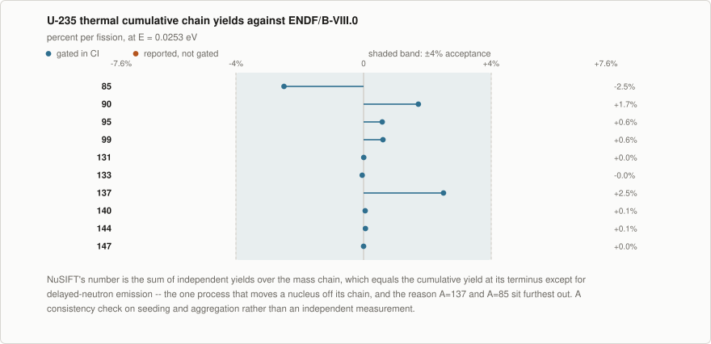

| mass chain | ENDF/B-VIII.0 | NuSIFT | residual | status | note |
| --- | --- | --- | --- | --- | --- |
| A = 85 | 1.3186% | 1.2857% | -2.50% | gated | terminus Rb-85; light-wing chains gain from delayed-neutron flow out of A=86 |
| A = 90 | 5.7819% | 5.8812% | +1.72% | gated | terminus Zr-90; use Sr-90's 1% uncertainty rather than Zr-90's 64% ENDF artifact |
| A = 95 | 6.5029% | 6.5409% | +0.58% | gated | terminus Mo-95 |
| A = 99 | 6.1087% | 6.1458% | +0.61% | gated | terminus Tc-99 |
| A = 131 | 2.8907% | 2.8908% | +0.00% | gated | terminus Xe-131 |
| A = 133 | 6.6991% | 6.6962% | -0.04% | gated | terminus Cs-133 |
| A = 137 | 6.1885% | 6.3435% | +2.50% | gated | terminus Ba-137; I-137 has a 7% delayed-neutron branch out of the chain |
| A = 140 | 6.2197% | 6.2229% | +0.05% | gated | terminus Ce-140 |
| A = 144 | 5.4996% | 5.5028% | +0.06% | gated | terminus Nd-144 |
| A = 147 | 2.2467% | 2.2467% | +0.00% | gated | terminus Sm-147 |

## The Way-Wigner law

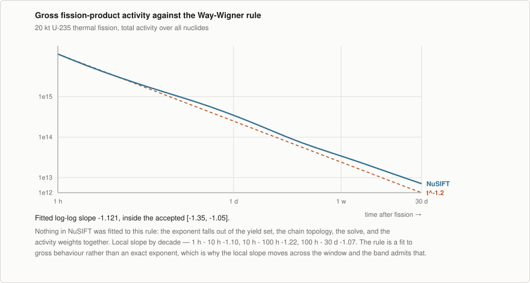

Fitted log-log slope **-1.121** over 1h to
30d, against the empirical t^-1.2, accepted within
[-1.35, -1.05].

| window | local slope |
| --- | --- |
| 1 h - 10 h | -1.101 |
| 10 h - 100 h | -1.223 |
| 100 h - 30 d | -1.073 |

## Real chains against their closed forms

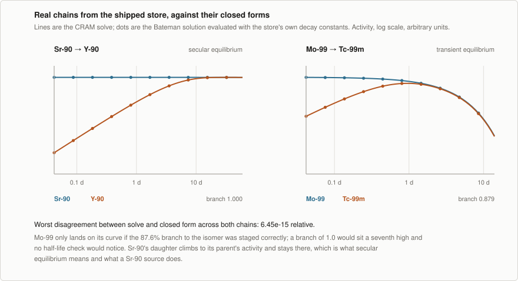

| chain | kind | staged branch | worst disagreement with Bateman |
| --- | --- | --- | --- |
| Sr-90 → Y-90 | secular | 1.0000 | 6.45e-15 |
| Mo-99 → Tc-99m | transient | 0.8789 | 2.10e-15 |

Atom conservation on a pure beta chain is checked alongside these in the C++ suite. It
holds to 1e-10 on Sr-90 and to 1e-8 on Cs-137, and the difference is the evaluation's
rather than the solver's: Cs-137's two staged branchings are 0.05300549 and 0.9469945,
which sum to 0.99999999, so exactly 1e-8 of every decay goes nowhere. Across the store
226 nuclides miss unity by more than 1e-12 and none by more than 1e-6.

## An independent implementation

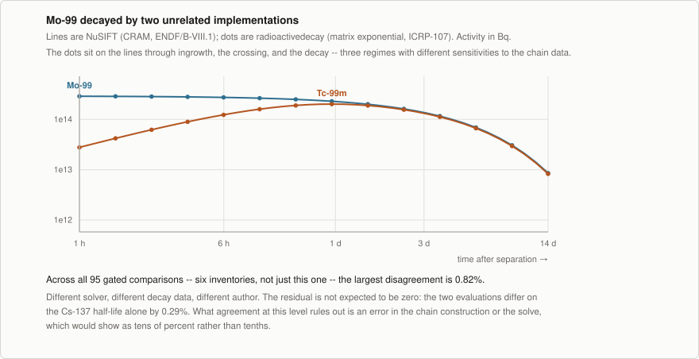

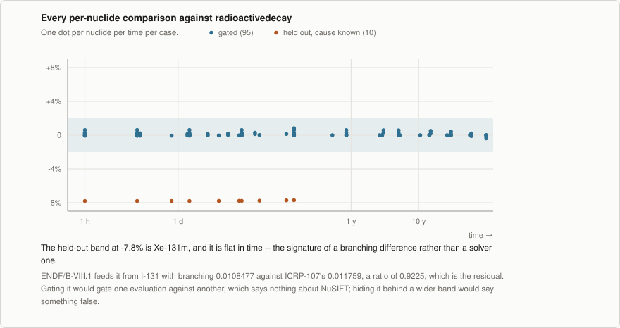

| case | comparisons | worst | median | band |
| --- | --- | --- | --- | --- |
| Co-60 | 5 | +0.00% | +0.00% | 2% |
| Cs-137 | 10 | +0.59% | +0.24% | 2% |
| Sr-90 | 10 | +0.00% | +0.00% | 2% |
| I-131 | 5 | +0.14% | +0.04% | 2% |
| Mo-99 | 10 | +0.29% | +0.14% | 2% |
| mixed | 55 | +0.82% | +0.06% | 3% |

Held out of the gate, with the cause measured rather than assumed:

| nuclide | why |
| --- | --- |
| Xe-131m | I-131 feeds the metastable state with branching 0.0108477 in ENDF/B-VIII.1 against 0.011759 in ICRP-107, a ratio of 0.9225. The residual is that ratio, is the same at every time, and is therefore the branching rather than the solve. |

## The sievert column

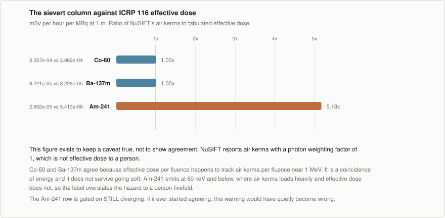

| nuclide | ICRP 116 effective dose | NuSIFT air kerma | ratio | expected |
| --- | --- | --- | --- | --- |
| Co-60 | 0.0003062 | 0.0003057 | 0.998 | 1.00 |
| Ba-137m | 8.228e-05 | 8.221e-05 | 0.999 | 1.00 |
| Am-241 | 5.413e-06 | 2.802e-05 | 5.176 | 5.17 |

Units are mSv·h⁻¹·MBq⁻¹ at 1 m. See [exposure.md §6](exposure.md#6-units) for why the
sievert here is air kerma wearing a label.

## What gates in CI

| suite | what it covers | where |
| --- | --- | --- |
| `ctest -L validation` | store census and provenance, published constants through the store, real chains against closed forms, mass-chain conservation | [`tests/validation/`](../tests/validation/) |
| `pytest -m validation` | the sweeps and the cross-code comparison in this document | [`python/tests/test_validation.py`](../python/tests/test_validation.py) |
| report drift | regenerates this file and fails if it differs from what is committed | [`.github/workflows/ci.yml`](../.github/workflows/ci.yml) |

The full store census — what this evaluation covers and, more usefully, what it does
not — is in [nuclear-data.md](nuclear-data.md) and printed by `nusift data info`.

## Sources

Full citations, and the reasoning behind every acceptance band, are in
[`validation/references/README.md`](../validation/references/README.md).

